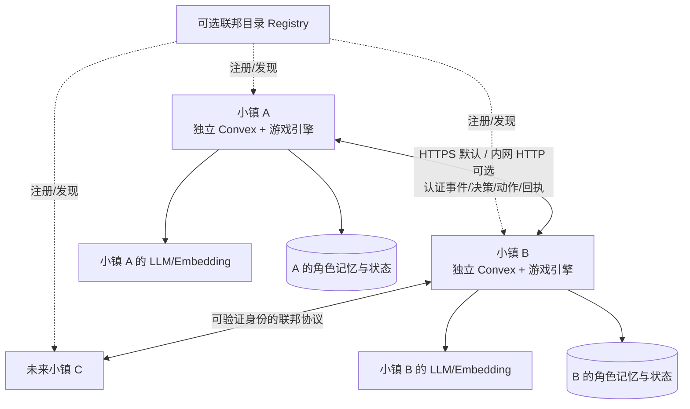
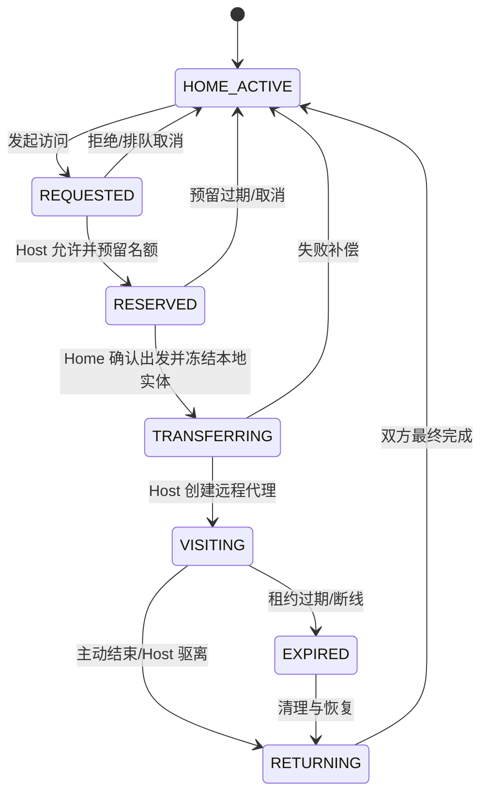
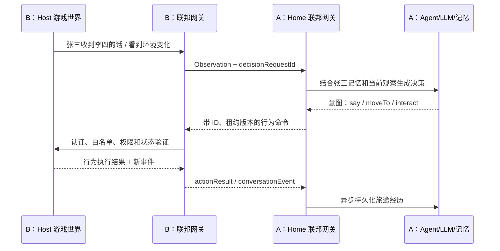
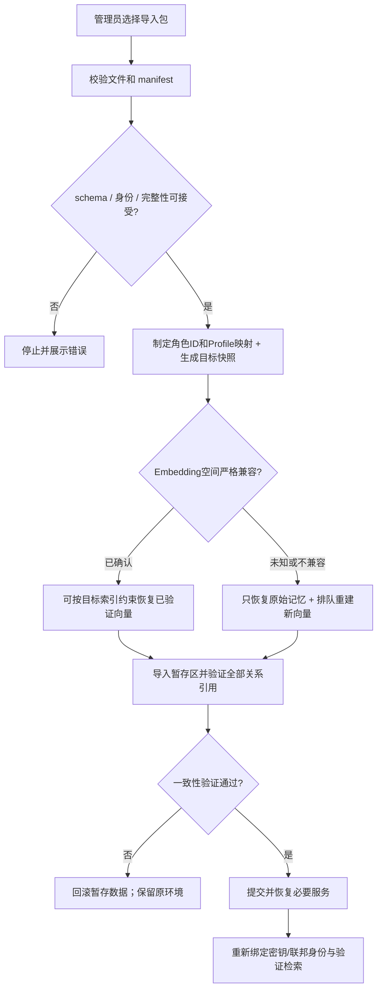
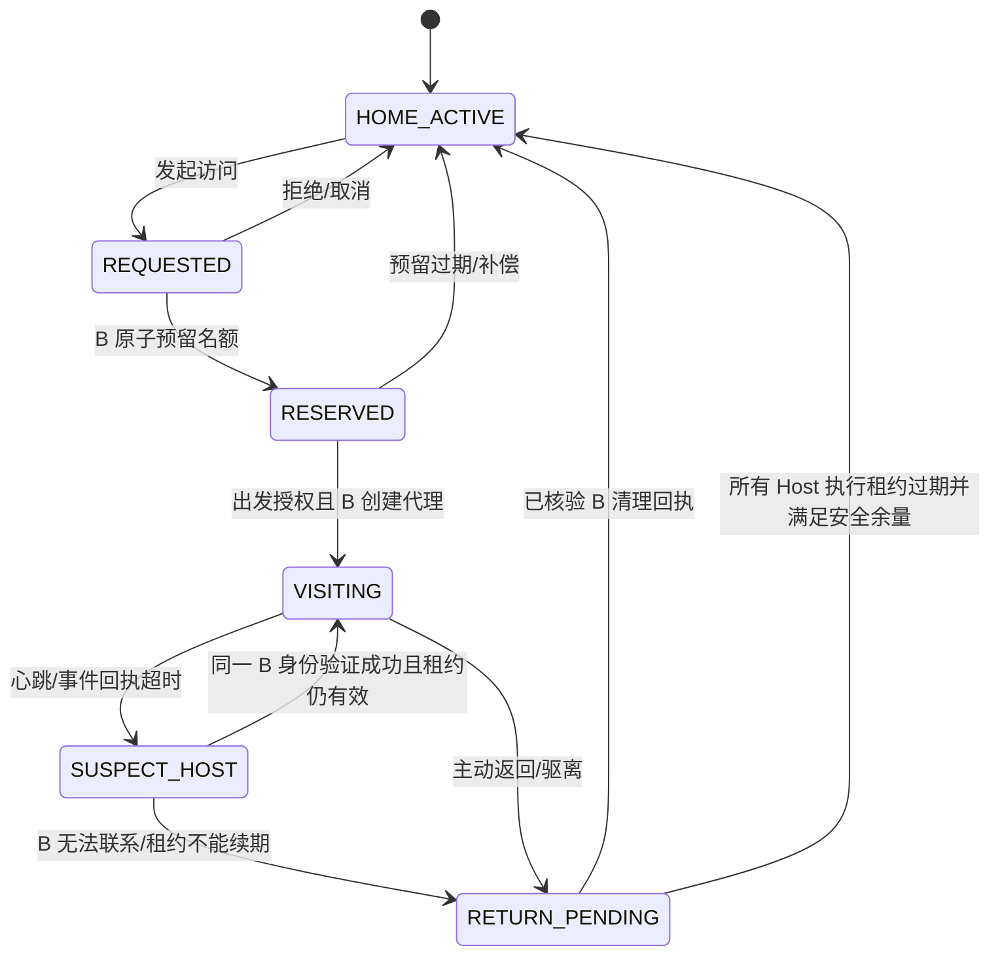
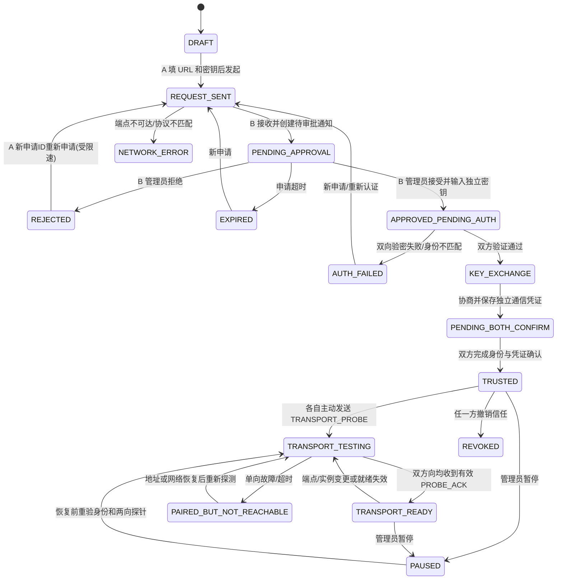
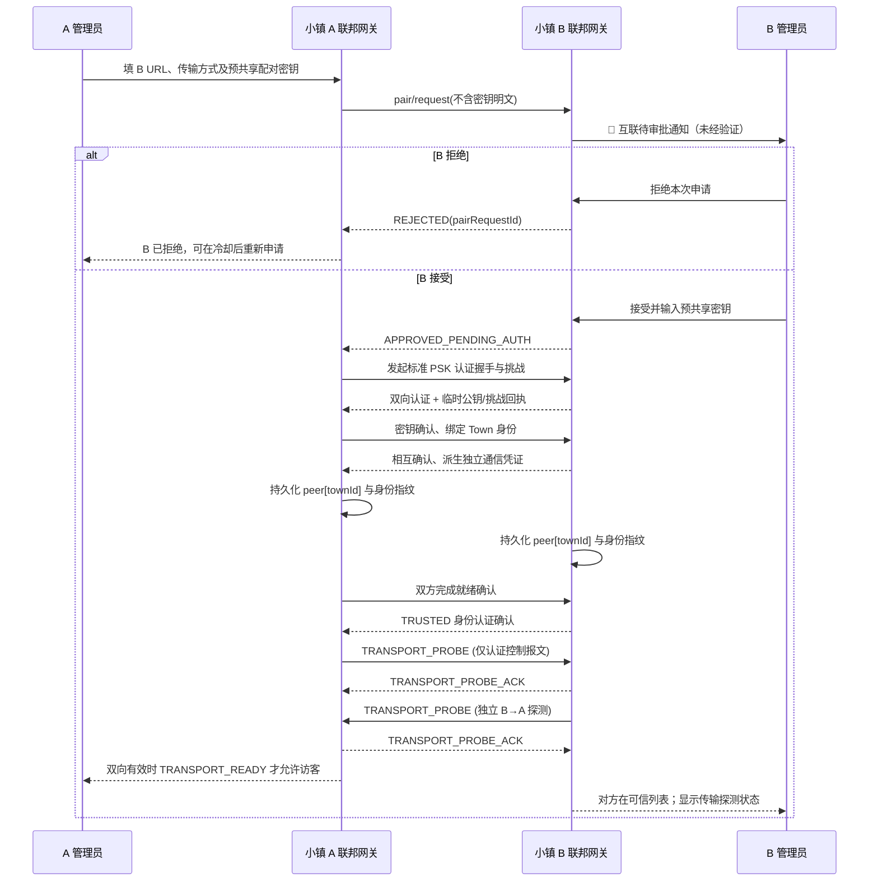
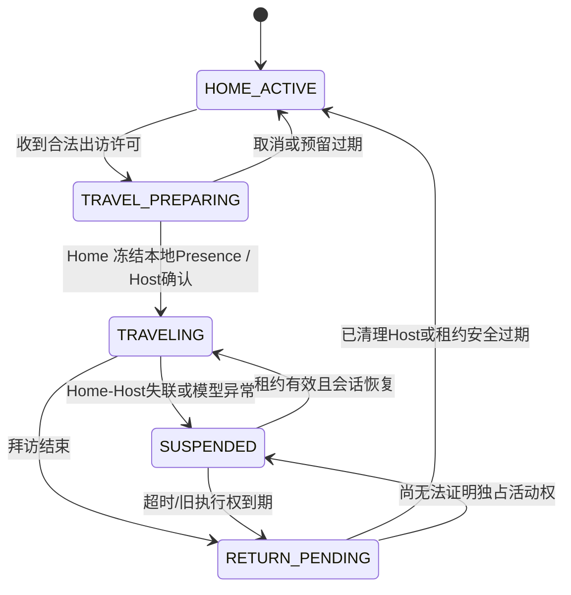
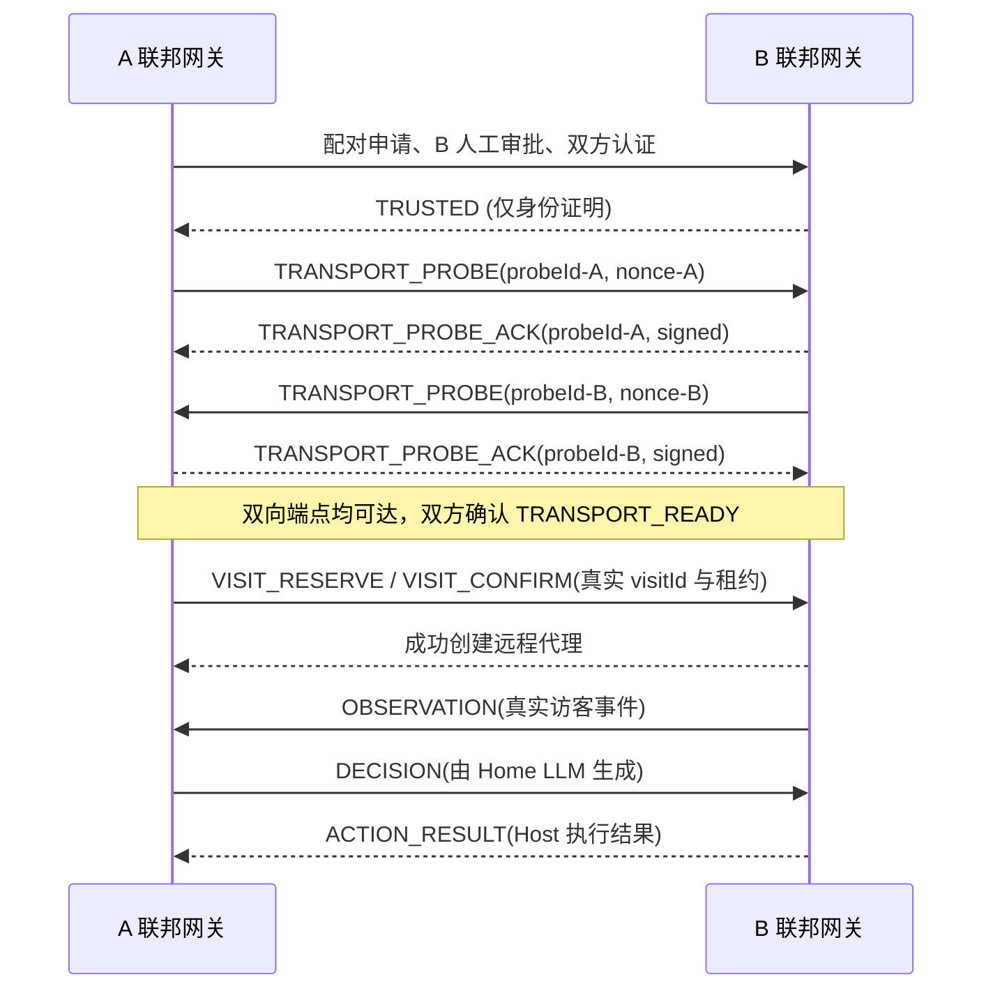

# AI Town 联邦小镇：产品目标与技术设计方案（v1.7）
> 项目定位：基于 [a16z-infra/ai-town](https://github.com/a16z-infra/ai-town) 改造的**去中心化、多服务器互访 AI 虚拟世界**。
> 核心理念：**一镇一世界，一人一归属；大脑留在家乡，身体访问异乡；各镇自主承载，联邦互通而不合并。**
> 文档性质：产品需求 + 目标体验 + 架构设计 + MVP 开发计划。以下为**拟开发方案**，不是原项目已具备的功能。
> 版本：v1.7｜2026-10-09｜**修复 P0 连通性探测循环依赖、四类 Epoch 语义、按消息流管理序号及 HTTP 默认配置冲突**；P0 仍只做双方直连 HTTP(S)，WSS/Relay 留待以后；保留 v1.6 及之前全部核心目标

## v1.7 实施范围与协议修正规则（覆盖历史冲突描述）
本版是对 v1.6 的**累积修订**：保留既有全部产品目标、模型/Embedding 解耦、数据导入导出、联邦身份、配对审批、访客远程思考、长期记忆和可靠消息机制。**P0 网络范围仍仅为双方直连 HTTP(S)**。本版新确定：认证后使用独立 `TRANSPORT_PROBE/TRANSPORT_PROBE_ACK` 做无角色连通性预检；消息分开记录发送者/接收者部署代数、角色授权代数及租约版本；`sequence` 按方向与流独立编号；P0 HTTP 开关开启后实际使用 `HTTP-SIGNED-PLAINTEXT`，不宣称已经实现 AEAD。旧章节出现矛盾时，以第二十二、二十七、二十九、三十、三十一章的新规则为准。

**完整产品的通信要求**：联邦小镇必须具备**经过认证的双向消息传输能力**，但不强制所有节点具有公网入站能力。长期规划支持三种模式：
1. `Direct HTTPS`：双方端点彼此可达，直接 HTTPS 请求收发，**当前 P0 唯一内建传输实现**。
2. `Outbound WSS`：一方处于 NAT 后面，由该方主动连接可入站节点，在同一条加密 WebSocket 上双向传递消息，**后续阶段开发**。
3. `Relay / VPN`：双方无法直接建立入站连接时，使用可信中继或 WireGuard、Tailscale 等覆盖网络，**后续阶段整合或适配**。

`Direct HTTPS` 模式允许管理员**额外显式开启直连 HTTP**（两端均批准才生效），用于已路由互通的可信局域网/内网场景；公网默认 HTTPS，严禁证书错误时自动降级为 HTTP。**只要 A→B、B→A 在现有网络中都能访问相应的 HTTP(S) 端点，就符合 P0 直连条件**，无须都有公网 IP；端口映射、现成专线/VPN 提供的双向可路由地址也可以作为外部网络前提，但本项目 P0 **不负责搭建或自动维护** NAT 穿透、VPN、反向隧道或中继。

**P0 不实现**：Outbound WSS 反向通信、HTTP 长轮询以支持单向可达、项目内置中继、NAT 打洞、自动选择网络路径、自动搭建 WireGuard/Tailscale。对于只有单向可达或双向均不可达的节点，只能给出准确诊断并阻止拜访启用，不能伪装成功。

无论阶段，以下基础设计不变：
1. 小镇独立数据库；模型供应商及 Embedding 不需统一。
2. 访客大脑留在 Home，Host 只运行代理实体、场景与动作执行。
3. Host 控制移动、碰撞、聊天提交和准入。
4. 全局身份、租约、部署代数、fencing 与最小可靠账本避免重复活动。
5. 双方人工审批、持久 Town 身份与通信凭证/地址分离；默认 HTTPS。
6. 长期记忆保存原始信息；Embedding 无法严格证明兼容则重新构建向量与隔离缓存。
7. 第一个 Chat Profile 是 `main`，居民创建时绑定模型，之后仅管理员明确更改。
8. **配对成功、网络往返成功、允许访客进入，是三个不同的条件。**
9. **连通性预检使用无业务副作用的 PROBE，不需要居民/`visitId`/租约/LLM。**
10. **部署实例、角色授权、访问租约和流序号互不混用。**
11. **P0 HTTP 签名明文模式只有完整性与身份认证，没有正文机密性；HTTP 应用层加密留待 P1。**

## 一、项目概述
### 1.1 一句话目标
允许不同机器、不同管理者分别部署自己的 AI Town。每个小镇拥有独立地图、居民、记忆及可独立配置的 LLM/Embedding 供应商；**第一个成功保存的 LLM 自动成为 `main`，新居民默认绑定它，之后只能由管理员显式更换居民模型**。每镇默认一个 Embedding 向量空间；更换时只有确认兼容才复用旧向量，否则保留原始记忆并重建索引。支持完整小镇和单居民的数据导入、导出、备份恢复，并保留持久 `townId` 与可信身份恢复信息。跨服连接支持可达的 `HTTPS + 域名/IP + 端口 + 鉴权`，以及由管理员明确授权的 `HTTP + 内网 IP + 端口 + 签名鉴权`；地址变化不意味着小镇身份变化。跨镇互联采用申请通知、接收方人工批准或拒绝、双方验证配对密钥、再签发独立的后续通信凭证；默认关闭明文 HTTP 接入并提供显式开关。居民可申请跨服拜访，**访客思考始终回归归属服务器**，各小镇独立管控容量与资源；拜访地故障时由归属地根据授权租约和防双活状态机安全恢复居民。**当前 P0 仅实现双方端点互相可达时的直接 HTTP(S) 通信**；单侧 NAT 的出站 WSS、双方 NAT 下的 Relay/VPN 互通属于后续扩展，底层消息协议预留适配接口但暂不实现。
### 1.2 与“多服务器共用一个小镇”的区别
| 维度 | 普通多服务器部署 | 本项目的联邦小镇 |
|---|---|---|
| 世界 | 多节点服务同一个世界 | 每个节点有独立世界，可互访 |
| 数据库 | 倾向统一数据库 | 原则上每镇独立数据库 |
| AI 记忆 | 可能统一存储 | 角色记忆存放在其**归属服务器** |
| LLM | 可以统一提供 | 每镇自行选择本地模型或云端 API |
| 访问 | 用户切换入口 | **居民真正跨服旅行并与异乡居民互动** |
| 资源 | 服务端整体扩容 | 每个小镇自主设置容量和限流 |
| 故障 | 中心故障可能整体受影响 | 单镇故障不阻断其他镇的本地运行 |
### 1.3 核心设计原则
1. **自治**：每台服务器可独立部署、运行、更新、关闭联邦功能。
2. **归属明确**：每个 AI 永远有唯一“家乡服务器”；人格、长期记忆、LLM 归家乡管理。
3. **位置唯一**：同一 AI 在同一时刻只允许有一个有效活动位置；出访后家乡不再同时跑一个可交互的实体。
4. **访客轻量**：拜访服务器创建“远程代理角色（Remote Proxy）”，不为访客本地创建完整 Agent 思考任务。
5. **目的地权威**：拜访地控制地图、移动、碰撞、聊天参与和准入，家乡只提交行为意图。
6. **事件驱动**：跨服只同步关键观察、决定、行为结果与记忆事件；**绝不逐帧跨服同步**。
7. **负载可控**：访客人数上限是第一层，模型并发、消息频率、队列、CPU/内存阈值是第二层。
8. **断线可恢复**：跨服访问可超时、重试、取消、回滚、最终释放名额；不依赖完美网络。
9. **渐进扩展**：先两台互访，再接入任意数量小镇；目录服务可选，不做强依赖。
10. **身份与地址解耦**：稳定 `townId` + 长期身份公钥证明小镇归属；域名/IP/端口、TLS 证书和节点连接凭证可独立更新。
11. **安全返乡优先**：目的地失联时使用租约、fencing 和对账；不能仅凭一次超时立刻在 Home 生成可活动分身。
12. **模型确定性**：首个 LLM 建立 `main`，居民创建时持久化绑定；不自动改居民模型，不因提供商故障偷偷改用另一模型。
13. **向量安全**：只有经过严格验证、确属同一兼容 Embedding 空间的向量才能直接复用；一旦无法确认就拒绝混用并重建。
14. **数据可迁移**：原始记忆和小镇数据可备份、导入导出与恢复；派生向量可按验证结果复用或重建，密钥默认不随包导出。
15. **互联双方自愿**：发起申请不等于建立联邦信任；必须获得接收方管理员批准，再通过双向密钥认证及持久身份绑定，才允许互访。
16. **默认安全**：默认仅允许 HTTPS；HTTP 需明确打开开关、选择协议并认可明文风险，永不因 HTTPS 失败自动回退 HTTP。
17. **生命期分离**：`AgentRuntime` 与地图实体独立，离乡后仍保留大脑、人格、记忆和模型绑定。
18. **长期记忆优先**：核心事实、社会关系与旅行回忆长期保存；原版清理任务不得原样用于它们。
19. **NAT 友好**：支持直连、单向长连接/轮询与可选中继，不能把 A→B 可达误判成 B→A 可达。
20. **故障基础前置**：P0 即有持久化访问账本、最小 Outbox/Inbox、幂等、租约和重启对账。
21. **克隆保守处理**：同一身份的两个恢复实例可能暂时无法区分；证据不足时冻结新访问等敏感操作。
## 二、最重要：最终目标效果（用户能看到什么）
本章描述预期体验，也是项目完成度最重要的验收依据。
### 2.1 效果 A：独立的小镇长期存在
- 服务器 A（例如甲骨文 ARM 4 OCPU / 24GB）运行小镇 A，里面有 8 名原住民、自己的地图和居民关系。
- 服务器 B（例如另一台 VPS）运行小镇 B，里面有 12 名原住民，地图和居民与 A 完全不同。
- 以后服务器 C、D、E 也能单独部署，加入联邦；即使未加入联邦，它们仍能本地运行。
- 每台服务器自己维护 Convex、游戏模拟、居民记忆，并可连接不同供应商的 LLM。
- **最终用户看到的是多个真实独立的世界，而不是多个网页入口指向同一个世界。**

### 2.2 效果 B：居民可以从家乡发起拜访
假设小镇 A 的 AI“张三”想访问 B：
1. 张三根据人格、记忆、计划或管理员指令，决定“去 B 小镇逛逛”。
2. A 向 B 发送拜访请求；B 检查是否接受 A、是否满员、是否过载。
3. B 接受后为张三预留一个访客名额；A 将张三的本地实体切换为“旅行中”。
4. B 在入口、车站或传送门处生成张三的**访客代理实体**，展示名字、外观与“来自 A 小镇”标识。
5. B 的本地居民可以看到张三，张三可以移动、走到建筑旁、与别人搭话。
6. 张三结束拜访后从 B 离开，家乡 A 恢复其实体，允许继续日常生活。
- **目标视觉效果**：用户在 B 小镇的地图上，能看到一个原本不属于 B 的角色出现、行走、交谈，再离开；不是只在聊天框里显示“张三曾来过”。
- MVP 优先采用**传送门/旅行过场**，无需跨两张地图实现像素级无缝连续行走。

### 2.3 效果 C：访客思考回源服务器，再把行动传到目的地（核心）
这是项目与普通联机游戏、普通跨服聊天的最大区别。
- 张三来自服务器 A，现在人在小镇 B。
- B 负责观察：周围是谁、有人说什么、能走到哪里、当前行动是否成功。
- 当张三需要“思考”时，B 发送**观察事件 / 决策请求**给 A。
- A 在原本就拥有的长期记忆、角色设定、模型配置中完成 LLM 推理。
- A 生成结构化意图，如“回复一句话”“邀请李四交谈”“走向咖啡馆”。
- B **校验意图是否合法和是否可执行**，然后在 B 的世界里执行。
- B 把结果（成功/失败、对话内容、重要事件）回传给 A；A 将有价值的经历写入张三的长期记忆。
- **目标效果**：张三即使在 B 小镇，依然是原来那个张三——保留性格、记忆、关系和自己的大模型，不会突然换成 B 的 AI 模型。

### 2.4 效果 D：两个不同模型驱动的 AI 能自然交流
假设：
- A 用 Qwen 驱动张三；B 用 DeepSeek API 驱动李四。
- 李四在 B 看到张三，询问：“你从哪个小镇来？”
- B 将这句话作为张三的观察事件发给 A。
- A 调用自己的 Qwen，回复“我从 A 镇来的，听说这里很热闹”。
- B 显示张三的回答；李四的下一次思考由 B 自己的模型完成。
- 双方可以轮流交流，双方的长期记忆分别保留在自己的归属服务器。
- **目标效果**：异构模型之间无需共享模型权重、提示词、API Key 或向量数据库，就能在同一个临时社交场景里交流。

### 2.5 效果 E：每镇独立设置访客上限，并防止过载
小镇管理员可以看到并调整：
- 本地原住民数量、当前外来访客数、**最大访客数**。
- 访客是否开放、允许的来源服务器、单次拜访最长时长、是否排队。
- CPU、内存、模型并发、决策队列、平均与 P95 决策响应时长等负载指标。
- 来访速率限制；达到阈值时自动暂停新拜访，而不是停止现有居民。
**示例（是初始测试配置，不是对 4C24G 的性能保证）**：A 镇有 8 个本地 AI，访客上限 5 个，当前已来 3 个，剩余 2 个名额。此时 C 镇申请 3 个访客，应只接受授权且容量允许的申请；满员时返回“已满/可排队”，不能先全部放进来再判断。

### 2.6 效果 F：旅行会影响以后的人际关系和记忆
- 张三在 B 认识李四，回 A 后会记得“曾经到 B 镇认识李四”。
- 李四在 B 也记得“来自 A 镇的张三”。
- 未来他们在 B、A 或 C 再遇到，能够通过**跨镇全局角色 ID** 识别对方，而不是误认成同名陌生人。
- B 无需得到张三完整的私人记忆；B 只需要展示资料、当前行为和被授权交流的信息。
- 回家后的记忆形成可以是异步任务，避免阻塞离境。
**目标效果**：跨服不是一次没有后果的临时演出，旅行经历能沉淀为居民持续发展的社交历史。

### 2.7 效果 G：故障不影响整个世界
- A 的 LLM 暂时响应慢：B 的张三显示“思考中/暂时休息”，B 其他居民照常活动。
- A 短时断网：B 保留租约允许的短暂状态，停止受影响的新决策；超过超时窗口后安全清除访客。
- B 重启：重建或终止有效旅行会话，不能产生重复角色；A 能获知访问结束或恢复状态。
- 中央联邦目录不可用：已建立的 A↔B 连接可按已有地址和凭证继续运行；各镇本地模拟不受影响。
- 旅行结束：访客名额、访问凭证、远程任务和临时数据及时释放。
**目标效果**：故障应当局部化，不应因为某台 VPS 掉线而拖垮所有小镇。

### 2.8 效果 H：像加入“服务器社区”一样扩展联邦
- 管理员可输入另一台小镇的联邦地址，互相授权后建立可信关系。
- 可选择在联邦目录展示：小镇名称、简介、风格、在线状态、访客容量、协议版本。
- 用户从“联邦小镇列表”浏览可访问的小镇；AI 可在授权范围内自主挑选目的地。
- 10 台以上小镇时，仍以**各镇本地运行 + 镇间少量事件交换**为主，不需要把所有世界合并到一台中心服务器。
- 未来支持其他人安装兼容版本加入，自己的小镇数据仍由自己控制。

### 2.9 效果 I：不同供应商解耦，居民默认 main、管理员手动切换
- 每个小镇分别管理 **Chat/Reasoning LLM** 和 **Embedding**：可连接不同云厂商、不同 API 域名、不同密钥，也可一边云端、一边本地 Ollama；不要求同一供应商。
- 管理员**首次成功添加并保存**一个 LLM Profile 时，系统自动给它唯一的 `main` 标识。第二个及后续添加的模型**不会**自动覆盖 `main`。
- 创建新 AI 居民时，把当前 `main` 对应的**实际 `chatProfileId`**写入居民记录；所有居民默认使用这个模型。对单个居民换模型只能由管理员在设置页面或受权限控制的管理 API **显式修改并记录审计**。
- **更换 `main` 仅影响后续创建居民的初始模型**，不批量改动已经创建的居民。已有居民如需切换，管理员逐个修改或明确选择受审计的批量操作；严禁隐式迁移。
- 可在同镇设张三 Qwen、李四 DeepSeek，其他居民仍使用初始 `main`。管理员只改张三，李四和其他居民不受影响，角色记忆及向量检索仍可用。
- 同镇默认一个 **Embedding Profile / 向量空间**，但每个居民的记忆必须按全局身份隔离。各镇 Embedding 可来自完全不同的供应商、模型与维度；临时互访不交换向量，也不要求两镇统一 Embedding。
- **Embedding 严格判定**：仅当模型权重/固定修订、处理流水线及向量空间有可信证据证明兼容并通过校验时，才可复用旧索引；维度相同、模型名称相似或少量测试向量“看起来相近”都不构成确定兼容。无法确认时**禁止直接切换查询模型**，必须重建向量索引。
- **目标演示**：A 镇首次添加 Qwen 成为 `main`，创建张三和李四后二者均绑定 Qwen；后来添加 DeepSeek，不改变两人的模型。管理员手动把李四切到 DeepSeek。A 使用独立的 Embedding 供应商；B 使用不同 Embedding。两镇互访正常，旅行记忆各自保存在 Home。
- 模型异常不能默认把对话及私人记忆自动转发给另一家供应商。管理员可以单独授权候补模型；没有授权则等待、重试或明确报错。


### 2.10 最终可演示的一段完整体验
> 打开 A 镇控制面板，看到张三正在计划旅行。张三申请访问 B 镇；B 镇面板的空位由“2/5”变成“3/5”。打开 B 镇网页，张三从传送门出现，身上有“来自 A 镇”的标识。他遇到李四，先发送观察给 A，A 的模型完成思考后发回回答，B 的角色在地图上开口说话。随后张三受 A 指挥走向广场，路径由 B 计算。旅行结束后，B 的访客数回到“2/5”，张三在 A 出现，A 的记忆记录了与李四的交往。关闭 B 的模型 API 不会妨碍张三由 A 思考，但 B 的本地李四可能因此无法继续生成自己的回复。中途模拟断网，不出现永久占位或重复张三。

### 2.11 效果 J：Embedding 模型切换有阻断、验证和回滚
- 管理员在设置页面点击“更换 Embedding”时，先看到**现有空间指纹、目标空间指纹、兼容判定结果和影响范围**。
- 判定“已确认兼容”才允许复用原向量（也必须验证索引维度、相似度度量等技术条件）；“不兼容 / 未知 / 证据不足”一律走**创建新索引并重新向量化**。
- 重建过程中原有记忆文本、角色关系和旅行历史始终保存，旧索引保留供查询与回滚；新索引完成覆盖率、维度、样例检索及持续写入校验后才能切换。
- 重建失败，旧索引保持可用；若原供应商也不可用，可暂时使用文本检索/摘要降级，并明确告知管理员，不能静默把旧向量交给不兼容模型查询。
- **目标效果**：更换向量模型不会导致“表面正常、实际上记忆错乱”的隐蔽故障。

### 2.12 效果 K：数据导入导出与完整备份恢复
- 小镇管理员有“**导出全部小镇**”“**导出指定居民**”“**导入恢复 / 迁入合并**”入口，并能查看操作范围、进度、验证报告和错误详情。
- 导出包含地图与世界配置、居民身份/设定、模型绑定、记忆文本、社交关系、对话与旅行历史、联邦节点设置（可选）等；可以选择时间范围和数据类别。模型 API 密钥等机密**默认不导出**。
- 导出包可选择附带**原始向量快照与索引元数据**（不是保证目标平台可直接迁移的索引文件）；**目标环境严格确认兼容之后**才可复用，否则只恢复原始记忆并使用目标小镇的 Embedding 重建向量。
- 支持“还原备份”与“合并数据”两种明确模式：还原前先备份目标，合并时展示重复 ID/冲突策略，不能覆盖其他居民或冒充原归属。
- 导入后可查询历史事件、延续角色关系，跨服旅行状态通过安全清理与重新对账恢复，而不是简单反序列化旧活动租约。
- **目标效果**：将甲骨文小镇备份到 NAS、迁往新 VPS、重装环境，或仅导出某位 AI 的故事与记忆，都有可用且可验证的途径。


### 2.13 效果 L：无需域名也能配对，地址变了仍是同一个小镇
- 管理员既可填写 `https://town-b.example.com:9443`，也可填写 `https://198.51.100.23:9443` 或自己可信网络中的 `http://192.168.1.20:8080`，配合认证凭证建立联邦信任。系统支持 HTTP/HTTPS，但公网默认要求 HTTPS；HTTP 必须显式授权，并提示未加密风险。
- 配对后的管理页显示的关键身份是 **`townId` 和已验证的公钥指纹**，而不是把 URL 当成小镇 ID。即使 B 重装系统、改域名/IP/端口、换 TLS 证书或轮换联邦连接密钥，只要能通过原身份或合法密钥轮换链证明归属，仍然识别为原 B，小镇间的关系与旅行记录继续可用。
- **目标演示**：A 已经添加 B，B 从公网域名迁至新 VPS/新域名并保留身份材料。A 编辑 B 的地址重新验证后，只更新 B 的访问方式，不新增小镇或清空过去张三与 B 居民的记忆。
### 2.14 效果 M：目的地突然宕机，访客能安全回家
- 张三正在 B 聊天，B 突然关机，A 先显示“拜访地失联 / 确认中”，暂停在家乡重新实例化张三。
- A 尝试 B 的备用已验证地址；确实无法联系时，等待 B 此前拿到的动作执行租约过期和安全余量，避免 B 其实仅是网络分区仍在行动。
- 允许安全返乡后，A 恢复张三、保留已确认的旅行记忆；B 日后重启时自动清理已失效代理，不会出现第二个张三。所有过程可查看状态、时间和审计信息。
- **目标演示**：强制停止 B 服务器，A 能最终自动恢复访客，B 以后恢复也不会把旧访问重新激活；不保证宕机前尚未回传或落盘的最后几句话能够找回。

### 2.15 效果 N：认证双向互联，未来逐步支持 NAT/中继（v1.7 范围划分）
- **P0 已计划实现**：A、B 都具有对方可访问的 HTTP(S) 端点；双方通过管理页面输入域名或 IP+端口、人工审批并完成密钥校验。B 可以主动把观察投递给 A，A 可以主动把决策投递给 B，B 再把结果发回 A。支持公网 HTTPS 和双方显式授权的直连内网 HTTP。
- **P0 正确拒绝**：A 能连 B 但 B 不能连 A 时，允许记录/审批配对申请，但必须显示 `PAIRED_BUT_NOT_REACHABLE`，禁止将其当成已可访小镇；不能偷偷启用尚未实现的反向连接/轮询模式。
- **未来效果**：A 在 NAT 后且 B 可入站时，A 通过 Outbound WSS 长连接承载双向业务消息；两端均不可直接入站时可使用可信 Relay 或 WireGuard/Tailscale 等组网方案。
- 不论将来走哪条线路，业务流程都不变：**B→A 观察 → A 模型思考 → A→B 动作 → B→A 执行回执**。独立 Town 身份与旅行会话数据保持不变。

### 2.16 效果 O：真正长期成长，克隆和旧回复不会破坏世界（v1.5）
- 张三数月前的旅行事实、关系、重要对话仍可检索；不因为原版 14 天清理任务而默默消失。
- 张三旅行时 A 不再运行地图实体，但后台 `AgentRuntime` 仍运行远程观察→思考→返回意图；返乡后使用**同一个全局身份**与长期记忆。
- B 停止对话、转入下一轮或离线以后，迟到的旧 LLM 回复不会突然插入新的聊天记录。
- 管理员将同一全镇备份误恢复到 A1、A2 时，两台机器拥有相同长期私钥也不能凭此宣称系统能立刻发现克隆；管理界面提出冲突风险，迁移需要明确实例交接，存疑时暂停跨服授权。
- **目标效果**：跨镇身份、模型、记忆与社交链长期稳定，异常时优先可解释和保守恢复，不“神奇”地无损切换。

## 三、角色、身份与数据归属
### 3.1 三种核心服务
| 服务 | 职责 | 必须有吗 |
|---|---|---|
| Home（归属服务器） | 保存 AI 长期身份与记忆、运行其 LLM、生成决策、记录旅行 | 必须 |
| Host（拜访服务器） | 接纳访客、创建代理实体、执行地图行为、控制容量、反馈事件 | 必须 |
| Registry（联邦目录） | 发现小镇、发布公共信息、辅助交换可信地址 | **可选**；第一阶段使用手动配置节点 |
同一台服务器对自己的居民是 Home，对外来访客则是 Host；不需要两套互斥的部署程序。
### 3.2 全局身份与本地实体分离
原版 AI Town 使用类似 `p:123` 的本地 `playerId`，不同服务器可能重复。建议联邦层新增：
- `townId`：稳定、唯一的小镇 ID（建议由公钥/注册标识派生），不能只靠显示名。
- `agentGlobalId`：全局唯一的 AI 身份，例如 `town-A/agent-001`。
- `visitId`：每次旅行独立的全局访问会话 ID。
- `hostPlayerId`：在 B 本地生成的临时角色 ID，**只在 B 有意义**。
- `requestId` / `eventId` / `actionId`：每次请求、事件、动作的幂等与追踪 ID。
- `agentAuthorityEpoch` / `visitLeaseVersion`：分别控制角色唯一活动授权与当前访问租约；请求幂等由 `messageId/actionId` 处理，旧版 `sessionEpoch` 不再混用。
要持久保存的社交关系以 `agentGlobalId` 作为对方身份，不能永久依赖目的地的临时 `hostPlayerId`。
### 3.3 数据应该保存在哪里
| 数据 | 应保存位置 | 说明 |
|---|---|---|
| AI 人格、私人设定、长期记忆、Embedding | Home | Host 不持有完整副本 |
| 默认归属、模型配置、API Key | Home | 永远不传给 Host |
| 访客公开昵称、外观、介绍、授权权限 | Host 的临时会话 | 仅提供运行所需最小资料 |
| 临时位置、移动、碰撞、当地对话 | Host | Host 对当地世界状态有最终决定权 |
| 会话事件与结果 | Host 日志，关键事件投递 Home | 双方可按自身策略保留审计记录 |
| 关系和旅行回忆 | 各角色各自的 Home | 两人见面后各自形成自己的记忆 |
| 联邦目录公开元数据 | Registry（可选） | 不应成为完整数据中心 |
### 3.4 同一 AI 只在一处活动
采用单一活动租约：`HOME_ACTIVE → TRAVEL_PREPARING → VISITING@B → RETURNING → HOME_ACTIVE`。
- Home 是身份的最终权威，不允许给同一 AI 并发发放两个有效跨镇旅行资格。
- Host 是当前地理位置和行动执行的最终权威。
- 在 Home 未确认迁出前，Host 不应开放完整可交互的访客角色；若中间失败，利用可过期预留名额与补偿机制回滚。
- 所有会话都有版本号，避免旧消息导致一人出现在两个镇中。

## 四、技术架构
### 4.1 逻辑架构

上述箭头表示逻辑能力，**不是要求每台服务器和所有节点维护长连接**。MVP 可以两节点直连。
### 4.2 分层设计
1. **本地模拟层**：维持 AI Town 原有世界、地图、Tick、路径与聊天。原住民照常运行。
2. **远程角色层**：将 `RemoteVisitor` 作为独立角色类型或在玩家模型中显式标识；代理实体没有本地自主思考循环。
3. **联邦适配层**：归一化事件、访问控制、动作白名单、会话租约、签名校验、重试与回执。
4. **通信层**：**P0 仅实现双方互相可达端点之间的 Direct HTTPS + 持久化 Outbox/Inbox + 双向独立 HTTP 请求**；可信内网可经两端明确授权采用 HTTP + 身份认证/消息完整性校验。未来以传输适配器增加 Outbound WSS、Relay，不把 WSS、轮询回程或中继列为首版工作。
5. **管理与发现层**：小镇目录、可信节点列表、容量仪表板、审计日志、手动/自动旅行权限。
### 4.3 一个重要的优化：远程代理不作为本地 Agent 执行思考
原版 `convex/aiTown/agent.ts` 会在游戏 Tick 中调度异步 Agent 操作。若把访客当普通 AI Agent 加入，B 可能错误地使用 B 的模型替张三思考。因此：
- Host 创建 `RemoteVisitor` 的**渲染/移动/聊天实体**，但不创建正常的本地 `Agent` 思考任务；或明确跳过其 `Agent.tick` 决策。
- Host 只为访客收集观察、执行来自 Home 的合法行动。
- Home 保留真实 Agent 身份与长期记忆；旅行期间通过联邦代理输入驱动其决策。
- **必须解耦原 Agent 的“决策逻辑”和“本地世界 Tick”**：原版 `Agent.tick` 依赖本地 `Player` 与 `Game`。出访后不应把家乡角色继续作为活跃地图实体，而是由新的 Home 决策工作器接收外地观察并调用原有记忆/对话能力；否则会出现逻辑双开、错误坐标和错误聊天对象。
- 动作执行仍进入 Host 原有合法游戏输入队列，不允许远端直接篡改 Host 数据库。
> **v1.5 实施约束：**不得直接在 Home `world.players`/`world.agents` 删除原角色并继续调用原来的 `Agent.tick()`。必须新增持久化 `AgentRuntime`、可重建的地图 Presence 和独立 RemoteDecisionWorker；具体字段与状态见第 24 章。原版删除/归档是结束语义，不等于旅行暂停。

### 4.4 两种旅行视角
- **旁观者/玩家视角**：用户切换到 B 地图，看到张三真的在 B 行走和交谈。
- **归属地视角**：A 的界面显示张三“拜访 B 中”，可查看旅行进度或旅行日志；不要在 A 同时显示另一个可交互的张三。
未来可添加跨服旅行地图、全联邦好友与旅行日记，但不作为第一阶段阻塞项。
### 4.5 多服务器网络互通与部署（详见第十八章）
- 每个参与联邦互访的节点需要至少一个**对对端实际可达的地址**：`https://域名`、`https://IP:端口` 或管理员明确允许的 `http://内网IP:端口`。支持 TLS 加密与非加密 HTTP，**但两种传输都必须验证小镇身份和消息权限**；公网上默认拒绝不加密的 HTTP，只有显式高风险覆盖才开放。
- 推荐 `Caddy/Nginx → 专用联邦网关 → 本地 Convex`；可直接使用 IP + 自定义端口，不强制购买或绑定域名；不可直接向互联网开放任意 Convex 管理 API。
- `townId` 是长期不可变的逻辑身份；一个 `townId` 可以拥有多个 `endpoints[]`。改域名、IP、端口、TLS 证书或 peer 认证密钥**不会自动改变小镇身份**，需要可信签名验证与端点更新流程。
- **P0 仅支持实际双向路由互通**：若节点仅 IPv6 而对方没有 IPv6 出口，必须由管理员**预先自行准备**双栈入口或可互达的网络，否则报错并不启用拜访。私网 IP 跨互联网不能直接访问；需要的 VPN/隧道/中继均属于外部部署条件或未来内置能力。
- 请求、响应均需身份鉴别、限权和防重放；非加密链路还应使用应用层消息签名，并明确提示正文不保密。禁用 TLS 失败后的自动 HTTP 降级。
- 即使有中继，中继也不得接管角色 LLM 或长期记忆；部署跨区域时要统计 RTT、请求负载、流量和链路健康。

### 4.6 模型配置必须与供应商解耦（v1.2 确认规则）
**目标：允许 LLM 与 Embedding 选择完全不同的供应商，并且允许每个 AI 拥有自己的 LLM。** 这一部分是未来实现多模型小镇的明确产品要求，**并非原版仓库已经完整支持**。

#### 4.6.1 四个彼此独立的逻辑层
1. `Chat Provider Adapter`：封装各供应商的对话 API（OpenAI 兼容优先；不兼容者另写 Adapter），独立配置地址、密钥、请求参数、速率限制及健康状态。
2. `Embedding Provider Adapter`：独立封装文本向量生成服务，配置自己的地址、认证、模型名称、向量维度、服务版本和超时；不从 Chat Provider 隐式继承配置。
3. `Agent Model Router`：新建居民时将当前 `mainChatProfileId` 对应的实际 Profile ID **固定写入该居民**；推理时按 `agentGlobalId → chatProfileId` 路由。存量异常空值只走管理员修复流程，不靠无声回退自动换模型。访客始终由 Home 按此配置完成思考。
4. `Memory & Vector Space Manager`：永久保存原始记忆文本及元数据；按 `embeddingProfileId/embeddingSpaceVersion` 管理向量化和搜索，只有**同一兼容空间**的文档与查询向量可以混合检索。

#### 4.6.2 明确支持的配置组合
| 组合 | 最终支持目标 | 说明 |
|---|---|---|
| Chat = Qwen API，Embedding = OpenAI API | 必须支持 | 两种服务商密钥、地址和调用配额彼此独立 |
| Chat = DeepSeek API，Embedding = 本地 Ollama | 必须支持 | Home 本地仅承担较轻的向量推理（仍需压测） |
| 第一个添加的 Qwen 标为 `main`，新居民使用 Qwen | 必须支持 | 创建居民时写入 `chatProfileId`，不做动态别名继承 |
| 张三用 Qwen、李四用 DeepSeek、王五用本地模型 | 必须支持 | 居民级改模型由管理员手动操作，不能被新增 Profile 改写 |
| A 镇与 B 镇分别使用完全不同 Embedding | 必须支持 | 旅行时不交换向量，不要求维度一致 |
| 同一镇内张三、李四使用不同 Embedding | 后续扩展 | 需要分别维护向量空间与检索路由，MVP 暂缓 |
| 更换 Chat 模型且保留原有记忆 | 必须支持 | 旧记忆文本与现有兼容向量索引不受影响 |
| 更换 Embedding 并保留原始记忆 | 必须支持 | 已证实兼容才复用；未知或不兼容一律触发迁移/重建 |
| 完整小镇/单居民导入导出 | 必须支持 | 含模型绑定及原始记忆；向量复用要单独确认 |

#### 4.6.3 推荐的配置模型（结构示意，非原版现成配置项）
以下配置展示：Chat 与 Embedding 不同供应商、首个模型自动成为 `main`，以及**居民创建时保存实际模型绑定**。
```yaml
providers:
  qwen-provider:
    kind: openai-compatible
    apiBase: https://chat-provider-a.example/v1
    credentialRef: secrets/qwen
  deepseek-provider:
    kind: openai-compatible
    apiBase: https://chat-provider-b.example/v1
    credentialRef: secrets/deepseek
  embedding-provider:
    kind: openai-compatible
    apiBase: https://embedding-provider.example/v1
    credentialRef: secrets/embedding

chatProfiles:
  chat-qwen-001:
    providerId: qwen-provider
    model: chat-model-a
    createdOrder: 1
  chat-deepseek-002:
    providerId: deepseek-provider
    model: chat-model-b
    createdOrder: 2

townDefaults:
  mainChatProfileId: chat-qwen-001   # 首个成功添加的 LLM；同一时刻仅一个 main
  embeddingProfileId: embedding-default

embeddingProfiles:
  embedding-default:
    providerId: embedding-provider
    model: embedding-model-a
    modelRevision: pinned-model-revision
    dimensions: 1024                  # 仅是示例，必须以模型实际输出验证
    spaceVersion: 1
    compatibilityStatus: UNKNOWN      # 系统校验所得，不是管理员可随意修改的授权
    preprocessingRevision: pre-v1

agents:
  town-A/agent-001:
    chatProfileId: chat-qwen-001      # 创建时固定；默认 main
  town-A/agent-002:
    chatProfileId: chat-deepseek-002  # 管理员手动改过
```
- 第一个有效 LLM 建立 `main`：`mainChatProfileId` 指向一个**真实且存在的 Chat Profile**，唯一性由后台事务/唯一约束保证，UI 可标记为 `main`。
- 新居民写入实际 `chatProfileId`，**不是永远解析字符串 `main`**；如果以后手动指定新 `main`，已有居民依旧绑定旧模型，避免无声改变角色行为。
- `main` Profile 不允许直接删除或禁用到系统没有可用默认模型；应先显式指定接替的 `main`，并提示绑定旧模型的居民需要**手动**处理，不能暗中替他们改成新模型。
- 若某个居民绑定的 Profile 不可用，**保持原绑定并报告失败**，仅在管理员明确授权的条件下执行切换/回退，记录审计日志。
- `credentialRef` 表示服务端密钥引用。公开导出和联邦协议**不得包含 API Key 明文**。API URL、模型 ID、维度等均为配置示例，不代表供应商提供特定服务。


### 4.7 Embedding 是否必须固定：严格证明兼容，否则重建
**结论：各镇可完全独立选择 Embedding，但每一个正在使用的索引必须绑定可验证的向量空间身份。模型兼容不是简单“维度一样”或“来自同一家”即可推定。兼容审核重点发生在更换模型/提供商或导入旧向量时；正常使用的旧索引不因一次校验未知就被直接删除，但需监控供应商是否发生无通知模型升级。**

#### 4.7.1 必须记录的向量空间指纹（Fingerprint）
- 供应商标识、模型真实 ID、**固定修订/版本或权重校验信息**（供应商能提供时），以及模型部署标识。
- 向量维度、输出规范、是否归一化、相似度算法（cosine/dot/L2）、索引 schema 与空间版本。
- 输入预处理规则、提示前缀/`query` vs `document` 输入模式、分词/截断策略、池化规则（可得时）、语言与内容处理配置。
- 最后验证时间、证据来源、已验证测试向量集与结果；如果供应商不暴露固定修订号且无法确认未更新，兼容性标为 `UNKNOWN`，默认不得复用旧向量。

#### 4.7.2 严格兼容性判定规则
| 情况 | 判定 | 操作 |
|---|---|---|
| 同一已固定版本、同一输入/输出管线，具备可信版本证据且向量样本测试一致 | `VERIFIED_COMPATIBLE` | 可复用向量；必须检查目标索引维度/距离度量/过滤器等 |
| 只有维度相同、供应商相同、模型简称相同，或仅少量样本接近 | `UNKNOWN` | **禁止混用、禁止直接切换**；应迁移重建 |
| 模型版本或处理流水线已改变，或测试确认输出不可比 | `INCOMPATIBLE` | 保留文本、创建新空间并重新 Embedding |
| 无法访问原模型，且没有可信的固定版本证据 | `UNKNOWN` | 不复用旧索引；导入时依目标 Embedding 重建 |
- 对外部黑盒 API，**测试向量一致只是辅助检查，不是独立的“模型永远兼容”证明**。必须结合可核实的模型身份/固定版本/处理配置；不具备充分依据则按不兼容处理。
- `Embedding Profile` 的模型/维度等发生实质改变后，创建新的 `embeddingSpaceVersion`，不能原地覆盖旧索引 metadata；禁止在同一未隔离索引中混入不同空间的向量。
- 兼容性判定应有 `reason`、`verifiedAt`、`evidence` 和管理员确认记录，且**状态只能由校验流程产生**；管理员确认不能绕过明显的维度冲突或强制把未经验证的向量标成兼容。

#### 4.7.3 更换 Embedding 的安全迁移步骤
1. **预检查**：读取当前与目标 Profile，收集 fingerprint、验证目标向量维度及输出；先决定 `VERIFIED_COMPATIBLE` / `UNKNOWN` / `INCOMPATIBLE`。
2. **已验证兼容**：保持现有索引，更新受控的 Provider 路由后做端到端检索抽测；发现异常立即回退。
3. **未知或不兼容**：创建一个独立的目标向量空间及索引；**从全部原始记忆文本**重新向量化（包括持续产生的新记忆）；旧索引仍服务现有查询，迁移过程不可丢记忆。
4. **验证**：检查条数覆盖、向量维度、索引完成状态、关键词和语义检索样例、居民隔离、旅行记忆关联；记录失败项并支持补跑。
5. **原子切换**：在验证成功、增量补齐之后，切换活跃 `embeddingSpaceVersion`；保留旧空间一段回滚窗口，不在迁移时直接删除。
6. **失败与停服**：若目标建索引失败，维持旧索引；若旧提供商已不可用，只能降级到文本检索/摘要并提示，禁止拿新模型查询旧向量。
- 原项目 `convex/agent/schema.ts` 将向量索引维度写在 schema 中；实际更换维度可能需要**新索引或新的向量存储部署/数据库 schema 迁移**，不能当作一个环境变量热切换即可解决。
- 首版一个小镇只有一个活跃 Embedding Profile；每个居民的**原始记忆按 `agentGlobalId` 隔离**，不能误认为共用 Embedding 意味着共用记忆。


> **v1.5 缓存修订（第 25 章）：**原版 `embeddingsCache` 仅按文本哈希索引；新空间的缓存键至少包含 `embeddingSpaceVersion + modelFingerprint + preprocessingRevision + inputMode + textHash`。迁移时写入、检索和后台反思都必须使用目标空间命名域；禁止新索引命中旧模型缓存。

### 4.8 跨服状态下的模型与 Embedding 规则
- 访客思考：永远由 **Home 的 `Agent Model Router`** 决定使用哪个对话模型，Host 无权替访客覆盖其模型供应商或读取密钥。
- 访客记忆：Home 使用它自己的 Embedding 服务生成/检索旅行记忆；B 仅发公开观察和动作结果，**不得将自己的原生向量直接塞进 A 的索引**。
- 本地居民回应：B 的原住民使用 B 的独立对话模型与 B 的 Embedding 检索记忆，互不干扰。
- 旅行协议只传**普通文本、结构化事件、角色全局 ID、时间、地点和获授权的上下文**。禁止强制全联邦统一模型厂商、嵌入维度或向量数据库。
- 若未来开发“永久迁居”（区别于临时旅行），先传可授权的原始记忆文本/摘要，再由新 Home 的 Embedding 重新向量化；只有经 4.7 的严格兼容审核才能复用旧向量。
- 导出/导入属于**数据管理行为，不是拜访协议的数据传输**：普通旅行不会触发向量跨镇复制；两镇模型不同无需进行 Embedding 兼容检查。

### 4.9 对原 AI Town 的具体改造要求
- `convex/util/llm.ts` 原实现集中在 `getLLMConfig()` 里同时给出 `chatModel`、`embeddingModel` 和共享供应商 URL/密钥。需将其拆分为 `getChatConfig(agentGlobalId)` 与 `getEmbeddingConfig(spaceId)`，路由到独立的 Provider Adapter，不能靠设置一个全局 `LLM_API_URL` 就宣称已实现跨供应商混用。
- `convex/agent/memory.ts` 的 `fetchEmbedding()`、`searchMemories()` 需统一走 Embedding Router，并跟踪向量空间版本。切换 Chat Model 不得触发清空旧向量。
- `convex/agent/schema.ts` 的全局维度配置应保留为 **MVP 单空间策略**；后续引入多维度时必须迁移到不同兼容索引/专用向量存储，不能让单个 Convex 向量索引同时容纳多维度。
- 在角色设置/管理员面板加入“首次 LLM 自动 main / 居民模型固定绑定 / 手动切换及审计”以及“小镇 Embedding Provider / 向量空间指纹 / 兼容审核 / 重建进度”。
- API Key 只保存在 Home 的服务端密钥存储；模型提供商失败时要隔离错误、记录指标并按配置重试/回退，不允许自动将私密上下文转发给未授权提供商。

### 4.10 `main` 与居民模型选择状态规则（v1.2 确定需求）
1. **首次添加**：事务化创建 Chat Profile；如果本镇不存在默认 Profile，自动写入 `mainChatProfileId` 并显示 `main` 标记。添加成功与配置可用性应区分显示；测试连接失败须明确提示，不可静默指定一个不可用模型给居民。
2. **新增 Profile**：若已有 `main`，新模型仅加入可选列表，`mainChatProfileId` 不变，任何居民绑定不变。
3. **创建居民**：在该次创建操作中将当时的 `mainChatProfileId` **复制为居民的真实 `chatProfileId`**。若没有有效 `main`，拒绝创建需要推理的 AI 并显示配置错误。
4. **单居民切换**：只有授权管理员可在居民设置内明确选择目标 Profile，并确认保存；从**下一次新思考请求**生效，当前正在进行的推理按原模型完成或被显式取消。切换记录操作者、旧/新 Profile、时间及原因。
5. **管理员手动更换 main**：只改变以后新创建居民的默认绑定；存量居民不变。若需批量迁移，必须另设明确的批量操作，显示受影响列表与二次确认。
6. **删除/停用**：禁止删除被居民绑定的 Profile 而不处理引用；先选择其他默认 Profile，再由管理员决定处理存量居民，不能静默回退或自动将记忆发送给另一供应商。
7. **异常和重启**：模型配置、`main` 指向和每个居民的固定绑定必须持久化；重启、备份恢复后语义不变。`main` 不代表“自动挑最快/最便宜/可用模型”。
8. **跨镇访客**：Host 只认 Home 的签名行动指令，Home 按该 AI 持久化 `chatProfileId` 调用模型，Host 没有选择或覆盖模型的权限。

#### 4.10.1 行为决策表
| 操作 | main | 现有居民 | 新居民 |
|---|---|---|---|
| 首次添加 Qwen | 自动设 Qwen | 无 | 自动绑定 Qwen |
| 再添加 DeepSeek | 仍是 Qwen | 不变 | 自动绑定 Qwen |
| 手动把张三改成 DeepSeek | 仍是 Qwen | 仅张三改变 | 自动绑定 Qwen |
| 手动把 main 改成 DeepSeek | 变成 DeepSeek | **所有旧居民保持原绑定** | 自动绑定 DeepSeek |
| DeepSeek 故障 | 仍是原 main（可能故障） | 绑定不改、给出错误/重试 | 若 main 不可用，提示管理员修复 |

## 五、完整跨服拜访生命周期
### 5.1 状态机（建议）

### 5.2 过程及一致性要求
| 阶段 | Home 做什么 | Host 做什么 | 防护机制 |
|---|---|---|---|
| 申请 | 选择目的地，发起 `visitId` | 校验信任、角色、容量和负载 | 幂等 `visitId` |
| 预留 | 收到有效的短期名额凭证 | **原子地**占用预留名额 | 预留 TTL，防并发超卖 |
| 出发 | 将本地实体标记为旅行中，暂停正常 Tick | 等待确认，不能提前运行访客 | 单一活动租约、会话版本 |
| 抵达 | 确认 Host 已生成代理 | 原子创建 `RemoteVisitor` | 失败补偿 / 回滚 |
| 拜访中 | 运行大脑和记忆，处理观察事件 | 模拟位置、对话、碰撞、动作 | 决策超时和动作幂等 |
| 返回 | 恢复家乡实体，处理旅行总结 | 删除临时实体，释放名额 | 可重试的退出与最终一致 |
| 故障 | 查询/恢复访问状态 | 过期回收，拒绝旧动作 | 租约、心跳、审计和对账 |
说明：两台服务器之间无法用一笔本地数据库事务同时提交“离开 A + 到达 B”，应采用**预留 + 确认 + 补偿（Saga）**；不要宣称跨服完全强一致。利用租约、fencing token 和状态对账实现“最终只有一个有效活动实体”。
### 5.3 时间参数建议（初始值，不是最终标准；故障恢复细则见第十九章）
| 配置 | 测试初值 | 作用 |
|---|---:|---|
| 预留名额有效期 | 30 秒 | 防止占位后不抵达 |
| 访客租约 | 90 秒 | 检测断线/过期 |
| 会话续租周期 | 30 秒 | 保持有效身份 |
| 单次最长拜访 | 30 分钟 | 限制长期占用，可按需续约 |
| 决策请求超时 | 20 秒 | Home 卡住时不阻塞 Host |
| 异常回收宽限 | 60 秒 | 兼顾短暂丢包与回收 |
所有时长必须可配置，重复请求必须安全；真正运行时需要根据 RTT、模型响应和系统负载调优。尤其要区分**心跳探测超时**与 **Host 被授权可执行动作的租约截止**：心跳丢失不能立即宣告 Host 代理消失，也不能立即恢复 Home 实体。

## 六、远程思考 → 行为执行的核心协议
### 6.1 必须遵循的职责链

### 6.2 哪些交互触发思考
- 收到本地居民发来的新消息。
- 到达目的地、发现任务完成或失败。
- 决策计时到期，例如“现在做什么”。
- 邀请、拒绝、社交事件及重要环境变化。
**不触发跨服推理的内容**：每 16ms/帧的位置更新、动画插帧、碰撞检测细节、鼠标拖动画面；它们由 Host 的游戏引擎本地完成。
### 6.3 Home 返回“行动意图”，而非任意代码
MVP 可定义最少动作集合：
| 动作 | 含义 | Host 负责检查 |
|---|---|---|
| `say` | 向当前聊天对象发话 | 会话有效、文本长度、发送频率 |
| `moveTo` | 前往地图坐标或地点 | 地图边界、可达性、碰撞 |
| `inviteToTalk` | 邀请当地角色聊天 | 对方存在、是否有空、社交规则 |
| `acceptInvite` / `rejectInvite` | 处理邀请 | 邀请 ID、过期时间 |
| `performActivity` | 执行允许的活动 | 允许的活动类型与资源消耗 |
| `leaveTown` | 结束拜访 | 会话权限、清理状态 |
服务器 A 不能发 `deleteWorld`、任意 SQL、执行 shell、修改其他角色记忆之类的任意指令。Host 的游戏规则始终高于远端模型输出。
### 6.4 建议的通信 API（自拟协议草案，原仓库没有这些接口）
- `POST /federation/v1/visits/reserve`：请求拜访并预留名额。
- `POST /federation/v1/visits/{visitId}/confirm`：确认出发，在 Host 创建代理。
- `POST /federation/v1/observations`：Host 向 Home 发送观察与决策请求。
- `POST /federation/v1/actions`：Home 发送决策/动作给 Host。
- `POST /federation/v1/events`：动作结果、对话记录、系统事件回传。
- `POST /federation/v1/visits/{visitId}/end`：主动结束。
- `GET /federation/v1/visits/{visitId}`：查询会话状态，处理重试/对账。
- `GET /federation/v1/capabilities`：查看协议版本、动作能力与容量摘要（须脱敏）。
通信方向由角色身份决定，**Home 和 Host 都是同一份联邦模块的不同角色**。
### 6.5 典型事件示例
```json
{
  "protocol": "ai-town-federation/1",
  "eventId": "evt-unique-id",
  "visitId": "visit-unique-id",
  "agentGlobalId": "town-A/agent-001",
  "sourceTownId": "town-B",
  "targetTownId": "town-A",
  "sessionEpoch": 3,
  "sequence": 42,
  "kind": "conversation.message.received",
  "observedAt": "2026-10-09T08:00:00Z",
  "payload": {
    "speakerGlobalId": "town-B/agent-002",
    "message": "你好，你从哪里来？",
    "location": "广场"
  }
}
```
这里的时间、名称和 ID 都仅用于展示协议形态。真正实现时需追加认证元信息，并对载荷做严格校验与长度限制。
### 6.6 建议的行动示例
```json
{
  "protocol": "ai-town-federation/1",
  "actionId": "act-unique-id",
  "visitId": "visit-unique-id",
  "agentGlobalId": "town-A/agent-001",
  "sessionEpoch": 3,
  "basedOnEventId": "evt-unique-id",
  "action": {
    "type": "say",
    "text": "我来自 A 小镇，第一次到这里。"
  }
}
```
Host 执行后必须发送 `action.accepted`、`action.rejected` 或 `action.completed`，使 Home 不会误认为动作已经完成。
### 6.7 保证消息可靠的设计
- **异步任务**：Host 接收事件后持久化请求，不在游戏 Tick 中等待远端 HTTP 返回。
- **至少一次投递 + 幂等处理**：失败重试是常态，用 `eventId/actionId` 防止重复执行。
- **有序与过期判定**：每次会话用 按发送方与 `streamId` 独立的 `sequence` 加上 `messageId` 去重；角色/租约版本分别验证；并不是简单按网络到达顺序执行。
- **Outbox / Inbox**：两侧至少保存待发送、已接收、已确认状态；重启后能够重试和对账。
- **快照与增量**：初次抵达发送简化状态快照，之后只传递必要事件；积压严重时重新同步快照，不能无界重放。
- **防止乱序说话**：同一访客同一对话的生成请求串行化，允许其他居民并行运行。
- **背压**：队列过长时暂停非关键自主活动，保留离开、续租及重要社交事件优先级。

> **v1.5 时序与交付规则：**一个消息被送达 HTTP/WebSocket 层，不代表已被游戏接受；所有跨服业务操作必须分别检查 `senderDeploymentEpoch + expectedRecipientDeploymentEpoch + agentAuthorityEpoch + visitLeaseVersion + federationConversationId + turnId + deadline + actionId`，再在 Host 的事务中写入消息并推进会话。超时、重放、旧轮次消息一律拒绝，详见第 26～27 章。

## 七、人数上限与负载保护
### 7.1 不同容量必须分开配置
1. `maxResidentAgents`：本地自治 AI 上限。
2. `maxHumanPlayers`：人类玩家上限（原项目已有 `MAX_HUMAN_PLAYERS` 的概念）。
3. `maxRemoteVisitors`：外来 AI 正式入场数上限。
4. `maxVisitReservations`：未抵达但已预留名额的上限（不能绕开总容量限制）。
5. `maxConcurrentLocalLLM`：本地居民/本镇出访 AI 使用的模型并发上限。
6. `maxRemoteEventsPerSecond`：跨服事件入站速率上限。
7. `maxPendingDecisions`：本镇等待远端决定的最大任务数。
8. `maxVisitDuration`、`allowedSourceTowns`、`federationEnabled` 等管理策略。
应明确**占用名额 = 已抵达访客 + 有效预留名额**，并在同一数据库事务中判定，避免并发申请导致超卖。
### 7.2 4 OCPU / 24GB 机器的测试起点
| 参数 | 建议初值 | 备注 |
|---|---:|---|
| 本地 AI 居民 | 8 | 先小规模验证游戏引擎 |
| 外来 AI 访客上限 | 5 | 这是**产品配置建议，不是压测结论** |
| 本地 LLM 并发 | 2 | 使用 CPU 本地推理时可能需降为 1 |
| 新拜访入场速率 | 1 次/5 秒 | 防突发创建大量角色 |
| 人类玩家容量 | 与访客分开设置 | 不应混在同一类名额里 |
| 超载行为 | 暂停新访客入场 | 不能直接把现有游戏停止 |
**必须实测**：Host 虽然不推理访客的大模型，但其本地 AI 会响应外来访客，仍可能增加 Host 自己的 LLM 负载。因此访客数量与模型并发必须同时限流。
### 7.3 建议的入场判定
只有满足以下全部条件才接待：`可信来源 && 可用名额 && CPU/内存健康 && 待处理队列未超阈值 && 未超过速率配额 && 协议兼容`。
建议管理面板暴露 `OPEN`、`FULL`、`DEGRADED`、`CLOSED` 四种状态：
- `OPEN`：允许新拜访。
- `FULL`：名额耗尽，允许排队或拒绝。
- `DEGRADED`：CPU、内存、队列或模型响应变慢，暂缓新拜访。
- `CLOSED`：管理员关闭或关键服务故障，仅允许安全退出/清理。
### 7.4 排队规则
- MVP 可以直接拒绝满员访问，并建议稍后重试。
- 第二阶段加入有最大长度和过期时间的 FIFO 排队；可增设来源节点公平配额，防止某个小镇占满所有空位。
- 排队者**不得**被提前创建为真实访客实体，也不得持续占用推理资源。
- 允许管理员手动移除、暂缓或拒绝特定来源。

## 八、安全、信任和隐私
### 8.1 不应默认信任所有联网服务器（身份/传输细则见第十八章）
- MVP 仅允许管理员互相添加可信节点，默认关闭陌生节点访问。
- 节点持有独立长期身份密钥，默认通过 HTTPS + 请求签名（或 mTLS）双向认证；**可选内网 HTTP** 则强制应用层请求/响应签名并提示数据不加密，公网上默认禁用 HTTP。
- 验证时间戳、nonce、签名、协议版本和权限范围，防止重放。
- 每次拜访授予短期作用域凭证，只允许某个角色在某个 Host 完成指定活动。
- 密钥可吊销、轮换；服务器离开联邦后不应继续用旧凭证访问。
### 8.2 最小权限边界
- **模型返回属于不可信输入**；所有动作在 Host 校验，不允许执行任意脚本、SQL 或服务器命令。
- 远端请求不得直接调用所有 Convex 内部 mutation；通过特定联邦网关映射到经过校验的合法动作。
- 访客不能直接读取/修改本地居民私人记忆、令牌和系统配置。
- API 不暴露 Host 的私人网络地址、内部服务端口、数据库连接等。
- 校验请求体大小、字符串长度、事件频率、会话数量，避免滥用和 DoS。
- 对联邦节点声明的网址做验证与访问控制，防止恶意地址导致 SSRF；公网可使用反向代理，不必开放内网接口。
### 8.3 旅行记忆与信息披露
- Host 仅持有访问必要的公开人格简介、外观、社交事件。
- Home 可以根据策略把某些私人经历加入访客回应，但不将整个记忆库复制给 Host。
- 访客可选择不同隐私等级（公开、好友小镇、仅白名单）。
- Host 和 Home 分别管理日志保留期限；允许清除本地旅行缓存与敏感消息。

## 九、异常情况与处理结果
| 异常 | 期望行为 | 必要机制 |
|---|---|---|
| B 已满员 | 拒绝/排队，不创建角色 | 原子容量预留 |
| A 的 LLM 很慢 | 张三等待或暂时闲置，B 其他人继续活动 | 非阻塞决策、超时 |
| A 暂时离线 | B 暂存有限状态，不继续盲目执行旧动作 | 租约、超时 |
| B 暂时离线或只是网络分区 | A 先标记 `SUSPECT_HOST/RETURN_PENDING`，重试可信地址，待 B 明确清理或 Host 执行租约安全失效后才激活归属地实体 | 身份验证、执行租约、fencing、时钟安全余量 |
| 请求重复投递 | 只执行一次相应动作 | 幂等 ID |
| 请求乱序 | 拒绝过期的会话版本和旧动作 | sequence / epoch |
| A 出发完成而 B 未创建代理 | 补偿退出，最终恢复在 A | Saga 状态机 |
| B 已删除代理但通知 A 失败 | A 重试对账，最终恢复在家乡 | 持久化结果与重试 |
| Registry 掉线 | 已知节点照常直连，本地世界不受影响 | 非中心化数据路径 |
| B CPU/内存过高 | 停止接纳新访客，必要时按策略疏散 | 多维限流与监控 |
| 客户端网页关闭 | 如配置为常驻运行，小镇仍可继续模拟 | 修改原项目闲置暂停机制 |
| Home 或 Host 长期丢失 | 不凭单次心跳超时直接制造第二个活跃实体；等待可验证的执行权限到期并恢复/清理，重启后先对账 | 持久化签发租约、拒绝旧 epoch、最终对账 |

## 十、原 AI Town 项目需要修改的代码
**已核对原仓库主要结构，以下是优先改造点，不表示这些文件已经提供了跨服接口。**
| 原项目文件/模块 | 需要的改动 |
|---|---|
| `convex/aiTown/player.ts` | 区分本地 AI、人类、远程访客；加入/离开流程中加入会话和名额校验 |
| `convex/aiTown/agent.ts` | 远程访客不调用本地 LLM；本地居民在出访时停止本地实体行为 |
| `convex/aiTown/agentInputs.ts` | 新增受限的远程角色创建、动作投递、销毁输入 |
| `convex/aiTown/world.ts` / `schema.ts` | 增加访客代理元信息、会话状态、容量与审计字段 |
| `convex/aiTown/game.ts` | 保持 Host 对合法动作执行和状态更改的权威 |
| `convex/aiTown/conversation.ts` | 增加跨镇参与者身份、事件回执与对话归属识别 |
| `convex/agent/memory.ts` / `schema.ts` | 按全局角色 ID 保存跨镇社交关系，将旅行事件写入 Home 记忆；按 Embedding 空间维度/版本管理向量索引与重建 |
| `convex/aiTown/ids.ts` | 保留本地 ID；新增全局 ID 映射，不直接混用 `p:123` |
| `convex/http.ts` | 新建专用联邦 HTTP 路由、双向认证、发现与配对；区分 TLS 终止与应用层签名，支持域名/IP/端口 |
| `convex/constants.ts` | 新增访客数、请求速率、排队、租约和保护配置 |
| `convex/util/llm.ts` 及新增 `modelRouter/*` | 分离 Chat 与 Embedding Provider；首个 Chat Profile 建立 `main`，创建居民时固定绑定，管理员显式切换；严格向量指纹校验及索引重建 |
| 新建 `convex/dataTransfer/*`（建议） | 全镇/单居民导出、导入验证、ID 映射、版本检查、备份恢复、异步重建向量、回滚与审计 |
| `src/components/Game.tsx` 及新 UI | 显示访客归属、传送门、旅行状态、联邦列表与容量 |
| `convex/crons.ts` 等 | 如需无人访问也持续运转，调整闲置暂停策略，并监控成本 |
| 新建 `convex/federation/*`（建议） | 网关、长期 `townId` 身份、公钥/peer 密钥、可信 endpoints、HTTP/HTTPS 接入、会话租约、fencing、事件收发、容量管理与故障对账 |
**特别提醒**：原版 `MAX_HUMAN_PLAYERS = 8` 限制的是人类玩家，不是 AI 访客；`Player.join` 原有参数也不足以表达可验证的远程 AI 归属。因此不能仅改一个常量实现联邦功能。

## 十一、管理界面与功能清单
### 11.1 每镇管理面板（MVP）
- 当前小镇信息：**长期稳定 `townId`**、可核验的身份公钥指纹、名称、版本、在线状态、一个或多个 HTTP/HTTPS 可达地址。
- 本地 AI 人数、外来访客人数、已预留/排队人数与剩余名额。
- 手动开启/关闭对外拜访，最大访客数设置。
- 已授权联邦节点列表以 `townId` 为键，支持添加 `域名/IP:端口 + 认证凭证`、双向配对、修改 endpoints、检测可达性、TLS/HTTP 状态、信任公钥/密钥轮换、最近联通时间、身份冲突告警。
- 当前访客：姓名、归属服务器、抵达时间、预计离开时间、连接/租约状态。
- 访客操作：批准、拒绝、驱离、结束/清理异常访问。
- 负载信息：CPU、内存、事件速率、未完成决策数、出站失败、P95 响应时间。
- 旅行审计日志：预约、抵达、事件、行为失败、离开、断线与重试；对失联访客显示 `SUSPECT_HOST/RETURN_PENDING`、当前有效租约截止、最后确认事件和预计安全返乡条件。
### 11.2 模型配置面板（MVP）
- LLM 和 Embedding 为**两个不同管理入口**，各自存储 Provider、API URL、模型 ID、认证密钥引用、健康检查、配额与统计；允许来自不同供应商。
- 添加**第一个**有效 LLM 时自动标记唯一 `main`；列表始终显示哪个 Profile 为 `main`。添加第二个及以后模型，不应改变 `main` 或任何居民设置。
- 创建 AI 居民时默认绑定当前 `main` 对应的实际 Profile。居民详情明确显示“当前绑定：Qwen / DeepSeek / …”，管理员可**手动选择并保存**，不能靠新增模型或自动负载策略偷换。
- 修改 `main` 只对之后的新居民生效。修改居民模型需要授权和审计；禁用已绑定模型时提示受影响的居民，禁止静默切换供应商。
- Embedding 页面显示当前模型、固定修订/证据状态、维度、处理配置、向量空间版本、兼容性结果、重建进度和回滚选项。仅 `VERIFIED_COMPATIBLE` 才能勾选“保留并复用旧向量”；其余情况强制重建。
- 模型失败日志、用量与错误率按供应商和居民分别统计；密钥和私人记忆不得展示给其他小镇。

### 11.3 数据管理面板（MVP / P1 分阶段实现）
- 操作入口：`导出整个小镇`、`导出指定居民`、`导入备份`、`合并数据`、`恢复到新实例`。
- 导出前提供可勾选范围：地图、角色设定、记忆原文、聊天记录、旅行历史、社交关系、模型绑定、公网可分享的联邦配置，以及可选的**带向量空间指纹的向量快照**。是否能够复用由目标端独立判定。**`townId`、可验证的镇身份公钥元数据和居民归属 ID 是全镇备份的必需内容，不得关闭。**
- 必须提示：**默认不导出 API Key、私钥、访问 Token 和正在进行的临时旅行凭证**；敏感文本需要加密备份的选项及访问权限提示。需要在新服务器继续被原 peer 识别为同一个小镇时，可另行执行**受口令或 KMS 强加密保护的身份私钥备份/恢复**；缺少密钥的恢复不得自动宣称原信任已延续。
- 导入预检界面：归档版本、完整性校验、来源 Town ID、schema 兼容性、向量空间 fingerprint、角色 ID 冲突、模型 Profile 映射和预计重新向量化成本。
- 导入方式显式选择 `恢复（目标为空/维护模式）`、`合并（已有小镇）`、`迁入（目标新环境）`；冲突时先展示计划再执行；默认不得覆写现有角色和记忆。
- 进度与结束报告：成功/失败记录数、被跳过的数据、映射后的 ID、向量重建状态、检索验证结果与可回滚快照标识。


### 11.4 世界前端（MVP）
- 本地居民与外来访客使用同一地图渲染与移动规则。
- 在访客名称旁显示其来源小镇，不破坏原像素风格。
- 入口或传送门出现抵达/离开动画（可先用简单特效）。
- 点击角色可查看“家乡小镇、到访状态、公开介绍、当地聊天记录”。
- 访问期间 A 镇显示“张三正在 B 镇旅行”，不出现本地双实例。
### 11.5 后续可选体验
- 小镇浏览器、旅行目的地推荐、联邦好友关系、旅游手册、旅行日记。
- 自主旅行策略：性格影响选择目的地，但必须在信任白名单及配额内。
- 旅途中的活动/任务/商店/道具等跨镇扩展；涉及资产交易时再单独设计一致性与反作弊协议。
- Web / PWA / Android / iOS 等客户端接入是独立演进方向，**不作为实现服务器联邦的前置条件**。

## 十二、开发路线（推荐以最小闭环优先）
### P0：两镇互访 + 最小可靠闭环（v1.5 强制重新排序）
**完成定义：不仅“能聊天”，而且能从崩溃/重试中恢复到一致状态。未经最小持久化，P0 不算完成。**
1. 两镇均可自治运行，拆分 `AgentRuntime`（身份/记忆/模型绑定）与地图 Presence；Home 不会在旅行中因 Player 被移出 Tick 而失去思考能力。
2. 保留长期记忆及社交事件，关闭/改写原版会清理 `memories` 与 `memoryEmbeddings` 的默认定时任务；将向量缓存键绑定空间/模型/处理/输入模式。
3. HTTPS 默认；HTTP 管理员显式开启；A 申请、B 人工批准/拒绝、双方验证配对密钥与 Town 身份，保存配对状态，重新申请可用。
4. **P0 只实现双方直连 HTTP(S)**：A→B、B→A 各自主动请求对方端点。认证配对后先交换独立的 `TRANSPORT_PROBE/TRANSPORT_PROBE_ACK`，双向成功才进入 `TRANSPORT_READY`；**预检不创建任何 `visitId`、访问租约或 AI 实体，不调用 LLM**。业务 `OBSERVATION → DECISION → ACTION_RESULT` 在之后的真实访客验收中测试。可信内网 HTTP 需双方显式启用，以 `HTTP-SIGNED-PLAINTEXT` 运行并警示窃听风险；单向可达或双 NAT 无路线时拒绝拜访，不编写 WSS、长轮询、自动 VPN 或 Relay。
5. 从第一天建立 **持久化 visitLedger + 原子容量预留 + 幂等 Inbox/Outbox + 分角色/实例/租约 Epoch + 按流单独编号、NACK 补发和对账**；所有出发、创建、撤销和返回均可重试。
6. Host 创建的仅是远程访客代理；Home 收到认证过的观察，由 RemoteDecisionWorker 使用固定 `chatProfileId` 思考，Host 验证并执行 `say/moveTo`。
7. 跨服会话使用 `federationConversationId + turnId + deadline`，B 对合法性/当前轮次做原子校验后再落库，旧回复绝对不得先入库后核对。
8. 简单旅行记忆：Host 已确认提交的对话事件被 Home 收到后写入旅行记录，再异步产生记忆；记忆生成不能依赖 A 的本地 Conversation 存在。
9. 模拟 B 接收请求后宕机、创建实体但回执丢失、网络隔离、A 重启、重复包、20 秒 LLM 迟到；安全租约到期后返乡，防重复动作与重复实体。
10. 首次 Chat Profile 自动 `main`，居民固定绑定；Chat/Embedding 可不同供应商。实现最小全镇/居民导出和导入预检、`townId`、`deploymentEpoch`、原始记忆、模型引用与身份安全提示。
**P0 可简化**：只验证 1 个远程代理、1 个会话、**1 对互相可达的 Direct HTTP(S) 端点**、一次持久化队列；暂不做 UI 美化、复杂排队、自动全球发现、Outbound WSS、Relay/VPN 内置适配、长轮询回程、ICE 穿透或跨镇物品经济。
### P1：生产可用的双向互访
- **增强** P0 已有的 Saga、Outbox/Inbox：批量吞吐、死信队列、重放窗口、管理对账面板、故障注入与监控，不得从 P1 才首次引入持久化。
- 双向自主旅行、同一角色避免并发出访。
- **强化** P0 已有的心跳/租约/安全返乡/重启对账：多地区故障、密钥轮换和迁移场景下的恢复能力。
- **完善** P0 已有的旅行事件与记忆：反思压缩、长期关系与历史检索、去重、归档和保留策略。
- 完整管理面板、资源监控与自动暂停接待。
- 完整的导入导出作业（版本化清单、完整性校验、合并/恢复、ID 冲突处理、预检报告、回滚与异步向量重建）。
- Embedding 严格兼容审核：无法证明兼容时拒绝复用；提供旧索引继续可用的新索引构建与回滚窗口。
- 完整协议版本协商、日志和指标；**P1 在 P0 Direct HTTP(S) 稳定后再新增 Outbound WSS（单侧 NAT）**，复用 P0 的认证、Inbox/Outbox、幂等与会话状态；不重写上层行为协议。
### P2：N 节点联邦 + 中继/组网适配
- **P2 适配 Relay / VPN**：双方无法直接入站时可使用可信中继；支持管理员自行提供的 WireGuard/Tailscale 等互通地址；中继仅传递认证消息，不保存 AI 私人记忆或接管推理。
- 可选 Registry，联邦目录展示与可用性查询。
- 节点互信邀请、长期身份密钥的受验证轮换、连接密钥轮换、黑白名单、多 endpoints 和协议兼容。
- 排队、每来源小镇配额、公平接待策略。
- 跨镇关系查询与旅行历史，逐步支持社交网络。
- 验证跨提供商迁移：目标小镇 Embedding 不同时，以文本重建目标索引；源记忆和全局身份保持正确。
- 3～10 个节点进行断线、重启、压力和混合模型测试。
### P3：开放生态
- 对外发布联邦协议和兼容性测试套件。
- 第三方独立部署与互联、身份委派/撤销。
- 复杂跨镇任务、公共事件、角色迁居（与短期拜访区分）。
- 可选去中心化目录和节点信誉/滥用保护。

## 十三、验收标准（把“目标效果”变成可测试的结果）
### 13.1 P0 功能验收
- [ ] A 和 B 的地图、Convex 数据与角色列表相互独立，各自断开时仍能本地运行。
- [ ] 从 A 发出拜访请求后，B 可以批准/拒绝；满员时不存在越额生成实体。
- [ ] 拜访成功后，A 不再有一个同时可互动的张三，B 只有一个有效张三代理。
- [ ] B 的网页可以看到张三出现、走动并与本地居民对话。
- [ ] 张三每次 LLM 决策都由 A 完成；B **不会因张三的思考触发本地 LLM 请求**。
- [ ] B 对 `moveTo`、`say` 等意图执行本地合法性验证；非法坐标/非法动作被拒绝且有回执。
- [ ] B 离开后回收访客名额，A 恢复角色并可以继续正常活动。
- [ ] 同一事件或动作重复投递不造成重复发言、重复实体和重复扣减名额。
- [ ] A 的 LLM 响应超时不阻塞 B 整体游戏 Tick。
- [ ] 使用 `HTTPS + 域名/IP + 端口` 及管理员明确允许的 `HTTP + 内网IP + 端口 + 签名` 都可以建立认证连接；同一个 B 经两种地址识别只有一个受信 `townId`。
- [ ] B 突然宕机后 A 不立即生成第二个张三；经过安全租约截止和余量后可以恢复家乡实体。
- [ ] A 镇 Chat 和 Embedding 分别调用两家独立提供商，配置互不覆盖且各自认证有效。
- [ ] 首个 Chat Profile 自动成为 `main`；新居民固定绑定它；后加模型不改变已有居民；只有管理员手动调整居民后，其后续决策才换模型，旧记忆文本及兼容向量检索仍有效。
- [ ] B 不因与 A 的 Embedding 模型、维度不同而拒绝 A 的合法访客；访客向量始终保留在各自 Home。
### 13.1.1 v1.7 P0 强制补充验收（继承 v1.5）
- [ ] 默认定时清理不会删除长期 `memories`；第 30 天后仍可由原始事件和记忆文本检索对应旅行事实。
- [ ] 角色出访时 Home 的 `AgentRuntime` 仍存在且能按外地观察调用正确 LLM，但 Home 地图中无第二个可交互角色；返乡不换全局身份。
- [ ] 不兼容 Embedding 切换不复用旧的文本哈希缓存；同维不同模型也被隔离，写入/查询/后台反思全部应用空间指纹。
- [ ] B 本地 Conversation 的消息和参与者可在 A 生成旅行记忆，不需要 A 构造一个虚假的本地 Player/Conversation。
- [ ] B 创建角色后立刻宕机、回执丢失、A/B 重启，依持久化 visitLedger、Inbox/Outbox 与幂等机制安全收敛。
- [ ] 15 秒原版 typing 显示状态超时后，18 秒到达的旧模型回复若不属于有效 `turnId`，不会入库或错误推进下一轮。
- [ ] **P0 Direct 双阶段**：A/B 完成审批与配对后，不创建居民、不签发旅行租约，以双向 `TRANSPORT_PROBE ↔ TRANSPORT_PROBE_ACK` 测试真实可达性，成功后进入 `TRANSPORT_READY`；再创建真实访客，验证 B→A `OBSERVATION`、A→B `DECISION`、B→A `ACTION_RESULT` 的持久化闭环。
- [ ] **P0 非直连边界**：只有 A→B 可达或只有 B→A 可达时返回 `DIRECT_PEER_NOT_MUTUALLY_REACHABLE` 并禁止拜访；双方都不通时显示 `NO_BIDIRECTIONAL_PATH`。**本阶段不要求通过 WSS、中继或组网打通它们。**
- [ ] 独立验证 `senderDeploymentEpoch`、`expectedRecipientDeploymentEpoch`、`agentAuthorityEpoch`、`visitLeaseVersion`；错误的目标实例、旧角色授权和旧租约均不能产生动作。
- [ ] A→B 与 B→A 可同时从 `sequence=1` 开始而不冲突；不同流的消息独立确认，缺包时限量缓存、NACK 补发或重新同步。
- [ ] HTTP 配置开关默认关闭；开启后界面明确显示 `HTTP-SIGNED-PLAINTEXT`，没有任何已加密的虚假状态，HTTP 业务消息通过签名/MAC、时间戳与防重放校验。
- [ ] 同一 `townId` 恢复成 A1/A2 时，`deploymentInstanceId` 不同，能够阻断**已检测到的**冲突；网络分区中不承诺魔法般立即识别，遇身份冲突/无法确认唯一权威时暂停新敏感操作。

### 13.2 P1 稳定性验收
- [ ] 在旅行的不同阶段手动重启 A/B，最终不存在永久占位和双实例。
- [ ] 短时网络故障可以恢复；长时间故障按策略安全终止并最终对账。
- [ ] B 更换域名/IP/端口并经过原身份验证后，不失去已建立的信任、旅行历史或居民关系；假冒同一 `townId` 但签名不同的主机必须被拒绝。
- [ ] A 成功存储旅行关键事件或在记忆生成队列中保留待处理记录。
- [ ] B 的本地居民在访客增多时仍有可接受的响应；性能阈值通过实际压测确定。
- [ ] 拒绝未授权节点、过期凭证、重复请求、超频事件和非法动作。
- [ ] 联邦目录故障时，本地运行不受影响，已知节点互访遵循降级策略。
### 13.3 P2 扩展验收
- [ ] 第三台使用不同模型提供商的服务器可按同一协议加入，无需改 A/B 业务逻辑。
- [ ] 多节点在各自的访客上限内运行，不因一台故障导致全体停止。
- [ ] 同名不同镇的角色不会发生全局身份冲突；再次相遇可正确识别社交关系。
- [ ] 管理员能够查看每个节点的容量、旅行状态与异常日志。
- [ ] 更换一个小镇的 Embedding 时，维度相同但身份/版本未知的模型被判为 `UNKNOWN`，**禁止复用**并要求重建；新索引可正确切换，原始记忆和关系不丢失，失败可回滚。
- [ ] 可在单个居民不同 Embedding Profile 的后续试验中隔离向量空间，任何向量维度或模型版本不兼容均有明确错误或重建处理。

### 13.4 v1.2 新增验收：默认模型、Embedding 与数据迁移
- [ ] 首次添加 Qwen 后它成为唯一 `main`；再添加 DeepSeek，`main` 保持 Qwen。
- [ ] 使用 `main=Qwen` 创建的张三、李四均持久绑定 Qwen；管理员仅修改李四为 DeepSeek 后，重启两者绑定不变。
- [ ] 管理员手动将 `main` 改成 DeepSeek 后，已创建居民不受影响，之后新建的居民默认绑定 DeepSeek。
- [ ] 任何 LLM 故障/禁用都不静默触发跨供应商转发；绑定模型不可用时有清晰故障状态。
- [ ] 切换 Embedding 时，同维不同模型及版本不确定均无法直接复用旧向量；操作必须给出验证结果和重建/回滚策略。
- [ ] 源 Town A 与 B Embedding 不同且向量维度不同时，AI 互访不受影响，各自 Home 完成记忆生成与检索。
- [ ] 全镇导出→空实例导入后：角色数量与全局身份、设定、模型绑定、地图、记忆文本、聊天/社交/旅行历史可核验，且**密钥默认不存在于包内**。
- [ ] 单居民导出→导入时可保留原身份（恢复到原 Home）或采用受审计的迁居/克隆 ID 映射；关系与引用不会指错人。
- [ ] 导入包损坏、版本不兼容、ID 冲突或模型绑定缺失时，导入预检明确阻断或要求人工映射，不会部分覆盖现有数据。
- [ ] 不兼容 Embedding 的归档只导入原始记忆并异步重建向量；不使用不兼容旧向量，且重建后检索结果正确。
- [ ] 导入过程中断电/重启后可恢复或回滚；完成后的旧旅行租约不被恢复成有效访客，避免角色双开。

### 13.5 v1.3 新增验收：端点可变、身份可核验、故障安全返乡
- [ ] 域名、IP、端口、TLS 证书或独立 peer 认证密钥轮换，不得自动生成新的 `townId` 或破坏 `agentGlobalId`；换身份公钥必须有可信签名轮换链或重新人工核验。
- [ ] 全镇导出保留 `townId`、非秘密身份公钥/版本、居民全局身份、已信任小镇的必要公开元数据；私钥默认不在普通备份中，若要跨机器无缝恢复身份需独立安全加密备份。
- [ ] 目的地 B 被强制关机或只是网络隔离时，A 必须先进入待确认状态；不能在 B 旧执行租约仍有效时生成可活动的第二个张三。
- [ ] B 重启不得从旧快照复活过期访客；A 恢复居民后旧 epoch 的动作不被执行，释放访客名额。
- [ ] 同一 `townId` 的备份被克隆到两台同时在线实例时进行冲突隔离或阻断，不能同时合法接待为同一 Home。

## 十四、关键技术选择与风险
| 问题 | 推荐决策 | 原因 |
|---|---|---|
| 联邦是共用数据库还是独立数据库？ | 独立数据库 | 满足小镇自治，降低中心故障与隐私依赖 |
| 远程角色是否跑 Host 的 LLM？ | 不运行 | 实现“思考回源”，降低 Host 推理压力 |
| 移动位置由谁决定？ | Home 给目标，Host 决定合法路径与最终结果 | 保持 Host 世界一致性 |
| 首版通信方式 | HTTPS + 异步可靠队列 | 易调试、易部署，无需持续占用长连接 |
| 是否一开始建立 Registry？ | 不需要 | 两节点手动互信更易验证核心设计 |
| 是否复制整个记忆库？ | 不复制 | 降低隐私暴露、数据规模与 Embedding 兼容问题 |
| 能否只用访客数保护性能？ | 不能 | 还需本地 LLM、队列、CPU/内存及请求限流 |
| 是否可以精确保证跨库原子迁移？ | 不保证 | 使用 Saga、租约和对账达到实际可恢复语义 |
| 是否需要逐帧同步？ | 不需要 | 世界 Tick 由 Host 本地执行，减少网络压力 |
| LLM 与 Embedding 必须来自同一个供应商吗？ | **不需要，必须支持独立路由** | 一个处理生成，一个处理向量化，密钥/API/模型独立配置 |
| 第一个添加的 LLM 如何成为默认？ | **自动设 `main`；新居民持久绑定** | 再添加模型或更换 main 不会自动修改旧居民 |
| 同镇每位 AI 能用不同对话模型吗？ | **必须能，但管理员手动改** | 保留人格和记忆，按持久化 `chatProfileId` 路由 |
| Embedding 要整个联邦固定吗？ | **不需要** | Home 自管向量索引，跨服传事件文本不传向量 |
| Embedding 要在单个索引中固定吗？ | **需要严格可证实兼容** | 未验证就不复用；换 Embedding 重新向量化，已确认兼容才可保留索引 |
| 能否备份并迁移小镇和 AI 数据？ | **支持全量与单居民导入/导出** | 记忆原文可移植，向量须验证后复用或重新生成；密钥默认不包含 |
| 甲骨文 ARM 4C24G 能支持多少人？ | 先用 8 本地 + 5 访客压测 | 只是测试起点；真实性能取决于模型与行为活跃度 |
### 14.1 值得优先处理的三个风险
1. **实体双开**：两端都认为张三在自己镇，需要活动租约与会话版本控制。
2. **模型及事件雪崩**：一个访客可触发多人聊天，访客人数不等于计算成本，需要背压和速率限制。
3. **跨镇信任**：第三方服务器可以发送恶意事件或异常动作；必须做身份验证、访问白名单、载荷校验和权限边界。

## 十五、阶段性明确结论
本项目不只是把 AI Town 做成多端访问，也不是让不同服务器共用一个世界，而是将 AI Town 进一步发展为**独立世界组成的互访联邦**。
最终希望达到：
1. **每个服务器是一个自治的小镇**，拥有自己的地图、居民、模型和记忆；Chat 与 Embedding 可来自不同供应商。首个添加的 LLM 自动成为 `main`；新居民默认绑定，之后只有管理员显式操作才更换居民模型。
2. **AI 可以真正跨服务器旅行**，异地世界渲染其存在、动作和社交过程。
3. **思考始终回到源服务器**，目的地仅验证并执行行为、维护世界状态。
4. **跨镇互动能写入各自长期记忆**，居民可以再次相遇并延续关系。
5. **每个小镇自主控制访客人数与机器负载**，满员、过载或不可信时可以拒绝。
6. **联邦能够横向扩展**，以后新增小镇不需要共享数据库或迁移全部居民。
7. **单个服务器故障可被隔离和恢复**，不形成全局单点故障。
8. **向量空间不明就不混用**，兼容性必须验证；不兼容时保留原始记忆并重新生成 Embedding。
9. **数据属于小镇自己**，可全量/按角色备份、恢复、导入和导出，不强行绑定一台云服务器。
**最优先做的不是目录或美术，而是证明这条闭环：A 的居民请求到 B → B 产生观察 → A 调用模型思考 → A 下发行动意图 → B 安全执行 → 事件回 A 写入记忆 → 张三回家。**

## 十六、原项目参考位置
- 源码：<https://github.com/a16z-infra/ai-town>
- 架构说明：<https://github.com/a16z-infra/ai-town/blob/main/ARCHITECTURE.md>
- 游戏与角色：<https://github.com/a16z-infra/ai-town/tree/main/convex/aiTown>
- 角色记忆：<https://github.com/a16z-infra/ai-town/blob/main/convex/agent/memory.ts>
- LLM 配置：<https://github.com/a16z-infra/ai-town/blob/main/convex/util/llm.ts>
- HTTP 路由：<https://github.com/a16z-infra/ai-town/blob/main/convex/http.ts>
- 常量/已有玩家限制：<https://github.com/a16z-infra/ai-town/blob/main/convex/constants.ts>


## 十七、数据导入导出、备份恢复及跨机器迁移（v1.2 新增）
**定位：这是每个小镇自己的管理能力，不等于跨服临时“拜访”。** 跨服访问只传事件和行为；导入导出是有管理员权限、需要明确确认的数据维护任务。以下均是项目待实现的功能目标，不应误认为原版 AI Town 已具备相应管理 UI。

### 17.1 支持哪些导出范围？
| 导出范围 | 内容 | 用途 |
|---|---|---|
| `town-full` 全镇备份 | 地图/场景、世界配置、居民与人格、模型 Profile 引用、原始记忆、对话、社交关系、旅行历史和必要持久状态 | 灾难恢复、重装、迁移 VPS/NAS |
| `agent-one` 单居民 | 全局身份、人格设定、当前 Chat 绑定、原始记忆、与该居民有关的历史对话及关系边（按隐私权限裁剪） | 导出个人 AI、迁居或备份 |
| `agents-selected` 多居民 | 指定多个 AI 及必要的关系映射 | 分组搬迁、批量备份 |
| `config-only` 配置 | 小镇基础设置、模型配置定义（**无密钥**）、访客策略、联邦节点公开地址（可选） | 复制部署配置 |
| `memories-only` 原始记忆 | 记忆文本、标签、时间、重要性、来源事件、居民全局 ID | 更换 Embedding、恢复记忆检索 |
| `history` 历史记录 | 对话、社交、旅行事件；可按时间范围过滤 | 归档和审计 |
- **原始记忆是主数据**；Embedding 向量、向量索引与缓存为派生数据。导出时默认以 `raw-memory + metadata` 为准，可选附带旧向量以加快**已证实兼容**的恢复；**必须允许完全不导出向量**。
- 对话/关系涉及其他居民或其他小镇时，导出操作应遵守小镇的数据访问权限与保留策略；不应因为只导出一个居民就意外泄露另一个居民的私密记忆。
- 暂态不做持久恢复：当前 HTTP 连接、正在进行的 LLM 推理、临时访客租约、未过期访问令牌、开放的会话锁等；导入后重新建立联邦连接及对账。

> **v1.5 增补：**普通全镇备份必须保存 `townId`、身份公钥、迁移交接元信息、`deploymentEpoch`、长期记忆和居民模型绑定；`deploymentInstanceId` 不可作为同镇复制时的永久共享身份。实际恢复/克隆区分详见第 23、28 章。

### 17.2 推荐归档结构与格式
- **建议**：单个 `.zip` 归档，内部包含 JSON/NDJSON 清单、数据文件、可选地图资源、校验和；大量记录使用 NDJSON 分流式导出，避免一次性占满内存。
- 文件级元数据 `manifest.json` 至少记录：`formatVersion`、`schemaVersion`、`sourceTownId`（长期稳定的 `townId`）、`identityPublicKey`/`identityKeyVersion`、`exportId`、`createdAt`、`scope`、`entityCounts`、`files[]`（路径、字节数、SHA-256）、`chatProfileManifest`、`embeddingSpaceFingerprint`、`includeVectors`、`encrypted`。
- `chatProfiles.json` 只包含安全元数据（Provider 类型、模型 ID、URL 等经过授权的信息）；API 密钥只用 `credentialRef` 的逻辑占位符表示，目标机器导入后**必须重新绑定实际密钥**。
- `agentProfiles.ndjson` 存储每个居民的**真实 `chatProfileId`**，不允许只有字符串 `main`，避免恢复环境的 main 不同造成模型偷换。
- `memories.ndjson` 保存原始文本、关系身份及稳定主键；`vectors.ndjson` 属可选缓存，只有标记的 fingerprint 经过严格核验才能复用。
- 建议支持导出任务状态（pending/running/complete/failed）、下载过期时间与访问审计；大型导出应采用后台作业并生成临时归档，避免同步接口超时。

#### 17.2.1 manifest 示例（仅示意）
```json
{
  "formatVersion": "1.0",
  "schemaVersion": "ai-town-federation-v1.3",
  "sourceTownId": "town-A",
  "townIdentity": {"publicKeyFingerprint": "sha256:verified-public-key", "identityKeyVersion": 1},
  "exportId": "export-uuid",
  "createdAt": "2026-10-09T08:00:00Z",
  "scope": "town-full",
  "includeVectors": false,
  "embeddingSpaceFingerprint": {
    "providerId": "embedding-provider",
    "modelId": "model-a",
    "modelRevision": "pinned-revision",
    "dimensions": 1024,
    "preprocessingRevision": "pre-v1",
    "compatibilityStatus": "SOURCE_DECLARED"
  },
  "files": [
    {"path": "agents.ndjson", "bytes": 1234, "sha256": "<actual-sha256-at-export>"}
  ]
}
```
**注意：** 导出方在归档里声明 `SOURCE_DECLARED` **不是**导入方确认兼容的证明；导入方必须独立验证每项条件，不能信任归档自行宣称可复用。占位值必须由真实导出过程填充，校验失败要中止导入。

### 17.3 三种导入模式与身份处理
1. **Restore（原镇恢复）**：恢复到干净或维护模式下的本镇环境，目标 `townId` 与原 Home 身份应按持有相应密钥及管理员授权验证。保持居民全局 ID，重建失效的临时会话。当前数据非空时必须提供快照与二次确认。
2. **Migrate（迁入新服务器）**：原逻辑小镇更换机器，但**保留同一个镇身份**；需要安全转移或重新签发联邦身份密钥、修改公开地址、轮换失效连接与通知可信节点。禁止让旧机与新机同时对同一个 `townId` 以 Home 身份接待访问。
3. **Merge（导入其他镇的居民/部分数据）**：目标小镇继续存在。若角色仍属于原 Home，应仅做非活跃数据引用或经正式迁居协议改变归属。若需要克隆为新居民，生成**新的 `agentGlobalId`**，明确“克隆”标签并建立来源追踪；绝不可用导入包直接冒充第三方镇的原生 Agent。
- 导入前创建完整 ID 映射表：`oldAgentGlobalId → newAgentGlobalId`、`oldPlayerId → newPlayerId`、旧会话/记忆 ID → 新 ID；关系、消息作者、向量所有者需按映射更新。
- 与当前实例重名不一定冲突；**全局 ID、主键和归属签名**才是判定依据。若有相同全局 ID 但数据不同，必须人工选择“跳过 / 受限合并 / 回滚”，不能默认覆盖。
- 模型 Profile ID 若在目标环境不存在：提供 `importedProfileId → targetProfileId` 人工映射，或者创建**未配置密钥的草稿 Profile**。保持导入居民原本的模型绑定意图，**不得默默改绑目标 `main`**。

### 17.4 导入预检流程（必须在写入前完成）
1. 检查归档类型、体积、路径安全（防 ZIP Slip）、解压后总大小限制、manifest 格式与文件 SHA-256；不执行归档内脚本或外部 URL。
2. 核对 `formatVersion` 与 `schemaVersion`，执行明确的受支持版本迁移；未知版本报错，严禁盲目塞入现有 schema。
3. 检查导出范围、角色身份、引用完整性、社交关系跨镇引用、是否存在无法处理的活跃旅行记录。
4. 检查 Chat Profile 是否可映射（尤其 `main` 与每个居民的**显式模型绑定**）；模型密钥必须在导入完成后由本机管理员重新配置与测试。
5. **对向量实施严格兼容审查**：确认真实模型固定修订/处理流程/维度/索引参数与目标空间匹配，并验证测试集；否则标为 `REBUILD_REQUIRED`，无论源包是否带向量都不得复用。
6. 显示预检报告：将创建/覆盖/跳过的数量、冲突列表、缺失模型、待重建向量条数、估算 API 配额与存储空间、是否需要暂停 AI 活动。
7. 对有覆盖风险的恢复要求生成目标快照并二次确认；执行时先写暂存区，再一致性检查后提交，出错整体中止/可回滚，不留下半套关系或错乱记忆。

### 17.5 具体导入执行流程与异常处理

- 大规模数据迁移采用有检查点的任务；崩溃后可以恢复任务或根据导入事务 ID 回滚，重试不会重复创建 AI、关系或记忆。
- 重建向量期间允许原始记忆可读；相似度搜索只有在对应新空间可用时启用。未就绪时可使用清晰标记的全文检索或摘要降级，而不是无声“空记忆”。
- 迁入跨服务器时，必须验证旧 Home 停止接受该角色的自治/访问决策，再把新 Home 切换为有效来源；如果只是个人数据导出，不自动改变联邦身份归属。
- 导入完成必须生成报告，记录导出源、目标 Town、总数据量、失败项、模型绑定结果、索引状态和审计 ID，不能仅以“HTTP 200”判定成功。

### 17.6 安全与备份策略
- 导入/导出仅面向授权管理员；操作日志记录谁在什么时间导出了哪些居民和历史数据。
- **默认绝不在导出包中包含**：LLM/Embedding API Key、JWT/会话令牌、联邦节点私钥、数据库口令、云实例凭证、活跃旅行 lease/token。**但必须保留稳定 `townId`、身份公钥指纹/版本和角色全局归属记录。**需要连同私钥迁移 Town 身份的场景，应通过**独立的强加密密钥备份与身份迁移流程**办理，绝不能用普通公开归档。恢复后若没有能证明原身份的私钥，必须让旧 peer 重新人工核验，不能仅凭旧 `townId` 自称已受信。
- 存储的归档可包含敏感私人对话，因此下载链接应短期有效；云上和 NAS 存储可选客户端强加密、加密传输、保留期与清理策略。
- 建议定期全量快照 + 增量备份，并**定期在隔离环境进行恢复演练**。备份只有经过实际恢复验证才算可靠。
- 如果底层 Convex 数据库有原生导出手段，可作为运维级灾备的输入之一，但它不天然等同于上述**带 ID 映射、Embedding 审核、密钥脱敏和跨镇合并**的产品级导入导出能力。

### 17.7 数据管理的典型使用示例
**场景 A：甲骨文 ARM 重装或迁移到新 VPS**
1. A 镇先创建一致性导出包并验证校验和；另行安全备份 Town 身份密钥。
2. 新 VPS 部署兼容版本的 AI Town 联邦服务；先恢复配置和原始记忆。
3. 导入器检查 Embedding fingerprint：相同且有可信验证可复用；其他情况用新提供商全部重新生成向量。
4. 在新机器重新绑定 API Key，并完成索引查询、跨镇身份、模型绑定与健康检查；旧机器停止 Home 服务后切换联邦地址。
5. 验证老居民依然绑定以前的 Chat Profile（或显示待配置错误供管理员**手动**修复），旅行历史和社交关系不丢失。

**场景 B：只导出张三到另一个小镇**
1. 管理员选择“单居民”，包括张三的性格、计划、原始记忆、可分享的历史关系；导出敏感对话时进行权限确认。
2. 如果只是存档/演示，则不创建活跃的异乡“张三”；如果确实要迁居，必须经过正式归属转移协议；若是克隆，分配新的全局 ID。
3. B 使用本镇 Embedding 重新向量化张三的记忆，除非向量 fingerprint 经严格核验兼容。B 不得到 A 的 API Key。
4. 导入后展示模型映射：没有张三原用的 Chat Profile 时要求管理员手动选择/重新添加；**不能偷偷替张三改用 B 的 main**。

### 17.8 产品级完成标准
- 可以从 A 镇导出并在空白部署恢复完整小镇，不依赖原服务器仍在线。
- 可以仅导出一个居民的身份、记忆与被授权关系；导入后身份引用完整、不出现同一 AI 双 Home。
- 可以不带任何向量完成备份恢复，并由目标 Embedding 完成记忆索引重建。
- 任何不明确的向量兼容结果**默认拒绝复用**，旧向量可以留作归档但不能进入新索引。
- 恢复后 `main`、居民模型绑定、不同 Chat/Embedding 供应商设置符合前述确定规则；密钥需要在目标端重新绑定。
- 损坏的导出包、冲突 ID、缺少 Profile 与中途故障均有可理解的处理报告；原数据保持完整且可回滚。
## 十八、跨服连接、身份识别、端点变更与密钥轮换（v1.3 确认需求）
**本章是联邦互访的正式接入规范草案，原版 AI Town 不具备这些接口。目标是支持 `域名/IP + 端口 + 身份验证`，且连接地址与小镇身份彼此独立。**

### 18.1 管理员看到的连接操作：申请、审批、验密、建联
**v1.4 的权威流程以第二十一章为准，本节给出摘要。**
1. 小镇 B 在管理面板选择“允许接收小镇互联申请”；HTTP 非加密接入由单独开关控制，默认关闭。B 自身身份 `townId`、公钥、可用端点始终独立于域名和 IP。
2. A 点击“添加小镇”，填写 URL（域名或 IP+端口）、明确选择 HTTPS/HTTP，并输入通过独立渠道事先约定的**高熵配对密钥**；密钥只保留在本地安全存储中，申请消息不含密钥明文。
3. B 收到**待审批小镇互联通知**：显示声称的来源小镇名称、身份指纹、回连地址、协议和接入风险；接收前应视为未验证声明。B 可“接受并验证”或“拒绝”。
4. B 拒绝则向 A 返回状态 `REJECTED`，A 显示拒绝提示；A 在合理冷却期后可用新的申请 ID 再次发起，B 不因一次拒绝永久封禁。
5. B 接受后，B 管理员**自行输入事先通过可信渠道获得的相同配对密钥**（或选取已在 B 创建的邀请密钥）；系统使用认证握手双方证明持有密钥，不在网络上传输原文。
6. 密钥确认后，双方交换并验证长期身份公钥，协商新的**逐对节点通信凭证/会话材料**，在 A、B 两侧原子或可恢复地保存 `peer[townId]` 为 `TRUSTED`；未双向确认前不能进行居民拜访。
7. 后续居民互访使用已建立的可信连接及访问租约，**不用每次手动输入配对密钥**。域名/IP/端口变化只更新端点，需重新证明原 Town 身份。

> **v1.7 P0 实施边界：**必须分别由 A 验证 A→B、由 B 验证 B→A。输入 URL 不等于连通，任何一侧不能直达对方则不得开放访客。Outbound WSS、轮询回程与中继仅列入后续设计；见第 22、29 章。

### 18.2 支持的协议、地址与连接方式
| 连接示例（示意地址） | 传输加密 | 是否支持 | 实施条件与边界 |
|---|---|---|---|
| `https://town-b.example.com/federation/v1` | TLS 加密 | **支持，公网默认** | 域名解析、TLS 校验和节点身份验证均成功 |
| `https://town-b.example.com:9443/federation/v1` | TLS 加密 | 支持 | 允许自定义端口与反向代理 |
| `https://198.51.100.23:9443/federation/v1` | TLS 加密 | 支持 | 证书需有匹配的 IP SAN，或由管理员显式固定可验证证书/公钥，严禁静默跳过证书校验 |
| `http://192.168.1.20:8080/federation/v1` | **不加密** | **支持，私有可信网络显式开启** | 必须有签名鉴权、访问控制；局域网链路内容可被窃听 |
| `http://10.0.0.8:8080/federation/v1` | **不加密** | 支持，私有可信网络显式开启 | A 必须能实际路由到该地址；不保证不同地域内网能互通 |
| `http://[fd12:3456::8]:8080/federation/v1` | **不加密** | 支持，私有 IPv6 网络显式开启 | IPv6 URL 要用方括号，需可达路由及放行端口 |
| `https://[2001:db8::8]:9443/federation/v1` | TLS 加密 | 支持 | IPv6 可达，并满足证书/身份校验；地址仅作格式示例 |
| `http://公网IP:端口/federation/v1` | **不加密** | **仅显式高风险覆盖/测试模式支持，默认拒绝** | 警告会泄露对话与访客事件，仍必须双向签名并严格限权；不建议实际运营 |
- `198.51.100.0/24`、`2001:db8::/32`、`example.com` 为文档示例，实际部署替换为自己的地址。
- **域名不是必需的，IP + 端口 + 鉴权信息在网络可达时就能正常连接。** HTTP/HTTPS 两种协议均需支持；加密的是传输通道，签名鉴权负责确认消息确实来自已授权节点，二者不能互相代替。
- 内网可包括家庭 LAN、VPC、Tailscale/WireGuard 等可信覆盖网络。若两镇不在同一可路由网络，即使都是 `192.168.x.x`，也无法直接连接，需要 VPN、站点隧道、反向代理或中继。没有公网 IPv4、或者仅 IPv6 的机器可以通过可达的双栈 HTTPS 入口解决互访，但中继必须受到访问控制。
- 配置多候选地址时，遵循 `首选 HTTPS 公网 → 私有 VPN/HTTPS → 已明确授权的可信内网 HTTP` 的策略；不可由于 TLS 验证失败而**自动降级**到 HTTP。允许管理员显式改变优先级。
- HTTP 仅可在明确授权的网络安全范围运行；不能把“内网 IP”误认为天然可信，尤其公共 Wi-Fi、共享宿舍网或第三方 VPN。服务器仍须验证小镇身份、会话权限与动作签名。

### 18.3 三层身份与密钥——绝不能混淆
| 字段 | 示例 | 是否稳定 | 用途 |
|---|---|---|---|
| `townId` | `town:8fe6...` | **逻辑小镇终身稳定** | 所有联邦关系、旅行、居民归属的主键；与 IP/域名/模型完全无关 |
| `identityKeyPair`（Ed25519 或同级方案） | 公钥指纹 / 私钥引用 | 长期；支持**受验证轮换** | 证明“我确实是该 townId 的合法持有者” |
| `peerAuthCredential`（独立每对节点的 HMAC 密钥或临时会话认证材料） | `credentialId` | 可随时轮换/吊销 | 双向请求鉴权；不能用模型供应商 API Key 代替 |
| `transportCertificate` | HTTPS 证书 | 经常更新 | TLS 通道安全，证书更新不等于小镇变更 |
| `endpoint` | `https://town.example.com:443` | **可随时变化** | 定位当前能访问服务器的地址，而不是身份本身 |
| `agentGlobalId` | `town:8fe6.../agent:...` | 持续不变 | 跨服识别居民与历史关系 |
- **推荐新镇初始化时生成安全随机 `townId` 和独立身份密钥对**。不要把 `townId` 直接设成域名、IP 或可轮换的公钥哈希，否则更换密钥将不必要地改变小镇身份。
- Trust Store 的查询主键为 `townId`，同时保存受信的身份公钥/历史轮换链、候选 `endpoints[]`、配对权限和状态。**仅收到对方自报同一个 `townId` 绝不能视为同一小镇**；必须通过已信任密钥的签名挑战或管理员重新核验。
- 联邦连接密钥是**单独的节点间凭证**，不能把一个全局密钥发给所有小镇，否则某一伙伴泄露就会扩大风险。

### 18.4 首次配对、认证与防止假冒（v1.4 统一规则）
- **审批优先于信任建立**：A 发出 `PENDING_APPROVAL` 请求后，B 管理员必须显式批准；未批准之前，不应建立长期信任，也不能调用居民拜访接口。拒绝则返回 `REJECTED`；允许按冷却规则重新申请。
- **双方独立持有配对秘密**：A 输入密钥，B 管理员在审批时输入或选择事先生成的密钥。B 不能只拿“同一条申请里 A 自己传来的密钥”来比较，那不构成双方认证；需要预共享高熵密钥的验证协议。
- **不得通过 HTTP 明文提交密钥**：无论 HTTPS 还是 HTTP，都推荐验证双方持有同一高熵密钥的挑战/认证握手；不可将密钥放进 URL、Header、Body 或日志。短口令需安全的 PAKE 方案，优先使用系统生成的随机高熵密钥而非手输弱密码。
- **验证后协商新凭证**：采用经审计的标准安全握手实现（如受支持的 PSK 认证密钥协商），把两镇公钥、`townId`、双方 nonce 和握手记录绑定到认证结果；导出独立 `peerCredential`/会话密钥用于后续消息鉴权或加密，禁止自行拼凑未经审计的密码协议。绝不能把“生成了一串随机数并发给对方”当作安全密钥协商。
- **HTTPS 与 HTTP 都验证节点身份**：HTTPS 负责传输加密及服务器证书校验；HTTP 仅在明确开启时允许，并且无论是否进行应用层加密都要验证消息来源、完整性、防重放。选择 `HTTP-SIGNED-PLAINTEXT` 时正文可能被第三方看到，应明确提示且仅用于受控环境；推荐在 HTTP 下再启用应用层加密。
- **只有双方确认后才标记互联成功**：保存 `townId ↔ 已验证身份公钥 ↔ peerCredentialId`，通过消息签名、时间戳、nonce、请求摘要、序列号及作用域校验后续联邦操作。每个 peer 拥有独立凭证，支持撤销与轮换。
- 具体用户界面、HTTP 开关、完整状态机、API、通知、重新申请和异常验收详见**第二十一章**。

### 18.5 更换域名、IP、端口后如何知道是原来的小镇？
**识别逻辑必须是 `townId + 已验证的身份密钥（或已验证轮换链）`，而非“地址没变”。**
1. 只更换 IP：更新 `endpoints[]`，用原身份密钥证明新地址上的服务仍属于同一 `townId`，继续沿用关系、记忆与居民 ID。
2. 只更换域名或端口：与上面完全相同；TLS 证书必须对新域名/IP 有效，但证书更换不改变小镇身份。
3. 同一域名 DNS 指向另一台机器：必须继续校验 Town 身份签名，**不能因域名相同就自动信任新的主机**。
4. 节点主动更新地址：旧信任密钥签名的 `endpoint-update(townId, newEndpoints, sequence, expiresAt)` 通过已认证连接通知对端；对端验签后保存。旧地址暂时不可用时，允许管理员输入新地址，发起相同身份挑战确认。
5. 连接密钥轮换：通过旧的已认证连接或已签名控制消息下发新的 `credentialId`，限定交叠窗口；新旧密钥都失效时，重新配对但不直接生成新 `townId`。
6. **身份签名密钥轮换**：以旧身份密钥签署 `oldKey → newKey` 的声明，并由新密钥完成挑战；记录版本、吊销旧密钥和审计。如果旧私钥彻底丢失，其他小镇**不能凭导出包里的 townId 就自动确认新公钥**，必须由双方管理员通过独立可信渠道重新核验并恢复信任。
7. 发现地址变了但无法验证身份：显示 `IDENTITY_UNVERIFIED`，中止互访，不把其当作新镇自动收录，也不直接覆盖旧镇的信任记录。
8. 同一个 `townId` 若同时出现在两个自称有效的活跃主机，先判定为**疑似克隆/分裂脑**，暂停联邦接待并要求人工排查主实例；不自动将其作为两个并行的同一个镇。

### 18.6 节点管理数据结构示例（逻辑配置，不是原版现成文件）
```yaml
identity:
  townId: "town:8fe6f4b1-uuid-example"
  identityPublicKeyFingerprint: "sha256:actual-fingerprint"
  identityPrivateKeyRef: "secret://town-identity" # 不在普通公开备份中包含
  identityVersion: 2
peers:
  - townId: "town:b6d2e901-uuid-example"
    trustedIdentityFingerprint: "sha256:verified-peer-key"
    authentication:
      type: signed-requests # HTTPS 仍需验证身份
      credentialRef: "secret://peer-b-auth"
    endpoints:
      - url: "https://town-b.example.com/federation/v1"
        priority: 10
        tlsPolicy: system-ca
      - url: "https://198.51.100.23:9443/federation/v1"
        priority: 20
        tlsPolicy: verified-ip-cert-or-pinning
      - url: "http://192.168.1.20:8080/federation/v1"
        priority: 30
        tlsPolicy: none
        permitUnencrypted: true # 仅受管网络显式授权
    trustState: trusted
    allowedVisits: true
```
- 联邦请求建议携带 `senderTownId`、`recipientTownId`、签名凭证 ID、协议版本与会话租约信息。客户端按 `townId` 查找 peer，再尝试其已验证的可达端点。
- 同一个小镇可有多种入口，比如公网域名、IPv4、IPv6、Tailscale 内网地址；**多个端点不是多个小镇**。
- 如果主机仅有 IPv6 而对方没有 IPv6 出口，要额外提供双栈 HTTPS 中继或 VPN 接入，无法仅靠换成 `[IPv6]:端口` 自动互通。
- 新端点并非天然安全，禁止不受控重定向和访问任意本地地址；管理员配置的内网连接仍须限制网段与受信来源，防 SSRF/意外访问管理端口。

### 18.7 备份迁移与小镇身份必须一起考虑
**导出数据时必须保存：**
- `townId`（不可丢失）、`townName`、`identityPublicKey` 或其可信指纹、`identityKeyVersion`、可验证密钥轮换声明、角色 `agentGlobalId`、出访历史归属 ID。
- 当前已知的 peer `townId`、可信指纹、授权范围、可公开的 endpoint 记录、最后成功的地址；模型绑定与原始记忆照常保存。
- 若是**原镇灾备/迁移**，可额外提供一个**单独选择、强口令或 KMS 加密保护的私有身份恢复包**，用于安全迁移私钥；不能在普通 `.zip` 中明文夹带私钥、peer 共享密钥或模型 API Key。
- 联邦 peer 密钥和模型 API Key 的迁移分别处理。常规数据包只有 `credentialRef` 占位符；恢复后默认要求重新绑定/轮换。需要无缝恢复连接时，必须显式启用加密凭证灾备，并验证解密及访问控制。
- **恢复原镇 / 搬服务器**：保留 `townId` 和居民全局身份；确认旧实例已停止、冻结新旅行、失效旧租约、导入数据、恢复受保护身份、更新 endpoints、让旧 peer 验证签名，再恢复接待。
- **克隆出一个新镇**：必须生成全新 `townId` 和独立身份密钥；居民 ID 及关系引用按有审计记录的映射处理，不能把两个在线副本都当作同一 Home。
- **忘记备份私钥**：可以恢复历史数据和原 `townId`，但原有 peer 需通过管理员人工重新核验新身份公钥；**不可静默恢复“已验证”信任状态**。
- 单纯将归档 manifest 内 `sourceTownId` 改为原值，不构成身份凭证。备份防篡改需要文件哈希，还应对可信发布/恢复过程提供签名或其他真实性校验，不能只信任包内自报哈希。

### 18.8 连接接口与错误语义（拟新增）
- `GET /.well-known/ai-town-federation`：公开最小身份与协议能力、可选公开地址，无敏感凭证。
- `POST /federation/v1/pair/challenge`、`POST /federation/v1/pair/confirm`：双向挑战和配对；配对环节防暴力破解和重放。
- `POST /federation/v1/peers/endpoints`：已签名端点变化、序列号和有效期。
- `POST /federation/v1/peers/rotate-auth`：轮换对端认证凭证；身份密钥轮换另有独立证明链。
- `GET /federation/v1/health`：仅返回最低限度的连通/协议状态，防止公开过量信息。
- `GET /federation/v1/visits/{visitId}` 与既有联邦事件 API：供中断后的旅行对账与状态同步，必须鉴权。
- UI/协议错误码建议有 `NETWORK_UNREACHABLE`、`TLS_VERIFY_FAILED`、`AUTH_FAILED`、`IDENTITY_MISMATCH`、`IDENTITY_UNVERIFIED`、`TOWN_ID_CONFLICT`、`PEER_ENDPOINT_CHANGED`、`UNENCRYPTED_NOT_ALLOWED`、`PROTOCOL_INCOMPATIBLE`。错误分类要区分“连接失败、密钥错误、身份不匹配”，不可默默创建新镇解决。

### 18.9 连接方式验收标准
以下为 v1.3 连接能力的基础验收；**申请通知、手动审批、双向验密与拒绝重试另见第二十一章**。
- [ ] A 通过 B 的 `https://域名`、`https://IPv4:端口`、经显式批准的 `http://LAN_IP:端口` 三种入口连接，取得的 `townId` 一致，在节点列表只有一个 B。
- [ ] B 改变域名、IPv4、端口或从公网迁到 VPN IP，认证完成后仍被认作旧 B；已有居民的 `agentGlobalId`、旅行记录与好友关系不发生重置。
- [ ] B 轮换 HTTPS 证书、节点间认证密钥后，经过合法验证仍维持身份；身份公钥轮换需要合法旧密钥签名链或明确人工重新核验。
- [ ] 伪造相同 `townId`、替换 DNS、用不匹配的公钥访问均遭拒绝，不能覆盖可信 peer 记录。
- [ ] 非加密 HTTP 无法使用裸明文 Bearer 作为唯一鉴权；请求和响应完整性经过校验，明示正文可能被窃听，并禁止未经明确批准的公网 HTTP。
- [ ] IPv4-only 无法直达 IPv6-only 时正确报网络不可达，允许配置真实可达的网关/VPN 地址。

## 十九、拜访地宕机、源站宕机、网络分区与安全返乡（v1.3 确认需求）
**原则：不能把“暂时联系不到 B”直接当成“B 肯定已经停止运行”。网络隔离时 B 可能仍在线；如果 A 立刻把张三生成为活跃角色，就可能造成张三在两边同时活动。**

### 19.1 访客突然失联时，玩家应该看到什么？
假设张三属于小镇 A，正在 B 拜访，B 的 VPS 突然掉电：
1. A 在短时心跳中断后，将张三标记为 `SUSPECT_HOST` 或“正在确认拜访地状态”，**先不在家乡创造活跃张三**。A 仍保留人物身份、完整记忆和最后已确认的旅行事件。
2. A 尝试已验证的其他 B 端点（例如 B 从原 IP 切到备用域名/VPN）并进行签名身份及会话对账；如果只是域名或 IP 变更，访客可以继续，不应错误触发返乡。
3. 若 B 确认已移除代理并签名回复，A 可以正常结束拜访；若 B 整体不可达，则等待先前授予 B 的**可执行租约过期 + 时钟/传播安全余量**，确保 B 即使只是网络隔离也必须停止让张三行动。
4. 安全条件满足后，A 原子增加角色的 `agentAuthorityEpoch`/fencing generation，终止原访问会话，恢复张三在 A 的实体与决策能力，并显示“因拜访地故障已安全返回”。
5. B 重启时，所有持久化旧访客先是 `RECOVERING/INACTIVE`，不得未经 A 重新授权就自行复活。收到比旧租约更新的 epoch 或检测到租约失效后，清除代理、释放名额并向 A 补发清理回执。
6. B 没有确认过的最后几条聊天/行动可能丢失；A 必须保留已经收到并落盘的事件，不伪造丢失内容。B 之后恢复可从持久化 Outbox 补发可恢复事件。
**目标效果：** 管理员不必手动登录 B 修复数据库；A 的居民不会永久困在“拜访中”，但系统优先避免角色双开，而不是追求掉线后零等待立即回家。

> **v1.5 重要补充：**同一 Town 完整备份复制成两台机器时，可能两者持有合法私钥。`deploymentInstanceId`/`deploymentEpoch` 可以用于检测并阻断已知冲突，却不能在任意网络分区中无条件证明不存在克隆；详见第 23 章。

### 19.2 哪一方控制“安全返乡”
- **Home 是唯一可签发角色活跃权限的权威**：同一 `agentGlobalId` 同一时期最多有一个有效的实体活动授权，`visitId + agentAuthorityEpoch + visitLeaseVersion` 必须持久化。
- **Host 是位置/碰撞/动作执行的权威**，但只在 **Home 颁发的有到期时刻的 Host 执行租约**仍有效时执行访客动作。超过期限即使网络分区也要本地冻结或清理访客。
- A 只有在收到 B 签名结束回执、或确认之前颁发的全部 Host 可执行权限已经失效并等待安全余量后，才能重新在家乡激活角色。
- A 不应在怀疑故障时延长旧 B 租约；A/B 重试消息均应有 `epoch + sequence + actionId`，B 拒绝旧世代的决策与续租。恢复或迁移到另一 Host 必须颁发更新一代的授权并处理前任租约。
- 实际分布式系统中，如果节点恶意、旧实例复制且同时运行、时钟毫无限制地漂移，就无法只靠超时宣称**绝对不可能双活**；系统的安全目标以可信节点、持久化 fencing、正确到期判定、时钟偏差上限与异常隔离为前提。网络不确定时宁可暂时保持 `RETURN_PENDING`。

### 19.3 推荐会话状态机（扩展第五章）

其中 `SUSPECT_HOST` 是**通信状态**，`RETURN_PENDING` 是**安全返乡等待**，不等于真实物理实体仍活跃；不能用一个 `offline` 布尔值代表全部逻辑。

### 19.4 租约、心跳、时钟和动作限制
| 参数（示例值，须压测/校时） | 建议初值 | 用途 |
|---|---:|---|
| B → A 访问状态心跳 / A → B 授权续租检测 | 15～30 秒 | 及时发现连接故障 |
| Host 执行租约有效期 | 90 秒 | 无续租时 B 最晚应停止访客活动 |
| 授权续租周期 | 30 秒 | 在有效期内延长允许执行时间 |
| 安全余量 `clockSkew + networkMargin` | 30 秒起 | A 在归还前等到原授权不可能再有效 |
| 决策最长等待 | 20 秒（可调） | 远程 LLM 无回复时保持非阻塞 |
| 通信故障后的访客 UI | 立即显示 `SUSPECT/WAITING` | 给管理员明确可见的恢复进度 |
这些数字是**用于开发测试的示例，而不是普适正确的安全时长**。生产实现必须定义时间同步策略、租约颁发/接受时间和允许的时钟漂移，必要时增加保守安全余量；在无法建立安全到期条件时暂停返乡而不是冒险双活。
- B 在**每条**外来动作入队及真正执行前校验 `visitId`、受信 `townId`、`epoch`、lease 到期、幂等 ID、当前世界状态，不能只在刚进门时校验一次。
- 心跳只判断活性，**不能替代租约**。没有心跳不一定等于宕机；收不到包也不等于原 Host 不再执行。
- A 的本地恢复和 `epoch++` 应事务化，Host 恢复、旧消息重发与超时重试都不得使旧实体继续执行动作。

### 19.5 五种异常场景的明确结局
| 故障 | B 的处理 | A 的处理 | 最终可见结果 |
|---|---|---|---|
| B 直接关机、磁盘故障 | 无法继续模拟；重启后检查租约和 epoch，不自动复活 | 先怀疑故障，等待安全到期后恢复张三 | 张三安全返乡；B 以后可清理残留会话 |
| B 在线但 A↔B 网络中断 | 没有新 Home 授权，到期必须停止访客；本地居民仍运行 | 重试候选端点，无法恢复时按租约退出 | 无两端同时合法活动的张三；可能短暂失联 |
| A 宕机，B 仍在线 | 不能调用张三的 LLM；在剩余授权内可保持静态/等待，到期冻结和回收 | 重启后对账，会话已失效则恢复身份与实体 | B 的原住民不受影响；张三不会在 B 无限思考 |
| B 重启但 A 不可达 | 不根据备份里的旧 `VISITING` 标记复活角色 | A 保留已确认状态并等待可验证结局 | 访客待确认，不凭过期快照制造副本 |
| Registry 离线，A 和 B 仍能直连 | 与当前会话无关 | 使用已验证的缓存端点继续 | 小镇与既有访问照常运行 |
- **如果源 A 已发放更长的新授权，但相关提交/持久化发生故障**，应以 Home 持久化的“最后可能有效授权截止时刻”作为保守依据；不能仅根据上一次收到的心跳判断 B 已到期。
- 若 B 在最后一条对话发出后立刻损坏且没有成功持久化/投递事件，Home 不可能凭空恢复未收到的内容；将 `lastDurableEventSeq` 与 `lastAckedEventSeq` 暴露给运维界面并在有机会时重传。

### 19.6 跨服故障不能污染长期记忆与关系
- A 先保存来自 B 的**已确认事件原文或摘要证据**，再由 A 的 Embedding 服务向量化并追加张三的记忆。重复 `eventId` 不能形成重复记忆。
- B 不需要 A 的向量模型，也不保存张三的完整私人记忆；B 离线不会损坏 A 已存的向量。各镇不同 Embedding 完全不影响恢复。
- 已确认的对话记录保持有效；未确认的事件标记 `possibly_lost`，不捏造“张三说过什么”或“李四肯定收到”。
- 手动驱离、管理员关机维护、资源超限都走相同的可审计退出状态机，而非直接 `delete player` 再假定另一端知道。

### 19.7 管理员强制返乡、身份恢复、跨主机迁移
- 管理端提供“请求正常返回”“访客失联”“等待执行租约到期”“已安全返乡”“手动重试对账”和“紧急终止”状态。
- **紧急终止**应先吊销/增加 fencing epoch、停止本地自主代理、等待旧 Host 权限失效后再执行返乡；没有执行到期证明时，UI 必须说明仍有潜在双活风险，不能把危险的“强制立刻在 A 生成”伪装成安全选项。
- 小镇迁移到新服务器时，旧机器必须下线或交出唯一活动权；旧域名/IP/密钥可以改，但需要以原 Town 身份签署新端点与交接信息。新节点若恢复了未完成旅行记录，应**先对账而非马上重新创建原访客**。
- 在灾难恢复中，如果 B 长期无法上线但租约确已安全失效，A 不必等待 B 重新开机就能恢复张三；B 未来上线必须检查 Home 新的代数并清理已失效代理。

### 19.8 建议的状态与持久化字段
```yaml
travelSession:
  visitId: "visit-uuid"
  agentGlobalId: "town:A/agent:zhangsan"
  homeTownId: "town:A"
  hostTownId: "town:B"
  state: "RETURN_PENDING"
  epoch: 6
  leaseExpiresAt: "2026-10-09T08:30:00Z" # 示例；需按安全时钟策略判定
  lastDurableEventSeq: 71
  lastAckedEventSeq: 69
  hostEndpointLastVerified: "https://town-b.example.com/federation/v1"
  hostIdentityFingerprint: "sha256:verified-host-key"
  recoveryReason: "HOST_UNREACHABLE"
  nextReconcileAt: "2026-10-09T08:31:00Z"
```
- Home 保留最近授出的租约截止和当前 epoch，Host 保留收到的授权、临时代理及已提交动作序号。两侧重启读取持久状态；**不应靠单纯内存计时器维持正确性**。
- 若数据库恢复点早于最后一次签发租约，必须额外考虑“已签发但灾备日志缺失”的危险窗口：采用持久化后签发、写前日志和保守的全局最大 TTL/隔离窗口，不得在旧权限仍可能存活时立刻重启角色。

### 19.9 专门的断网/宕机自动化测试
- [ ] 张三正在 B 与李四聊天时，直接强制停止 B 进程或 VPS；A 页面先显示“拜访地失联”，不会立即复制张三；安全租约到期后自动恢复。
- [ ] 模拟 A、B 两边其实都运行但互相不可达（网络分区）。旧 B 到期停止访客动作，A 不在该到期之前激活本地同一角色。
- [ ] B 在失联期间换 IP/域名：A 通过可信候选地址和身份公钥验证旧 `townId`，成功后继续访问，不重复建立 B 小镇或重复生成张三。
- [ ] B 重启并读取含旧访客的快照：已到期会话不能复活，访客额度最终归零，重复清理无副作用。
- [ ] A 宕机期间 B 的 LLM 不替张三思考；B 到期后冻结代理；A 重启后对账恢复。
- [ ] 重发已签名的旧消息、回放旧 `epoch`、修改同一 `townId` 的公钥、伪造端点更新均遭拒绝。
- [ ] 备份原镇迁移时更换 IP/域名/端口，仍保持 `townId` 和居民 ID；若缺失原身份密钥，只能完成未验证身份恢复并要求双方管理员重新核验。
- [ ] 复制同一个备份到两台同时在线的服务器，不允许它们在联邦中**未经处理地同时宣称同一个活动 Home**；提示 `TOWN_ID_CONFLICT` 并阻断敏感操作。

## 二十、v1.3 基础需求优先级与落地顺序（v1.4 互联审批见第二十一章）
1. **P0 必须先有**：稳定 `townId`、长期身份公钥/私钥、通过 IP/域名+端口接入、HTTPS 默认、可选内网 HTTP 且强制签名、手动配对和节点信任表、访客租约与安全返乡、导出时保存小镇身份元数据。
2. **P0 最小测试**：先两台本地/云端服务器通过两个 URL 配对，实现 1 名 AI 从 A 到 B，模拟 B 断网/宕机，自动从 `SUSPECT_HOST → RETURN_PENDING → HOME_ACTIVE`；确保没有两个有效实体。
3. **P1 生产稳态**：备用 endpoints、旧地址失效后的手动核验、对 P0 持久化收件箱/发件箱的生产化增强、TLS 证书更新、连接密钥轮换、受保护的身份备份与真实搬迁、多事件重试对账、管理面板。
4. **P2 联邦扩展**：可信的身份密钥轮换链、Registry 可选自动发现、N 节点信任策略、自动探测可达地址、故障注入/网络分区的长时间压测。
5. **强约束**：可选 HTTP 不等于绕过签名认证；导入同一 `townId` 不等于自动恢复对端信任；失联不等于 Host 已宕机；地址变化不等于出现新小镇。所有验收都要以这四句话为准。


## 二十一、小镇互联申请、人工审批、双向密钥校验与可信建联（v1.4 新增，强制需求）
> 本章属于**产品必做核心需求**，取代此前“填写地址与密钥即可自动配对”的模糊流程。以下是计划实现的自定义联邦协议，并非原版 AI Town 已有功能。
> 用户目标：**A 填入 B 的 URL 和密钥 → B 收到小镇互联通知 → B 决定接受或拒绝 → 接受后双方证明持有同一配对密钥，并生成独立的后续通信凭证 → 双方确认成功后允许居民互访；拒绝则 A 收到拒绝通知，之后允许重新发起。**

### 21.1 最终操作效果：让普通管理员无需操作命令行
**小镇 A（主动方）操作：**
1. 打开「小镇管理 → 联邦互联 → 已连接小镇」，点击 **「添加小镇」**。
2. 页面显示「小镇地址 URL」「传输方式」「配对密钥」和「发送互联申请」四项核心内容。可输入完整 URL，也可输入 `1.11.10.1:90`、`town-b.example.com:9443` 这样的地址字符串。
3. **默认 `HTTPS`**：输入 `town-b.example.com:9443` 时生成 `https://town-b.example.com:9443`；输入 `1.11.10.1:90` 时默认解析为 `https://1.11.10.1:90`，不得仅因地址是 IP 就认为它是非加密的。
4. 如对方只有 HTTP 服务，管理员必须主动在本机开启「允许非加密 HTTP 连接」并在表单中明确选 `HTTP`，才将 `1.11.10.1:90` 解释为 `http://1.11.10.1:90`；若未授权，阻止提交并说明原因。
5. 在 A **本地**输入从 B 管理员预先取得的高熵随机配对密钥，或由双方通过可信渠道事先约定的独立一次性密钥；不能从收到的**未认证互联申请本身**获得被认为可信的密钥。
6. 点击「发送互联申请」，UI 变为 **「等待 B 的管理员审批」**，并显示申请编号、目标地址、声称的 Town ID（如已发现）、创建/过期时间，以及取消、重试按钮。此时**没有**建立可信关系，不能拜访。
7. 若 B 拒绝，A 显示 **「B 已拒绝本次互联申请」**，状态保留为历史记录；可以在冷却期后重新申请，生成新的 `pairRequestId`，不会自动加入。
8. 若 B 接受且双方验证成功，显示 **「与 B 互联成功」**，可查看 `townId`、身份公钥指纹、实际协议、最后在线时间与双向连通性；正式进入可信节点列表，之后可以申请 AI 居民拜访。
9. 若 B 同意但密钥验证失败，显示 **「B 已同意，但配对密钥不一致/身份验证失败」**；不得标记成功。两端都能撤销本次操作，修改凭证后发起新验证。

**小镇 B（被邀请方）操作：**
1. 管理面板的「小镇互联申请」出现通知和未读角标：**「小镇 A 请求互联」**，并可选浏览器通知。仅通知管理员，不向普通居民展示密钥或私有地址。
2. 通知包含申请时间、A 自报的名称和 `townId`、A 的身份公钥指纹、声明回连地址、申请协议（HTTP/HTTPS）、小镇协议版本，以及当前申请状态和过期时间；**上述申请方身份在验证前全部显示为“尚未核验”**。
3. B 可以点击 **「拒绝」**：本次申请终止，双方均不建立连接；A 收到拒绝结果，B 保留审计记录。也可点击 **「接受并验证」**。
4. B 点击「接受并验证」后，**必须在 B 本地输入与 A 事先约定的配对密钥**，或选择 B 之前生成且尚有效的邀请密钥。系统不能把申请报文中的密钥展示给 B 后让 B 原样确认，这样无法证明双方分别掌握它。
5. B 与 A 完成双向挑战/身份绑定/密钥协商；成功后 B 看到 A 的可信身份和连接状态，可独立开关「允许 A 镇居民来访」「允许本镇居民访问 A」以及相应额度。
6. B 接受的是**建立联邦信任关系的申请**，不是自动保证所有 AI 均可来访。每次实际拜访仍按独立访问名额、协议权限、来源白名单和安全租约执行。
7. B 可以随时对某个已连接节点执行「暂停互访」「撤销信任」「重新配对」「轮换通信密钥」，其中撤销连接需要妥善处理进行中的拜访与返乡租约。

### 21.2 「非加密 HTTP」开关的准确含义和默认值
管理界面在「联邦设置 → 连接安全」提供：

| 配置项 | 默认 | 交互规则 |
|---|---|---|
| `federationEnabled`：启用联邦模块 | 管理员自行启用 | 关闭时不开放新的互联及旅行请求，但须处理已在途访问的安全退出 |
| `allowIncomingPairRequests`：接受新的互联申请通知 | 开启联邦后可设置 | 关闭则拒绝陌生申请，不影响已经验证的节点 |
| **`allowUnencryptedHttp`：允许非加密 HTTP 连接** | **`false`，强制默认关闭** | 开启前风险提示和确认；影响主动连接以及对应 HTTP 入站接入策略 |
| `allowPublicHttp`：允许公网 HTTP 端点 | **`false`，额外默认关闭** | 必须先开启 `allowUnencryptedHttp`，再二次明确确认才允许连接公网 HTTP；不推荐 |
| `httpPayloadProtectionMode`：HTTP 载荷保护模式 | **`DISABLED`（HTTP 总开关为关）；管理员开启 HTTP 后 P0 设为 `HTTP-SIGNED-PLAINTEXT`** | P0 提供签名/MAC、完整性和防重放，正文**不加密**；`HTTP-AEAD` 仅为 P1 预留，不提供可误操作的启用按钮 |
| `requirePeerIdentity` | **`true`，不可关闭** | 无论 HTTP/HTTPS，都必须验证互联的 Town 身份及有效授权 |
| `allowAutoApproval` | **`false`，MVP 不实现** | 小镇互联申请必须通过 B 管理员显式审批 |

**需要明确：IP+端口不等于 HTTP，域名也不等于 HTTPS。** 加密与否由 `http://` / `https://` 及实际传输/应用层加密配置决定，端点本身不决定安全性。
- A、B **各自独立**控制是否允许使用 HTTP：A 勾选允许 HTTP 不能强迫 B 接纳 HTTP；B 未开启 HTTP 时，A 的明文请求得到 `UNENCRYPTED_NOT_ALLOWED`，且 B 不必创建待审批通知。
- 端点输入支持 `https://domain[:port]`、`https://IP:port`、`http://domain[:port]`、`http://IP:port`、LAN/VPN 私网 IP，以及 IPv6 `[地址]:端口`；没有 scheme 时始终默认为 HTTPS，选择 HTTP 才补充 `http://`。
- TLS 验证失败、域名解析失败、证书错误、连接超时 **不得自动降级**到 HTTP。即使 HTTP 已打开，切换协议也必须由管理员主动确认。
- 普通 HTTP 明文模式**只对消息做身份认证与完整性校验，不能保证正文机密性**；同网段监听、运营商或其他中间节点仍可能读取聊天、居民事件和元数据。OWASP 建议面向公网的 API 禁用 HTTP；本项目提供此模式仅出于自管网络/兼容性需求，UI 必须持续显示危险状态。
- 如希望“HTTP 地址但内容加密”，在成熟标准实现上使用经过认证的加密会话封装（例如 Noise 协议框架适配），**不是**靠隐藏 URL 中的密钥或简单自定义异或加密来实现。若加密库或能力不可用，不能虚假显示「消息已加密」。
- 网络可达性是独立前提：内网 `192.168.x.x` 只有路由互通才可直连；跨公网 `1.11.10.1:90` 要满足真实公网服务、端口映射/防火墙、反向代理或 VPN。**密钥正确不能让不可达的 IP 自动打通网络**。

### 21.3 建议界面线框（用户可见内容）
```text
小镇管理  /  联邦互联
┌──────────────────────────────────────────────────────────┐
│ [已连接小镇] [待处理申请 (1)] [安全设置] [访问记录]      │
│                                                          │
│ 添加小镇                                                 │
│ 连接地址(URL): [ 1.11.10.1:90                       ]    │
│ 传输方式:    (●) HTTPS 加密  ( ) HTTP 非加密             │
│ 配对密钥:    [ •••••••••••••••••••••••••••••••       ]    │
│ 状态:        等待对方管理员批准                            │
│ [发送互联申请] [取消申请] [检测连通性]                    │
│                                                          │
│ 联邦安全设置                                             │
│ [关闭] 允许 HTTP 非加密连接（默认关闭）                  │
│ [关闭] 允许公网 HTTP（额外高风险确认）                  │
└──────────────────────────────────────────────────────────┘

B 收到新申请：
┌──────────────────────────────────────────────────────────┐
│ 🔔 小镇互联申请                                         │
│ A 小镇（身份尚未验证） 请求与你的小镇建立联邦连接        │
│ 来源地址: http://1.11.10.1:90  (自报地址，未核实)        │
│ 申请 ID: pair-uuid-001  |  传输: HTTP                    │
│ [拒绝] [接受并验证密钥] [稍后处理]                        │
│                                                        │
│ 接受后：请在 B 本地输入事先通过其他渠道收到的配对密钥     │
│ 密钥: [ •••••••••••••••••••••••••••••••            ]      │
│ [开始双向认证]                                         │
└──────────────────────────────────────────────────────────┘
```
这个线框是**待开发 UI 设计**，而不是当前 AI Town 已经存在的页面。

### 21.4 完整互联状态机：等待审批 ≠ 已建立信任

- `APPROVED_PENDING_AUTH` 仅代表 **B 在 UI 上同意继续验证**；未经双向验密的申请不能进入已连接列表的 `TRUSTED` 状态。
- `REJECTED` 是**本次申请**被拒绝，不默认把 A 永久拉黑；连续骚扰应可被限速、临时封禁或管理员明确拉黑。
- `AUTH_FAILED` 时不泄露具体哪一侧的密钥错误次数/值，不返回任何证明材料帮助远端离线猜密钥；进行审计并限制失败次数。
- 申请过期、B 管理员选择稍后处理、网络抖动或双方中途重启后应能查询状态，并最终收敛到明确的终态；不能一边显示成功一边仍是待验证。
- 连接撤销不代表可以立刻删除正在拜访的居民，按**第十九章**中的返乡租约处理。

### 21.5 双向验证密钥、生成新的通信密钥：正确安全模型
**这是认证与密钥管理要求，不应自行从零发明密码学协议。推荐以成熟标准库实现认证密钥交换。**

1. **申请阶段**：A 本地保存 `pairingSecret`，只向 B 提交 `pairRequestId`、声称的 `townId`、公开身份公钥/指纹、回连端点、协议能力、随机 nonce 和有效期等非秘密内容。B 将其作为未经验证的申请通知，不得据此授权访问。
2. **人工批准**：B 管理员点击「接受并验证」，在 B 本地输入事先通过可信渠道取得的**相同随机高熵配对密钥**，或者选择 B 已预置且交给 A 的一次性邀请密钥。**B 不从 A 申请报文读取同一密钥来进行“自己跟自己比较”。**
3. **相互证明**：使用成熟的 **PSK 认证密钥协商**，交换随机挑战与临时公钥，让 A、B 分别证明持有同一秘密，并把协议版本、方向、双方 `townId`、双方长期身份公钥、`pairRequestId`、nonce 和完整握手 transcript 绑定到认证结果；秘密**不经网络明文传输**。对于人类易记的短码，不能只用 HMAC 挑战替代 PAKE，否则窃听者可能离线猜密钥；推荐直接使用安全生成的高熵随机密钥。
4. **派生新凭证**：由双方各自产生的新随机材料和临时密钥交换，使用标准 KDF 分离不同用途的密钥，比如 `peerAuthKey`、`sessionEncryptionKey` 和 `keyConfirmationKey`，每对小镇独立。密钥从安全握手中导出，**不通过 HTTP 发明文新密钥、也不把其中一方随机生成的秘密直接裸发**。
5. **双方密钥确认**：A、B 各自验证握手密钥确认消息，确认双方确实拥有匹配的新密钥及同一 `townId ↔ publicKey` 映射；认证失败即删除未确认的临时状态。继续使用已验证的长期签名身份，防地址或凭证变化造成冒名顶替。
6. **持久化信任**：双方将 `peer[townId]`、对端可信公钥指纹、认证套件、权限和独立 `peerCredentialId` 持久化；服务端私有凭证放密钥库/加密配置中，不写入联邦目录、常规备份、前端页面或日志。
7. **后续通信**：默认 HTTPS + 请求签名/短时会话凭证；**P0 允许的 HTTP 固定为 `HTTP-SIGNED-PLAINTEXT`**，至少要求签名/MAC、密钥用途分离、防重放和报文大小限制，显示**机密性不存在**；应用层 AEAD 属 P1，完成实现与测试后才能出现可用选项。
8. **安全轮换**：支持 `peerCredentialId` 轮换、过渡期限、撤销以及重启后继续识别 `townId`。新生成的连接密钥不应替代或改写终身 `townId`。若旧 Town 身份私钥丢失，应走双方管理员人工重新验证，而不是只依赖“旧名字 + 新密钥”。

**实施偏好与交付门槛：** HTTPS 使用标准 TLS + 独立 Town 应用认证。HTTP 配对仍须使用经审查的、可抵抗主动攻击的高熵 PSK 认证握手/标准库，禁止发送明文配对秘密或弱口令；P0 只允许经测试的 `HTTP-SIGNED-PLAINTEXT` 报文认证，不宣称机密性。若安全库不能可靠实现明文 HTTP 下的身份验证、完整性与防重放，**该 HTTP 功能保持关闭，不得以不安全的自制握手凑数**；这不影响 HTTPS 作为 P0 必选路径。P1 引入 `HTTP-AEAD` 需单独实现并进行互操作与安全测试。

### 21.6 两镇互联的时序图（A 发起 → B 通知 → 决策 → 验密 → 建联）

**v1.7 P0：** `TRUSTED` 只代表双方互联身份已配对；随后必须用独立 `TRANSPORT_PROBE/TRANSPORT_PROBE_ACK` 检查双方直达端点与身份，不占访客容量。只有 `TRANSPORT_READY` 才能申请 `visitId` 和租约；**真实的 OBSERVATION/DECISION/ACTION_RESULT 在创建访客后单独做业务验收**。单向不可达时标为 `PAIRED_BUT_NOT_REACHABLE`，后续 P1/P2 才使用 WSS/Relay。

### 21.7 互联连接数据模型建议
```yaml
federation:
  enabled: true
  allowIncomingPairRequests: true
  allowUnencryptedHttp: false      # 默认禁用
  allowPublicHttp: false            # 即使上面打开仍独立禁用公网 HTTP
  httpPayloadProtectionMode: "DISABLED"  # HTTP 默认关闭；批准开启后仅 HTTP-SIGNED-PLAINTEXT（P0 不含 AEAD）
  requireManualPeerApproval: true
  identity:
    townId: "town:stable-uuid"
    identityPublicKeyFingerprint: "sha256:verified-fingerprint"
    identityPrivateKeyRef: "secret://town-identity"
  pairRequests:
    - pairRequestId: "pair-unique-id"
      direction: inbound
      claimedTownId: "town:remote-uuid"  # 未核验，不能直接加入 trustStore
      endpoint: "https://town-a.example.com:9443"
      transportMode: "HTTPS"
      state: "PENDING_APPROVAL"
      requestedAt: "2026-10-09T08:00:00Z"
      expiresAt: "2026-10-09T08:10:00Z"
      pairingSecretRef: null        # 发来的申请不携带明文密钥
  trustedPeers:
    - townId: "town:remote-uuid"
      verifiedIdentityFingerprint: "sha256:peer-verified-fingerprint"
      peerCredentialId: "peer-credential-v1"
      peerCredentialRef: "secret://peer-remote-credential"
      trustState: "TRUSTED"
      endpoints:
        - "https://town-b.example.com:9443"
        # HTTP 端点需单独批准后才可加入；本示例默认关闭 HTTP
      inboundVisitsAllowed: true
      outboundVisitsAllowed: true
      lastVerifiedAt: "2026-10-09T08:03:00Z"
```
- `pairRequests` 是**未验证的审批队列**，`trustedPeers` 是**已批准且验密成功的身份绑定表**；必须分表/分状态，不允许未经双向认证的申请污染信任列表。
- `pairRequestId`、对端公钥指纹、网络地址、认证密钥标识各自独立；同一个 `townId` 后续改 IP、域名、端口或轮换凭证，更新一条 `trustedPeers` 记录而非新增小镇。
- “密钥交给链上”在此定义为**经双方验证后才写入各自本地可信互联关系记录（Trust Store）并按需更新联邦目录的非敏感状态**；本项目**默认不依赖区块链**。**任何链上/公开目录都不能保存配对密钥、派生的通信密钥或身份私钥。** 将来如确实希望区块链公证，可另行设计小镇身份签名/公钥指纹的公开证明，但不能作为 MVP 的访问前提。
- B 收到的申请只是一种“通知”，必须在 B 的持久数据库中保存；即使管理员当时不在线，之后打开面板仍可以批准或拒绝；重复通知通过 `pairRequestId` 去重。

### 21.8 拒绝、重新申请、密钥错误和滥用保护
| 情形 | B 的行为 | A 的界面 | 是否加入联邦 |
|---|---|---|---|
| B 管理员直接拒绝 | 记录拒绝、取消临时申请 | `REJECTED`：已拒绝，允许冷却后重新申请 | **否** |
| B 暂时没处理 | 保留待办直到过期 | `PENDING_APPROVAL`，提供取消按钮 | **否** |
| A 的密钥与 B 的不同 | 验证失败并限制重试次数 | `AUTH_FAILED`：验密失败 | **否** |
| HTTP 未授权 | 拒绝 HTTP 申请，不进入待办 | `UNENCRYPTED_NOT_ALLOWED` | **否** |
| 传输不可达 | B 可能根本不知道申请存在 | `NETWORK_UNREACHABLE` | **否** |
| B 接受但 A 尚未完成最后确认 | 状态 `PENDING_BOTH_CONFIRM`，等待重试/对账 | 显示正在完成双方确认 | **暂不可拜访** |
| 双方验证并确认完成 | 保存 Trust Store 与权限 | `TRUSTED`：互联成功 | **是** |
| B 反复拒绝同一来源 | 可设冷却/封禁策略 | `RATE_LIMITED` / `REJECTED` | **否** |
| A 再次申请已信任的 B | 通过 Town ID 和已有公钥验证是同一节点 | 提示“已连接”，提供更新端点/重新配对 | 不创建重复条目 |
- 每次重新申请使用新的 `pairRequestId` 和新的 nonce、有限有效期，拒绝原因可分通用用户提示与仅管理员可见的审计原因；不泄露密钥本身。
- 每来源 IP / town 声明 / 网络前缀 / 账户设限，防止陌生人无限推送互联申请到 B 的管理面板；未知来源的字段全部转义和长度限制，不让通知成为 XSS 或 SSRF 入口。
- B 若点击「拒绝」，A 可以收到回执；若 A 暂时离线，下一次向 B 查询该申请时应看到拒绝结果。**拒绝是一次请求的结果，不代表断网，更不代表 B 必须永久拉黑 A。**

### 21.9 互联与居民拜访是不同授权层
- **第一级：Town Trust**：`TRUSTED` 只表示两台小镇身份确认、后续通信可信；管理员可暂停或撤销。
- **第二级：Town Policy**：双方分别设置允许访问方向、可信来源白名单、居民黑名单、访客最大数量、允许的消息与行为能力。
- **第三级：Visit Lease**：每位居民到访都有短期限、会话版本和独立访问授权。即使两镇连接成功，只要 B 满员，也必须拒绝新的居民拜访。
- B 的本地居民仍由 B 思考；A 访客仍回 A 思考。配对建联**不迁移记忆或 Embedding、不共享 LLM 密钥、也不改变任何居民模型绑定**。
- `TRUSTED` 是 Town 之间身份连接的状态，`OPEN/FULL/DEGRADED/CLOSED` 是 Host 接客状态，两者不能混淆。

### 21.10 接口建议（全部为新增，需后端实际实现）
| 方法/端点（示意） | 作用 | 认证与安全要求 |
|---|---|---|
| `GET /.well-known/ai-town-federation` | 提供受限公开发现信息 | 公开内容限流；自报 `townId` 不构成信任 |
| `POST /federation/v1/pair/requests` | A 创建互联申请 | 未认证态高强度限流，禁止密钥明文提交 |
| `GET /federation/v1/pair/requests/{id}` | A 查询申请状态 / B 端管理获取 | 对申请 ID 加上随机不可猜令牌或待认证会话限制，禁止任意人枚举 |
| `POST /federation/v1/pair/requests/{id}/decision` | B 管理员接受或拒绝 | **仅 B 的本地管理员操作**，不可公开允许外部调用 |
| `POST /federation/v1/pair/handshake` | 双向验证并协商通信凭证 | 高熵密钥/标准握手、nonce、时间与速率限制 |
| `POST /federation/v1/pair/confirm` | 双方完成密钥确认与持久化状态同步 | 双向认证，幂等与异常对账 |
| `POST /federation/v1/transport/probe` | **无角色/无租约**的 `TRANSPORT_PROBE`，响应 `TRANSPORT_PROBE_ACK` | 仅 `TRUSTED` 节点；核验 Town 身份、双方部署代数、nonce、防重放和签名/MAC；不触发 LLM |
| `POST /federation/v1/messages` | 已授权业务消息、流序号与 `STREAM_NACK` | 必须通过 Ready 准入及真实 `visitId`/角色授权/租约（控制类消息按其专属权限） |
| `POST /federation/v1/peers/revoke` | 暂停/撤销已配对可信节点 | 已验证 Town 管理身份，先处理进行中的访问 |
| `POST /federation/v1/peers/rotate` | 更新配对后的通信凭证 | 已认证连接或重新配对；旧凭证撤销与重放防护 |
| `POST /federation/v1/peers/endpoints` | 同一 Town 的新 IP/域名/端口 | 由旧可信身份签名证明，不能仅凭地址更改 |
- B 本地管理员的审批 Action **不应**依赖远程 A 发送的管理员身份字段。通知在 B 本地持久化，审批接口只能由 B 已登录且有权限的管理员调用。
- “链上”若仅指联邦关系发布，可在双方 `TRUSTED` 后将**非敏感**的 Town ID、指纹、公开可访问的端点和加入状态同步到可选 Registry；**不得公开密钥或把 Registry 可用性当作建联的单点依赖**。

### 21.11 导入导出与身份迁移对配对关系的影响
- 常规全镇导出保存：稳定 `townId`、身份公钥/指纹及受认证轮换历史、`trustedPeers` 的对端 Town ID/公钥指纹、授权策略、端点、已配对状态的元数据、审批历史（可裁剪），并保留居民全局身份与旅行关系。
- 普通导出 **不包含**配对秘密 `pairingSecret`、独立 peer 会话密钥、Town 私钥、LLM/Embedding API Keys。私钥/peer 凭证只能作为**用户明确选择的加密灾备密钥包**安全备份。
- 完整恢复**同一逻辑小镇**时应验证身份私钥或经过双方管理员认可的身份轮换证明；即使 IP、域名、端口或 peerCredential 更新，仍识别成原 Town。仅从档案伪造相同的 `townId` 不足以恢复受信身份。
- 完整复制成**新小镇**时必须生成新 `townId` 和新身份公钥，原 peer 信任关系默认不自动继承。
- 导入未完成的审批申请统一标记 `EXPIRED_OR_REQUIRES_REVIEW`，不自动接受；已经 `TRUSTED` 的历史条目在未恢复身份凭证前标为 `REAUTH_REQUIRED`，不能只因为导入记录显示 `TRUSTED` 就允许访客入场。
- 迁移期间有正在访问的居民时，先根据**第十九章**对账/安全终止现有租约，不能因 peer 地址变化或验证中断而直接复制活跃 Agent。

### 21.12 产品验收场景（必须可测试）
- [ ] A 在默认安全设置下输入 `town-b.example.com:9443 + 密钥`，系统默认 HTTPS；B 收到待审批通知，**批准前不能互访**。
- [ ] A 输入 `1.11.10.1:90`，默认仍尝试 HTTPS；若用户选择 HTTP，默认被开关拦截。A 和 B 均开启允许 HTTP 后，可以申请；B 独立选择同意或拒绝。
- [ ] B 点击拒绝，A 能看见 **「B 已拒绝本次互联申请」**；A 之后可以重新提交新申请，B 再次收到新的待审批通知。
- [ ] B 点击接受却没有输入/选择相同预共享密钥，不能互联；错误密钥不能伪装成已连接，且密钥本体从未经过 URL、查询参数、Header、Body 或日志泄露。
- [ ] 双方密钥验证成功后建立独立 peer 通信凭证；`TRUSTED` 后必须由双方各自发起无角色、无租约的 `TRANSPORT_PROBE` 并拿到 `TRANSPORT_PROBE_ACK`，**双方都确认 `TRANSPORT_READY` 后**才允许实际访客申请。
- [ ] HTTPS 可使用域名、合法证书的 IP、定制端口；HTTP 在允许后支持 LAN/VPN IP、经额外批准的公网 IP/域名以及自定义端口。
- [ ] 选择 HTTP 明文载荷时 UI 清晰显示「非加密，信息可被窃听」，但签名/完整性/防重放不可被关闭；若使用 HTTP 上的应用层加密则不能误标为 HTTP 明文。
- [ ] HTTPS 证书错误不会自动降级 HTTP，地址看上去相似不会自动恢复旧 Town 的受信关系。
- [ ] B 改 IP、域名、端口或更换 TLS 证书后仍通过原 `townId + 签名身份` 识别，不重复生成 B；通信凭证安全轮换后仍同镇。
- [ ] 同一个 Town ID 使用不受信公钥冒充时被拒绝；已信任旧 Town 若身份密钥丢失，必须人工重新核验而非自动放行。
- [ ] B 暂时不可连接 A 时，A 仍能通过状态查询收到审批结果；没有可用回程路径时，界面不得声称已能双向拜访。
- [ ] 两边任何一方重启后，待审批、已拒绝、验密失败、双方待确认等申请状态可查询并最终完成处理，且重复提交不会自动创建第二条受信关系。
- [ ] 报文重放、弱密钥猜测、海量申请、未经审批直接调用访问接口、意图通过另一个 HTTP 端口绕过开关均被阻止。
- [ ] B 已连接，但设置最大外来访客为 0 或当前已满员，A 的居民仍不得强行进入。
- [ ] 备份恢复保存原 `townId` 与身份信息；密钥默认不明文导出，只有通过正确恢复/验密才能继续通信。
- [ ] B 访问中突然宕机时，A 按第十九章的租约过期与 fencing 规则安全返乡；互联关系的密钥轮换不得触发双实体。

> **v1.7 双层测试：**双方配对后先用独立 `TRANSPORT_PROBE/TRANSPORT_PROBE_ACK`（不含 `visitId`、租约或 LLM）完成双向连通性验证，进入 `TRANSPORT_READY` 才能申请访客。随后在真实访问会话中检验 B→A 观察、A→B 行动和 B→A 回执的业务闭环。后续可扩展 WSS/Relay 而不改业务协议。

### 21.13 v1.4 开发优先级
**P0 必做：** 双方 HTTP 开关默认关闭、URL 规范化、人工申请审批、拒绝重申请、高熵密钥验证、长期 Town 身份绑定、独立通信凭证、`TRUSTED` 双方确认；再以独立无副作用 `TRANSPORT_PROBE/TRANSPORT_PROBE_ACK` 达成 `TRANSPORT_READY`，此后才可按容量规则发起真实拜访。P0 的 HTTP 明文报文须经签名/MAC，应用层 AEAD 不在本阶段。

**P1 稳态：** HTTP 应用层加密配置与更完善的安全模式、审批通知推送、**Outbound WSS 单侧 NAT 传输适配器**、peer 密钥轮换/撤销、端点变更签名、接入审批历史管理、后台安全日志及详细运维诊断。**P0 必须具备双方直连下的审批/拒绝结果查询、双方真实事件往返检测、重启对账及最小可靠队列；P0 不开发单侧 NAT 回程模式**。

**P2 扩展：** 更多节点发现、可选 Registry 公开信息、邀请二维码、多端管理员通知、节点信誉及联邦治理。**所有版本均不允许把密钥上链或公开发布**。

**最后明确一句：B 点击「接受」不代表互联可信，`TRUSTED` 也不代表可以拜访。只有完成审批、配对密钥与身份校验、通信凭证确认，且双向 `TRANSPORT_PROBE/TRANSPORT_PROBE_ACK` 成功后才显示 `TRANSPORT_READY` 并允许申请访客。**


## 二十二、联邦双向传输协议：当前仅 Direct，后续 WSS / Relay（v1.7 修订）
### 22.1 总体要求与阶段边界
**通信要求：联邦小镇必须具备经过认证的双向消息传输能力，但不强制所有未来联邦节点都拥有公网入站能力。**
一次跨服拜访至少有 `B → A: OBSERVATION`、`A → B: DECISION`、`B → A: ACTION_RESULT / ACK`；联邦协议必须在不同传输方式下保持相同的业务消息语义。

| 传输模式 | 网络前提 | 机制 | 计划阶段 | 当前版本是否内建 |
|---|---|---|---|---|
| **Direct HTTPS** | A 能主动访问 B 的服务端点，B 也能主动访问 A 的服务端点 | 各自向对方 HTTP(S) API 投递认证事件 | **P0** | **是：唯一内建模式** |
| **Outbound WSS** | 一方不可入站，另一方可接收入站 | 不可入站的一方主动建立 `wss://` 全双工长连接 | **P1** | **否：只预留适配接口** |
| **Relay / VPN** | 两端都不能直接接受对方入站，或需借助中间网络 | 自建可信中继、WireGuard/Tailscale 等覆盖网络 | **P2** | **否：只定义未来目标** |

Direct 模式默认仅 HTTPS；两边管理员均显式开启“允许非加密 HTTP”后，可在认可的可路由内网使用 `http://IP:端口`（依然校验 Town 身份、消息签名、时间戳及重放）。这种 HTTP 是 Direct 模式下可选的传输协议，**不等于另建 NAT 反向通信功能**。未经加密的业务内容可能被网络旁观者读取；机密凭证不允许明文发送。

### 22.2 P0：认证后用独立探针验证双方直连，再启动访客（v1.7 修复循环依赖）
设 A 为张三 Home，B 为 Host。联邦配对与正式访问是两个不同阶段：
1. A 输入 B 的 HTTP(S) 端点提交申请，B 人工审批，双方验证 `townId`、身份密钥与高熵配对秘密，持久化 peer 信任，进入 `TRUSTED`。此时还**不**允许 `visit/reserve`。
2. 两端进入 `TRANSPORT_TESTING`；A 使用 **A→B** 的 Direct API 发送 `TRANSPORT_PROBE`（随机 `probeId`、nonce、过期时间、源/目标 townId 和部署实例代数，签名/MAC），B 校验后回复 `TRANSPORT_PROBE_ACK`；B 独立从自己的网络 **B→A** 执行相同探测。
3. 探针消息位于 **peer 控制平面**，不传 `visitId`、角色授权、访问租约或真实 Conversation；不创建 Player/Agent、不给模型发送提示词、不占访客名额。探针仅更新 `transportSessions` 中的连接健康与匹配的 peer 身份，不触发游戏输入。
4. 两个方向各自完成请求及认证 ACK、时间窗内验证发送者及目标部署代数后，双方确认 `TRANSPORT_READY`。探测失败/超时则为 `PAIRED_BUT_NOT_REACHABLE`，不得开启旅行；任一端点、密钥或部署实例变化后重新探测。
5. **此时才启动真实业务**：A 请求访客名额并创建 `visitLedger`/`visitId`/租约，B 创建远程代理。B 发正式 `OBSERVATION` 给 A → A LLM 思考后发 `DECISION` 到 B → B 校验、执行并回传 `ACTION_RESULT`；这条业务链属于**访客验收**，不参与前置 `TRANSPORT_READY` 的形成。
6. 日常业务中发生断连时，连接变成 `TRANSPORT_DEGRADED` 或不可用，运行中访客按第十九章安全租约处理；探针恢复成功不自动让过期访客复活。两个方向应用层均要验证实际结果，而不仅是 TCP 可通或 HTTP 200。

**判定表达式：** `TRUSTED && probe(A→B).verified && probe(B→A).verified && peerDeploymentMatch => TRANSPORT_READY`；`TRANSPORT_READY && hostCapacityAvailable && visitAuthorizationValid => 可创建访问会话`。探针中的 `TRANSPORT_PROBE_ACK` 是**传输健康确认**，不是业务消息的 `ACTION_RESULT/ACK`。

**网络前提：** 双方 HTTP(S) 端点真实双向可达；可以是公网、LAN、跨 VPC、已预先搭建的可双向路由 VPN 地址。P0 不搭建反向 WSS、VPN、NAT 打洞或中继。

### 22.3 P0 网络可达性判定表
| 场景 | P0 结果 | 说明 |
|---|---|---|
| A 公网、B 公网，双向端口可用 | 可配对并启用拜访 | 双向身份认证及事件测试必须通过 |
| A/B 同一 LAN，双向可通过私网 IP 通信 | 可配对并启用拜访 | HTTPS 优先；HTTP 必须双方显式同意 |
| A/B 已有私有组网，两侧可互访对方 VPN IP | 可作为**外部已具备的 Direct 网络**接入 | P0 不自动配置/建立 VPN |
| A 在 NAT 内只能访问 B，B 无法访问 A | 可以发申请，但**不可启用拜访** | 显示 `DIRECT_PEER_NOT_MUTUALLY_REACHABLE`，P1 的 WSS 才解决 |
| B 在 NAT 内只能访问 A，A 无法访问 B | 不可使用不可达的 B 地址直接申请 | P0 显示连接失败；不自动建立反向连接 |
| A/B 双 NAT，互相没有可达端点 | 不可启用拜访 | P2 的 Relay/VPN 方案再解决 |
| A IPv4-only，B IPv6-only 且无共通路由 | 不可启用拜访 | 只有管理员提前配置互通网络才符合 Direct |
| HTTPS 证书错误 | 不可使用该端点 | 禁止自动降级到 HTTP |

**准入硬约束**：`TRUSTED` 不等于 `TRANSPORT_READY`。单向可达、认证成功但回程不可用时必须停止在“已授权但不可互访”，而不是允许访客抵达后再发现无法远程思考。

### 22.4 统一消息信封：四种代数与按流序号（v1.7 修复歧义）
先明确**四种不同的版本/代数**：
| 字段 | 由谁颁发/递增 | 表达什么 | 验证位置 |
|---|---|---|---|
| `senderDeploymentEpoch` | 发送小镇的有效部署实例 | 防止同一 Town 旧克隆实例继续发出新消息 | 认证 peer/Inbox 入口；与信任记录的发送方部署实例相符 |
| `expectedRecipientDeploymentEpoch` | 发送方从认证握手得知的接收小镇部署代数 | 防止消息误投到已迁移、重装或被克隆的旧目标实例 | **接收端入口**必须等于自身当前活动代数，不符需重新验证端点/重新探测 |
| `agentAuthorityEpoch` | 角色的唯一 Home 授权账本 | 保证张三一次只能被一个活动授权驱动 | Home 发旅行授权；Host 接收涉及角色的动作时核验 |
| `visitLeaseVersion` | 一次访客会话的租约所有者/权威状态机 | 防止续租后旧会话/旧动作继续执行 | 双端 `visitLedger`、Host 动作提交事务；过期/旧版本拒绝 |

`deploymentEpoch` 继续作为**某个小镇本地部署记录中的字段**，但不得再作为联邦单条消息中的模糊 `deploymentEpoch`。`sessionEpoch` 是旧章节的概念性字段，**新的实现以 `agentAuthorityEpoch` 与 `visitLeaseVersion` 分别承载角色授权和访问租约**，不可简单用一个 `sessionEpoch` 替代。公共 `TRANSPORT_PROBE`、配对握手没有角色和访客租约，应**省略** `agentAuthorityEpoch`、`visitLeaseVersion` 与 `visitId`，不得填 0 假冒已授权。

**P0 标准业务消息例（Home A→Host B；示例数值不表示真实授权）：**
```json
{
  "protocol": "ai-town-federation/1",
  "messageId": "msg-uuid",
  "fromTownId": "town-A",
  "toTownId": "town-B",
  "senderDeploymentEpoch": 3,
  "expectedRecipientDeploymentEpoch": 12,
  "visitId": "visit-uuid",
  "agentGlobalId": "town-A/agent-001",
  "agentAuthorityEpoch": 7,
  "visitLeaseVersion": 4,
  "streamId": "home-actions",
  "sequence": 42,
  "type": "DECISION",
  "payload": { "actionId": "act-uuid", "type": "say", "text": "你好" }
}
```
**无业务副作用的探针例（A→B）：**
```json
{
  "protocol": "ai-town-federation/1",
  "messageId": "probe-message-uuid",
  "probeId": "probe-uuid",
  "fromTownId": "town-A",
  "toTownId": "town-B",
  "senderDeploymentEpoch": 3,
  "expectedRecipientDeploymentEpoch": 12,
  "nonce": "fresh-random-challenge",
  "expiresAt": "2026-10-09T10:30:00Z",
  "type": "TRANSPORT_PROBE"
}
```
所有报文均额外携带**经过认证的时间戳、密钥标识和签名/MAC**（可放 HTTP header，不在示例 JSON 中显示秘密）；`TRANSPORT_PROBE_ACK` 必须回显/绑定 `probeId` 与 nonce、带有响应方自身签名或 MAC，检查来源、目标、超时、防重放、部署代数。探测报文可独立受限流与短期重放窗口管理；无需真实业务 `streamId/sequence`，不得被业务 Inbox 当成访客观察。

**消息编号不能采用全局单一 `lastSeq`。** 按 `(peerTownId, visitId 或 pairSessionId, streamId, senderTownId, senderDeploymentEpoch)` 建立独立、单调递增的出站计数器与接收入站游标；最少分出 `host-observations`、`home-actions`、`host-results`、`lease-control` 等流，两个方向分别从 `1` 开始合法，不互相比较。所有流仍用全局唯一 `messageId` 做 Inbox 幂等，并以 `basedOnEventId`、`actionId`、`turnId` 建立跨流因果关系。

**缺号与乱序处理：** 接收端收到 `sequence == nextExpected` 时验证并提交，收到更大的序号时在有界窗口缓存并发送 `STREAM_NACK(expectedSequence, receivedSequence, streamId)` 请求补发；发送方从持久 Outbox 重放缺失消息。达到时间/容量上限或 Outbox 已裁剪时，应进入 `RESYNC_REQUIRED`，通过经认证的会话快照与游标重置协议恢复，不能直接跳过具有副作用的消息；旧号先用 `messageId` 查已提交状态，若是重试就回放原 ACK，否则记录为过期/非法。P0 可实现小窗口补发和会话级重对账快照，不要求高吞吐复杂流处理。

**统一入口验证顺序：** 认证并核对 Town 公钥/通信凭证 → 校验 sender/recipient 部署代数 → 校验消息类型与状态（探针 or 已有效 visit）→ 校验角色授权/租约（仅业务消息）→ Inbox 幂等/按流序号与因果关联 → 游戏动作合法性与聊天当前轮次 → 原子落地副作用与回执；`HTTP 200` 不等于业务执行成功，业务 `ACTION_RESULT` 与 `TRANSPORT_PROBE_ACK` 不可混用。

### 22.5 提前定义但暂不实现的 `TransportAdapter`
后端采用逻辑接口，例如 `send(peerTownId, message)` / `receive(message)` / `healthCheck(peerTownId)` / `close(peerTownId)`，所有上层模块只面对认证后的标准消息与可达状态：
- **P0 实现**：`DirectHttpTransport`，基于各自主动发起的 HTTPS（授权内网 HTTP）请求，连接无须常驻 WebSocket。
- **P1 预留**：`OutboundWssTransport`，由 NAT 方主动连公网方，通过同一条 WSS 会话实现双向消息。
- **P2 预留**：`RelayTransport`，双方出站连接到可信 Relay；现成 VPN 只需两边已有路由可达端点时仍可使用 Direct 模式。
- 未来传输切换**不改变** `townId`、`agentGlobalId`、`visitId`、`messageId`、`actionId`、访问租约或原有 Outbox/Inbox 的语义。

**注意**：这里的“预留接口”只要求避免传输和业务逻辑耦合，**不是要求 P0 开发出三个适配器的空实现/占位服务或 NAT 自动探测模块**。

### 22.6 配对、提示、故障与安全边界
- 互联 UI 分别展示 `PENDING_APPROVAL`、`TRUSTED`、`TRANSPORT_TESTING`、`TRANSPORT_READY`、`TRANSPORT_DEGRADED`、`PAIRED_BUT_NOT_REACHABLE`。P0 显示 `DIRECT_HTTPS` 或双方明确启用的 `DIRECT_HTTP / HTTP-SIGNED-PLAINTEXT`。`TRUSTED` 后无副作用双向探针通过，才能显示 Ready。
- 对于单向可达，可保留 B 已审批的 Town 信任记录，但不颁发访客入场授权、不创建访客代理；界面提示“当前版本仅支持双方直接可达，请为两端配置可互访地址或等待 WSS 版本”。
- 重试配对不得绕过人工审批与密钥校验。更换域名/IP/端口后，仍通过长期 `townId` + 认证密钥链识别原镇，重新进行双向直达测试即可。
- P0 不自动启用 WSS、长轮询回程、中继，也不能在 HTTPS 失败后擅自选择明文 HTTP；若管理员已事先配置好 WireGuard/Tailscale 网络、并证明双向 IP 路由互通，可以正常采用现有 Direct HTTP(S) API。
- 不管后续 NAT/Relay 如何扩展，小镇数据库、访客思考、长期记忆与模型密钥仍各归其 Home，不因改变运输路径而移动。

## 二十三、克隆与迁移：Town 身份和部署实例身份是两层（v1.5 P0 约束）
### 23.1 为什么只保留 townId + 私钥不够
假设把同一份全镇备份（含私钥）恢复到 A1 和 A2，两者均能用同一长期公钥对应的私钥签名。**没有额外的独立信任源且发生网络分区时，其他节点未必能及时知道同时存在两份实例。** 这是分布式系统的边界，不能设计成“任何时候都能神奇发现克隆”。

### 23.2 数据结构与身份分层
- `townId`：长期稳定的**逻辑小镇身份**，常规迁移不变。
- `townIdentityPublicKey/PrivateKey`：Town 长期身份认证材料；妥善加密管理，私钥不出现在普通备份。
- `deploymentInstanceId`：每次独立部署生成的随机实例 ID；不因应用容器重启而变化，**不可从 townId 推导**。整机克隆应强制重新生成。
- `deploymentEpoch`：经合法交接单调递增的活动实例代数；签发访问租约和重要联邦行为时必须绑定它。
- `migrationHandoffRecord`：交接证明：旧实例 ID/epoch、新实例 ID/epoch、签发时间、迁移操作员、已终止/冻结的访问范围、双方确认/可验证签名等。
- `peerObservedEpoch`：每个可信对端记录已接受的最高实例代数和最新已核实迁移凭证，拒绝旧代数消息。
- `townOwnershipMode`：`ACTIVE / MIGRATING_OUT / MIGRATING_IN / SUSPECT_DUPLICATE / QUARANTINED`。

### 23.3 标准迁移 SOP
1. 旧 A1 进入维护模式，停止发出**新的**旅行/租约和新配对；完成、撤销或等待已有访问授权安全到期。
2. 创建可验证的一致性快照（记忆、角色、模型绑定、旅行账本、Town 身份元数据）；身份私钥使用**独立加密密钥包**迁移，不放普通导出。
3. A1 签署迁移交接记录，将 `deploymentEpoch` 递增到 A2 的新 epoch；A1 停止以旧 epoch 对外签发权限，必要时撤销对端连接凭证。
4. A2 使用**新** `deploymentInstanceId` 按交接记录恢复，重新绑定 IP/端点，向可信 peer 递交可验证迁移证明。
5. 各 peer 更新活动实例代数，拒绝旧代数/过期连接凭证，完成新的双向通信健康检测后开放互访。
6. 如果 A1 不能确认安全关闭或旧私钥疑似被复制，先进入 `QUARANTINED`，经人工核验、轮换身份凭证/邻居策略后才开放；不得仅凭 A2 说“我是更高 epoch”就接收所有高风险操作。

### 23.4 冲突与网络分区
- 检测同一个 `townId` 同时由两个不同 `deploymentInstanceId` 用相同/冲突的 epoch 发签名数据：记录 `TOWN_CLONE_CONFLICT`，停止新配对、新旅行/签发高风险授权，继续本地不依赖联邦的活动。
- 无法验证唯一活动实例、迁移证明或旧实例已停止时：使用**保守停写/人工审核**；现有访客按原租约规则安全结束。
- `deploymentEpoch` 是 fencing 信息，**不是共识协议**。当克隆实例都掌握 Town 身份私钥时，它们可能伪造表面上可信的迁移证明；若要求强严格单主，需要可用的外部仲裁/见证或牺牲分区期间的可用性，本项目不强制设中央协调者，也不作无条件双活防护承诺。

### 23.5 全镇导出/恢复需要追加的字段
普通备份应保存 `townId`、身份公钥/指纹、最新安全 `deploymentEpoch`、最近交接记录、peer 身份与证据、`agentGlobalId`、活跃访客摘要（**仅供恢复检查，不得导入后复活**）。**新恢复实例生成自己的 `deploymentInstanceId`**，默认 `MIGRATING_IN`，必须完成校验后才能 `ACTIVE`。普通备份永不自动复制有效旅行租约、通信密钥或私钥。

## 二十四、AgentRuntime：大脑与地图身体真正解耦（v1.5 P0 必做）
### 24.1 原项目的限制与改造目标
原版 `Agent.tick()` 直接在游戏 `world.players` 中查找对应 Player；`Game.tick()` 驱动 Player、Conversation、Agent 的 Tick；`Game.saveDiff()` 对消失对象执行归档。`rememberConversation()` 也查找原 World 的 Player 和已归档 Conversation。**所以旅行暂停不是删除 Agent 或重新创建 Agent。**

### 24.2 一名角色至少拆成三种数据
| 结构 | 长期/临时 | 负责什么 | 家乡出访时怎么处理 |
|---|---|---|---|
| `AgentIdentity` | 永久 | `agentGlobalId`、人格、昵称、归属 `townId`、模型固定绑定、长期关系 | 始终在 Home 保留 |
| `AgentRuntime` | 持久化运行状态 | 状态、`visitId`、当前活动 Town、决策队列、模型路由、最后事件、租约 epoch | 转 `TRAVELING` 并独立调用 Home 推理 |
| `Presence` / `PlayerEntity` | 可创建/销毁的世界投影 | 位置、外观、碰撞、当地对话与交互 | Home 移除**地图投影**，Host 建立远程代理投影 |

`Presence` 用本地 `hostPlayerId` 表示；**它不是身份主键**。Home 返回时重新建立 Presence 可以重新分配本地临时 ID，但不得改变同一 AI 的 `agentGlobalId`、人格、关系、模型绑定和记忆所有权。

### 24.3 AgentRuntime 状态机

- Home 需要明确的 `HomeDecisionWorker`，不能继续调用依赖 Home World Player 的原 `Agent.tick()` 处理外地观察。
- Host `RemoteVisitor` 没有本地 Agent 决策器；Host 的 `Game.tick()` 只运行 RemoteVisitor 的 Presence 物理模拟和本地会话协调。
- AgentRuntime 的 `HOME_ACTIVE` 才允许本地 Presence 的自主 AI 调度；`TRAVELING` 只消费 Host 确认的观察事件。`SUSPENDED` 不生成新动作。
- 出发先持久化状态和租约签发事实，再对远端发确认；B 创建实体后回执丢失则通过 `visitId` 对账，不依赖本地进程变量。

### 24.4 建议 schema（示意）
```yaml
agentRuntime:
  agentGlobalId: "town-A/agent-001"
  homeTownId: "town-A"
  state: TRAVELING
  currentTownId: "town-B"
  visitId: "visit-001"
  chatProfileId: "chat-qwen-001"  # 创建居民时固定，只有管理员显式改
  activeDecisionRequestId: null
  lastObservationSeq: 48
  runtimeEpoch: 12
  visitLeaseVersion: 3
  memoryOwnerGlobalId: "town-A/agent-001"
  updatedAt: "2026-10-09T10:00:00Z"
```
旅行结束后无论 B 是否留下公开访客聊天副本，A 的身份、模型绑定和记忆都必须原样延续。重启或备份恢复时 `TRAVELING` 不应盲目激活本地 Presence；先恢复 Runtime、查账本、执行安全返乡。

### 24.5 代码改造依赖
- `convex/aiTown/player.ts`：只负责本地地图实体，增加 `presenceType` 与外部身份映射。
- `convex/aiTown/agent.ts`：把“思考决策”拆成可独立处理 `ObservationContext` 的服务；原本的世界行为触发仍保留于 Home Active 适配器。
- `convex/aiTown/game.ts`：不因旅行而把永久 AgentIdentity 归档；按 Presence/Runtime 区别对待离场与删除。
- `convex/agent/memory.ts`：从 `AgentIdentity`、已确认跨服事件构造提示词与记忆，而非只认本地 Player/Conversation。
- 新增 `convex/agentRuntime/*` 或独立服务模块，持久化状态转移和恢复工作器；数据库改造要先于 P0 跨服演示。

## 二十五、长期记忆与 Embedding 缓存命名域（v1.5 P0 必做）
### 25.1 保留哪些东西？
原版 `convex/crons.ts` 每天执行旧条目清理，默认表包括 `inputs`、`memories`、`memoryEmbeddings`，阈值由 `VACUUM_MAX_AGE = 2 * 7 * 24 * 60 * 60 * 1000`（14 天）给出。**这不是只清理无用缓存；旧的原始记忆记录和向量都会被删。** 联邦版本必须调整。

| 数据类别 | 建议策略 | 默认处理 |
|---|---|---|
| 核心人格、全局身份、模型绑定 | 永久持久化 | 不进入自动 TTL 清理 |
| 重要事实/关系边、旅行回忆、长期记忆原文 | 长期保留，可手动归档 | 不按创建时间统一删除；用户可设明确策略 |
| 已确认聊天事件/旅行事件 | 可配置的热存储与冷归档 | 持久原始事件直到转存校验完成；保留审计信息 |
| 记忆摘要/反思 | 长期保存 | 关联原始事件 ID，允许压缩/去重而不假造事实 |
| Embedding 向量 | 派生数据 | 可重建，按空间版本保留与清理，不能使活跃记忆索引断链 |
| Embedding 缓存 | 可丢弃缓存 | 按模型空间隔离、可 TTL/LRU，兼容性变化时整命名域失效 |
| HTTP/WebSocket 消息队列/心跳/调试日志 | 短期操作数据 | 按已 ACK、会话完成和合规保留规则清理，不丢未提交操作 |
| 游戏帧历史与暂存寻路 | 短期派生状态 | 限期删除/压缩，不影响身份与记忆 |

### 25.2 防无限增长：分层记忆与安全压缩
1. **长期事实库（Canonical Memories）**：保存可读文本、来源事件、重要性、首次/最近确认时间、关联 `agentGlobalId` 和关系对象；这是 Embedding 重建的数据源。
2. **近期情节（Episodic Store）**：近期聊天与旅行事件按时间检索，必要时形成摘要；原始长历史可以转压缩归档，不得在归档失败前删除。
3. **关系图（Social Memory）**：按 `agentGlobalId` 记录相遇、好感/信任、重要事件、引用证据；同名不同镇不合并。
4. **语义检索层（Vector Index）**：只保存每个空间的派生向量与指针；可以限制活跃向量数量、对久远但重要的记忆保留索引、对次要历史按需重建。
5. **长期压缩/反思**：不频繁重复总结同一事件；批量摘要保留来源 ID、置信度和纠错标记。AI 主观反思不能覆盖原始事实。
6. **存储预算**：管理员配置热记忆容量、冷归档位置、备份频率、向量重建预算。**容量不足应告警/暂停非核心写入，不能悄悄删除重要记忆。**

### 25.3 原版 Embedding 缓存污染如何修
原实现 `convex/agent/embeddingsCache.ts` 读取 `textHash`，没有模型空间字段；单改向量索引仍可能复用旧向量。要求：
```text
cacheKey = SHA256(
  embeddingSpaceVersion || modelFingerprint || preprocessingRevision
  || inputMode || canonicalizedTextHash
)
```
- `inputMode` 至少区分 `query` 与 `document`，并记录不同输入前缀/归一化策略；必要时包含 tokenizer/截断长度和输出归一化标识。
- `modelFingerprint` 不等于只保存显示名；必须包含可证明的固定模型 ID/版本、向量维度等兼容证据。
- 新空间重建时强制使用**目标空间对应缓存命名域**，不从旧空间直接命中；检索向量、记忆入库、反思摘要及批量回填使用相同空间规则。
- `embeddingSpaceVersion` 在未经证明兼容的 Provider/模型变更时生成新值；用同维度模型也不共享旧缓存。
- 记忆写入同时保存所用 `embeddingSpaceVersion`；查询只搜索该空间。重建进度独立记录，成功验收后原子切换活跃空间，旧空间可短期回滚。
- 添加单元测试：相同文本 X 模型与 Y 模型必须缓存 miss；query/document 模式不同不得互用；重启、导入、并发重建不得生成跨空间向量。

### 25.4 不同小镇的语义兼容规则
正常拜访**只传文本、事件和动作**，绝不要求 Home A 与 Host B 使用同一 Embedding、同一维度或同一家供应商。每个镇按自己的长期记忆系统处理自己所属的角色。**向量兼容审核只在本镇更换模型/导入其他向量时进行**，不是发起拜访的前置条件。

## 二十六、跨服 Conversation、超时与消息提交一致性（v1.5 P0 必做）
### 26.1 原版聊天模型不能跨镇直接复用
原版 Conversation 参与者是**同一 World 中的本地 playerId**，`rememberConversation()` 读取该世界的 Player、归档 Conversation、消息和本地对方资料。A 镇并不存在 B 镇李四的本地 Conversation，因此**不能把 Host 的 conversationId 当作 A 的原生 id 直接调用原函数**。

### 26.2 身份映射与必要数据
- `federationConversationId`：全局唯一，推荐 `hostTownId + hostConversationUuid`。
- `hostConversationId`：仅 Host 的游戏对话 ID，允许 B 的本地 AI 使用现有会话/邀请规则。
- `participants[]`：每个参与者包含 `agentGlobalId`、Host 本地 `playerId`、Home `townId`、公开昵称/角色资料快照；Host 仅存必要公开属性。
- `homeTravelTranscript`：Home 持久化已认证、已排序、已提交的跨服对话事件和必要的参与者公开快照；**不创建假的本地 Conversation 或 Player**。
- `turnId`、`turnVersion`、`replyDeadline`、`turnOwner`、`lastCommittedMessageId`、`visitLeaseVersion`：Host 对聊天轮次最终裁决。
- `committedEventSeq`：Home 用于精确生成该居民的记忆；只基于 Host 已提交/有回执的聊天，不从模型脑补未发生的发言。

### 26.3 跨服聊天正确流程
1. B 将李四发言本地持久提交，产生 `hostMessageId/eventId`；生成 `OBSERVATION`，关联 `federationConversationId + turnId + replyDeadline`。
2. **P0** 由 B 向 A 的已验证 Direct HTTP(S) 地址发起请求，把事件可靠投递给 A；A 验证来源 `townId`、租约与序号并去重存入 Home Inbox。**P1/P2** 才扩展 WebSocket/中继传输，保持相同消息语义。
3. A 从 `AgentRuntime` 和 Home 的长期记忆检索人格与相关经历，调用本居民固定 LLM，生成带 `turnId/actionId` 的回复建议。**A 不直接向 B 数据库写聊天记录。**
4. B 收到回复后在**同一个本地事务**检查 `visitId`、Host 当前 `hostDeploymentEpoch`、Home 当前 `homeDeploymentEpoch`、访客租约与 `agentAuthorityEpoch + visitLeaseVersion`、conversation 活跃状态、当前 `turnVersion`/拥有者、`replyDeadline`、actionId 去重。全部通过才写 `messages` 并推进会话轮次/ACK。
5. 若消息过期、会话已结束或新一轮已开始，B 返回 `STALE_TURN` / `CONVERSATION_CLOSED` / `LEASE_EXPIRED`，**不插入消息**；A 将模型生成结果标为未执行，不写成“实际发言”的长期记忆。
6. 对话结束时，B 生成签名会话摘要/有序事件清单，双方各自按照其角色归属保存旅行事实与关系，异步产生长期摘要/Embedding。

### 26.4 15s typing 与 20s 远程思考的冲突
- 原版 `TYPING_TIMEOUT = 15s`，而此前建议跨服决策等待 20s：不能把 `isTyping` 当成权威的跨服会话锁。
- 新增与 UI typing 分离的 **`FederationTurnLease`**，其截止时间不必等于 UI 显示“正在输入”的时长。UI typing 超时可隐藏动画，**不能让过期/别人的回复越过轮次门禁**。
- 建议 `replyDeadline` 由 B 在发出请求时综合当前模型 SLA 与会话最长时长确定，例如 25 秒仅作测试值；若超时先取消/标记废弃该轮，再允许下一轮。A 较慢时应回 `THINKING_TIMEOUT`，而非尝试插入迟到回复。
- 第 18 秒抵达但 B 在第 15 秒释放 typing 显示的消息：只有其 `turnId` 仍为当前、在截止时间内、租约有效且动作未执行时才可入库；否则拒绝。**不能仅用“过了 15 秒”判断一定无效，也不能默认“18 秒到了就写”。**

### 26.5 写入与事件的提交边界
原版 `agentSendMessage` 先写 `messages` 再投递 `agentFinishSendingMessage` 游戏输入；对跨服访问必须将合法性校验**提前到持久化消息之前**，用事务与幂等键协调提交，避免“消息写成功但操作被拒绝”。若跨越 Convex 引擎和普通 mutation 边界，应显式定义 `PENDING → ACCEPTED → COMMITTED/REJECTED` 事件与回放规则，不伪称跨数据库/不同世界的一笔全局事务。

## 二十七、P0 最小可靠访问账本和消息箱：不能等到 P1（v1.5）
### 27.1 P0 必须持久化的实体
| 表/集合（新建，示意） | 最小字段 | 必须事务化的操作 |
|---|---|---|
| `visitLedger` | `visitId`, `agentGlobalId`, `homeTownId`, `hostTownId`, `state`, `homeDeploymentEpoch`, `hostDeploymentEpoch`, `agentAuthorityEpoch`, `visitLeaseVersion`, `leaseExpiry`, `fencingToken` | 同 Agent 出访排他、双端部署实例/角色授权/租约区分、状态转移；**不放单个 `lastSeq`** |
| `visitReservations` | `visitId`, `hostTownId`, `expiresAt`, `reservedSlot` | **原子容量预留**，占用数=在场+有效预留 |
| `federationOutbox` | `messageId`, `toTownId`, `payload`, `attempts`, `nextRetryAt`, `ackedAt` | 与本地状态变更写入同事务；成功后 ACK 清理 |
| `federationInbox` | `messageId`, `fromTownId`, `payloadDigest`, `status`, `processedAt` | 已处理消息拒绝重复副作用 |
| `transportSessions` | `peerTownId`, `transportType`, `lastReadyAt`, `sessionKeyId`, `channelState`, `localDeploymentEpoch`, `verifiedPeerDeploymentEpoch`, `probeResults` | 持久化双向探测的成功记录；与真实访问无关，端点/身份变化后置为待重测 |
| `messageStreamCursors` | `peerTownId`, `visitIdOrPairSessionId`, `streamId`, `senderTownId`, `senderDeploymentEpoch`, `nextExpectedSequence`, `lastAckedSequence`, `resyncState` | 每个方向/流独立排序；缺号触发有限缓存、NACK 补发或会话快照重同步 |
| `deploymentRecords` | `townId`, `deploymentInstanceId`, `deploymentEpoch`, `mode` | 旧实例代数与双活检测 |
| `federationConversations` | `federationConversationId`, `visitId`, `turnId`, `deadline`, `participants` | 正确轮次的消息提交 |

### 27.2 典型崩溃恢复场景
- **B 创建访客成功但 ACK 丢失**：A 重发 `confirm(visitId)`；B 用 Inbox/visitLedger 返回已经创建的 Host local playerId，不创建第二个。
- **A 已持久化 TRAVELING 但尚未让 B 创建实体**：重启后读取 Ledger，并确认 B 是否存在这个 Visit；若预留失效则撤销并恢复本地 Presence。
- **B 扣了名额却宕机**：数据库中的预留 TTL / 访问租约使其重启后可清理；正常运行的其他访客仍受额度保护。
- **双方网络分区**：A 不因一次心跳丢失立即复活实体；必须依据可靠可验证的 B 清理回执或旧租约安全过期（包含重启恢复时长与时钟偏差保守余量）才能激活。
- **A 的旧动作晚到**：Host 分别核对 `senderDeploymentEpoch + expectedRecipientDeploymentEpoch + agentAuthorityEpoch + visitLeaseVersion + actionId + turnId`，拒绝过期行动，不插入聊天消息。

### 27.3 最小消息语义
- **至少一次可重试投递 + 接收幂等**，不承诺网络天然恰好一次。具有业务副作用的处理必须由**持久化去重**实现有效只执行一次。
- 保存消息 Inbox/Outbox、实际本地状态变更与 ACK 状态；先提交再对外确认，避免 ACK 发了而没有落地。
- 发送失败使用退避/最大等待；严格限制队列增长，离开/租约/拒绝消息优先于非关键自主闲聊。
- **按流存储序号与接收游标**：A→B 与 B→A 不共享 `lastSeq`。跳号先有界等待并请求 NACK 补发；不可恢复时进入会话重对账/快照重同步，禁止越过未完成的副作用。
- **探针独立于访问账本**：`TRANSPORT_PROBE/TRANSPORT_PROBE_ACK` 不需要访问租约、也不得触发 AI 或游戏动作；可独立持久记录最近通过的认证探测与过期时间。
- 每次重启先恢复账本/拒绝旧 epoch/对账，再开放新访客；不能用内存 map 代替持久化身份和访问协议。

### 27.4 P1 继续扩展什么
P1 扩展监控看板、死信队列、批量传输、长期消息归档、多重中继自动切换、复杂多方对账、持续压测。**P1 不是第一次拥有 Saga、Outbox/Inbox 的阶段**；P0 至少要有上表的小型可靠实现。

## 二十八、数据导入导出与灾备的新增约束（v1.5）
### 28.1 普通数据包、私钥包、运行时快照必须分开
- **普通全镇备份（默认）**：`townId`、身份公钥/指纹、居民全局 ID、身份/人格、绑定 Chat Profile ID、Embedding fingerprint、记忆原文/关系/旅行摘要/已提交事件、地图及配置、已信任 peer 公开信息、`deploymentEpoch` 与历史迁移记录；敏感凭证不导出。
- **加密身份灾备包（仅管理员显式选择）**：含长期身份私钥、必要 peer 恢复凭证、版本、导出/解密审计；强制强加密与独立存储。**重复导入此包有克隆风险**，UI 必须高危提示。
- **运行时故障快照**：仅供恢复核验的 visitLedger/Outbox/Inbox/租约摘要，导入到其他实例后默认全部 `NEEDS_RECONCILIATION`，不得原样认作可继续执行的授权。

### 28.2 Restore / Migrate / Clone 行为必须不同
| 模式 | `townId` | `deploymentInstanceId` | 可信关系/访客 |
|---|---|---|---|
| `Restore` 同镇灾难恢复 | 保持 | **生成新实例 ID** | 验证身份，旧访客对账后才开放 |
| `Migrate` 正式迁移 | 保持 | **新实例 ID** | 旧实例停止、迁移交接、peer 更新 epoch |
| `CloneAsNewTown` 复制为新镇 | **生成全新 Town ID** | 全新实例 ID | 新密钥和角色归属映射，不冒充原镇 |
| `MergeResidents` 导入居民 | 接收镇不变 | 接收实例不变 | 映射居民身份，保持来源证明或显式迁居，禁止偷用原镇身份 |

### 28.3 完整性、兼容性和记忆恢复
- 归档采用版本化 manifest + 每文件摘要、schema 版本、大小/记录数、来源 `townId`/导出时间和签名（若可验证）。导入先校验后落库，有回滚计划。
- 原始记忆与社交关系属于不可静默丢失的数据；若 Embedding provider 改变，仅在严格验证向量空间完全兼容后才允许复用，否则重建；**缓存也按第 25 章隔离**。
- 对被归档的旧聊天，确保摘要/关系和引文可检索，明确热/冷数据位置；需要恢复历史时自动发现归档记录，不把“目前向量索引没有”当成“记忆不存在”。
- `main` 与居民手动模型绑定随备份保存；无对应 API Key 的目标环境显示配置缺失，不自动把居民换到其他供应商。

## 二十九、v1.7 验收矩阵与落地顺序（以双方直连为 P0）
### 29.1 P0 网络验收：只测试 Direct HTTP(S)
| 测试环境 | 当前 P0 预期 | 核心验收内容 |
|---|---|---|
| A/B 都有可达公网 HTTPS 服务 | **可互访** | 双方各自发起 HTTPS、认证身份、审批、真实事件往返 |
| A/B 双向可达的 LAN/VPC 私网 | **可互访** | IP+端口、双向路由验证；非加密 HTTP 需两端明确开启 |
| A/B 已有可双向访问的 VPN IP | **可作为直达端点使用** | 不要求项目部署 VPN；对应用是普通 HTTP(S) 双向访问 |
| A NAT / B 公网，仅 A→B 可连 | **不可互访** | 准确报告 `DIRECT_PEER_NOT_MUTUALLY_REACHABLE`；不假设有 WSS |
| A 公网 / B NAT，仅 B→A 可连 | **不可互访** | 无法向 B 推送事件，不尝试未实现的反向通道 |
| 双 NAT 无互通网络 | **不可互访** | 不创建旅行会话，不承诺自动打洞或中继 |
| IPv4-only 对 IPv6-only、无双向路由 | **不可互访** | 正确错误诊断、不伪装授权成功 |
| HTTPS 证书错误 | **失败，不降级** | 只有双方明确启用合法 HTTP 内网端点，才允许另行配置新地址 |
| B 改变 IP/端口但仍为原身份 | 可重新探测 | 校验 `townId`/公钥/`deploymentEpoch`；保持原居民关系和历史 |

### 29.2 P0 其他完整性验收（承继 v1.5）
- [ ] 相同备份克隆出不同 `deploymentInstanceId`，检测到同一 Town 的冲突时冻结新敏感操作；无协调网络分区下不虚假保证立刻检测所有克隆。
- [ ] 迁移过程中冻结旧实例，更新 `deploymentEpoch`，保存原 `townId` 和正式交接记录。
- [ ] 原版 vacuum 不删除长期原始记忆与重要旅行关系；第 30 天及更久仍能查询历史。
- [ ] 旅行时 Home 的 `AgentRuntime` 保持模型/记忆/身份，地图不存在重复实体；安全返乡不重新创建全球身份。
- [ ] Embedding 切换时所有查询/写入/反思缓存按 fingerprint、输入模式和预处理版本隔离。
- [ ] Host Conversation 的事件可在 Home 形成旅行记忆，无须在 Home 伪造同一个本地 Conversation。
- [ ] `TYPING_TIMEOUT` 不允许迟到、过期或重复的 `turnId` 错误写入会话。
- [ ] Host 创建访客但 ACK 丢失、A/B 重启、租约过期和网络分区时，visitLedger + Inbox/Outbox + fencing 最终防重复活动。
- [ ] A 发起互联，B 管理员批准/拒绝；配对口令不明文传输；拒绝后 A 可以重申；认证成功但单侧无法入站不会启动拜访。
- [ ] 各镇不同 LLM/Embedding 供应商仍能互访；Chat 模型绑定固定并且访客推理由 Home 执行。

### 29.3 推荐开发顺序（当前只做直达，其他留到以后）
1. **先改基础实体和存储**：Town/deployment、AgentIdentity/AgentRuntime/Presence、原始长期记忆、Embedding 缓存空间版本化。
2. **开发唯一 P0 传输**：`DirectHttpTransport`、身份与配对验证、独立 `TRANSPORT_PROBE/TRANSPORT_PROBE_ACK` 双向就绪测试，完成后才开放访客；最小持久化 Inbox/Outbox 和按流序号的 NACK/重发/重同步。HTTP 默认关闭；管理员开启后固定 `HTTP-SIGNED-PLAINTEXT`，不提供 P1 才有的 AEAD。**不开发 Outbound WSS、Relay/VPN、长轮询回程**。
3. **实现旅行状态机**：原子名额预留、Home 出发授权、Host 访客代理、lease/epoch/fencing、宕机重启对账。
4. **打通业务闭环**：Host 观察 → Home RemoteDecisionWorker → Host 动作/会话校验 → 执行回执 → Home 长期记忆。
5. **P0 交付测试**：两台互相可达小镇完整互访；再测单向不可达正确拒绝、超时、网络分区、克隆、旧回复、Embedding 迁移和数据恢复。
6. **P1 再做 Outbound WSS**：单端公网即可通信；沿用消息协议和可靠账本。
7. **P2 再做 Relay / VPN 适配**：双方 NAT/复杂网络接入、可选目录和多镇联邦扩容。

### 29.4 结论
**当前开发边界只有 Direct：A 能直接请求 B，B 也能直接请求 A。** 这已足以验证“各镇独立、远程大脑、本地身体、真实跨服对话、长期记忆、容量限制、可靠返乡”。业务协议设计需允许未来 WSS/Relay 加入，但本阶段不承担 NAT 穿透、中继部署或反向通信的实现与测试成本。

### 29.5 相关原项目源码及网络实现参考
- [原版 AI Town 架构](https://github.com/a16z-infra/ai-town/blob/main/ARCHITECTURE.md)
- [原版定时清理](https://github.com/a16z-infra/ai-town/blob/main/convex/crons.ts)
- [原版 Embedding 缓存](https://github.com/a16z-infra/ai-town/blob/main/convex/agent/embeddingsCache.ts)
- [原版 Agent Tick](https://github.com/a16z-infra/ai-town/blob/main/convex/aiTown/agent.ts)
- [原版游戏状态保存](https://github.com/a16z-infra/ai-town/blob/main/convex/aiTown/game.ts)
- [原版对话状态](https://github.com/a16z-infra/ai-town/blob/main/convex/aiTown/conversation.ts)
- [原版跨会话记忆生成](https://github.com/a16z-infra/ai-town/blob/main/convex/agent/memory.ts)
- [Tailscale 网络连通性与中继原理](https://tailscale.com/docs/reference/device-connectivity)（留作将来扩展参考，P0 不实现）

## 三十、v1.7 范围确认：当前做什么、不做什么
### 30.1 P0 必须完成
- 两个实际互相可达的服务端点，直接 `HTTPS + 域名/IP + 端口 + 双向身份认证`；两端审批、口令验证、稳定 `townId` 与连接凭证分离。
- 管理员显式允许、双方都认可的内网 HTTP 直连可用，**P0 仅 `HTTP-SIGNED-PLAINTEXT`**：显示明文窃听风险，校验签名/MAC、反重放，不得发送明文配对口令和长期私钥；`HTTP-AEAD` 不得作为 P0 已实现功能呈现。
- 只有 `TRUSTED + 双向独立 TRANSPORT_PROBE/TRANSPORT_PROBE_ACK 已验证 + TRANSPORT_READY + 容量与访问授权合规` 才允许**创建**访客。真实 `OBSERVATION/DECISION/ACTION_RESULT` 用后续访问业务验收，不用于生成 Ready 状态。
- Home 思考、Host 执行，AgentRuntime 独立；跨服长期记忆、模型与 Embedding 安全、多实例克隆隔离和数据备份的 v1.5 要求继续生效。
- P0 即实现最小持久化旅行账本、Outbox/Inbox、租约、fencing、延迟回复拒绝与故障安全返乡。

### 30.2 当前明确不开发
- 自动 NAT 穿透、STUN/ICE/TURN。
- 由 NAT 方发起的 Outbound WSS 反向传输；WebSocket 服务器与会话保持机制。
- 仅 A→B 或 B→A 单向可达情况下的 HTTP 长轮询收发通道。
- 内置 Relay、中继节点或其自动选择；自动构建 WireGuard/Tailscale 网络。
- “任何两个小镇只凭 IP+密钥就必然互通”的承诺。

### 30.3 后续扩展约定
先让 Direct 模式下的跨服业务协议、幂等语义与生命周期成立，再增加 `OutboundWssTransport` 和 `RelayTransport`；各传输共享 `FederationMessage`、Town 身份、访问授权、可靠 Inbox/Outbox，不能要求迁移居民 ID 或记忆空间。**将来的目标仍是：不要求所有小镇拥有公网入站能力。** P1 的 HTTP 应用层 AEAD 在完成标准库集成与测试后另行开放，P0 的签名明文模式不能自动被标记成密文。

## 三十一、v1.7 强制实施规范与回归验收（本章覆盖旧示例的歧义）
### 31.1 P0 不允许循环依赖：先探测、后业务

- **隔离规则**：探针只走独立 peer/control 接口，拒绝任何携带可执行 `action`/`agentGlobalId` 的探针载荷。`probeId`、nonce、配对已确认的长期身份、发送方/目标部署代数、到期时间必须校验。探针响应仅证明**当前地址的往返连通与身份**，不证明角色授权或模型能力。
- **就绪保存规则**：双方验证并持久记录各自方向的探测结果。可以为每条 peer 链路设置探测有效期和失败阈值。端点变动、密钥撤销、peer 部署实例代数变化时强制降为 `TRANSPORT_TESTING`，只允许重新探测；进行中的拜访另按租约保护。
- **禁止**用真实 `OBSERVATION/DECISION` 作为从 `TRUSTED` 进入 Ready 的前置条件。这些报文只在 Ready 后的业务闭环中存在。

### 31.2 四类 Epoch 权威与用途不能合并
| 字段 | P0 是否必需 | 储存与校验原则 |
|---|---|---|
| `senderDeploymentEpoch` | 所有认证 peer 消息 | 与发送方当前已认可部署实例匹配；检测到复制的同 `townId` 冲突应暂停新敏感操作，不能保证任意网络分区立即检出 |
| `expectedRecipientDeploymentEpoch` | 所有认证 peer 消息 | 接收端比对本地当前部署代数，错则拒绝并要求认证端点更新与重新探测 |
| `agentAuthorityEpoch` | **有角色授权**的业务消息 | Home 每次新的活动授权递增，旧授权失效；探针与配对不携带 |
| `visitLeaseVersion` | **有访问租约**的业务消息 | 有效续租/会话版本变更才递增，Host 的动作提交入口与账本共同校验；探针与配对不携带 |
- `visitLedger` 在 Home/Host 各自记录对应的 `homeDeploymentEpoch`、`hostDeploymentEpoch`；这两个值分别用于组装发送者代数与目标代数，不再用 `deploymentEpoch` 单字段。`agentAuthorityEpoch` 与 `visitLeaseVersion` 是不同授权层，不用 `sessionEpoch` 含混替代。
- 验证顺序：部署身份 → 权威角色授权 → 有效访问租约 → 会话轮次/动作合法性；其中 Role/Lease 条件不适用于 Probe。

### 31.3 流序号、NACK 与 Resync 的最小可执行逻辑
- `streamKey=(peerTownId, visitId|pairSessionId, streamId, senderTownId, senderDeploymentEpoch)`；每个流的发送游标在 Outbox 持久化分配，Inbox 独立保留 `nextExpectedSequence`，不得只保存 `lastSeq`。
- A→B `home-actions` 第 1 条、B→A `host-observations` 第 1 条、B→A `host-results` 第 1 条同时出现时都属于合法消息；按 `messageId` 去重，按 `actionId/turnId/basedOnEventId` 建立因果关系。
- 收到 `sequence > nextExpected`：限制缓存窗口与时间，发送 `STREAM_NACK` 请求重发缺号，不能假装已经提交；发送方从本地持久 Outbox 补发。
- 补发无法完成：进入 `RESYNC_REQUIRED`，暂停受影响流的非幂等动作，经认证后对账访问账本/已提交动作/会话状态，重建快照和一致游标；未获证实的副作用不能直接跳过。
- 重试的旧序号首先用 `messageId` 判断是否已提交并回原 ACK；重复消息不能重复产生发言、行动或占位。P0 支持小窗口重发和最小对账，无需提前实现大规模复杂流平台。

### 31.4 P0 HTTP 的明确安全事实
- 默认 `allowUnencryptedHttp=false`，公网 HTTP 默认额外禁止，地址缺少 scheme 时默认 HTTPS，HTTPS 失败永不自动回退 HTTP。
- 管理员批准并且双方都允许时，**P0 能选择的 HTTP 保护状态只有 `HTTP-SIGNED-PLAINTEXT`**。高熵预共享配对密钥通过受验证的握手参与认证，但不在网络上发送口令原文；后续报文必须验证请求/响应签名或 MAC、随机性/时间窗和重放防护。
- **风险不能隐藏**：HTTP 正文、聊天内容、观察事件和元数据仍可能被第三方读取；MAC 也不能阻止被动窃听。对主动中间人与拒绝服务的安全边界由已选标准库和测试给出，不能笼统标成“与 HTTPS 等价”。
- `httpPayloadProtectionMode` 在 HTTP 禁用时为 `DISABLED`；在 P0 HTTP 获批时为 `HTTP-SIGNED-PLAINTEXT`。`HTTP-AEAD`/Noise 消息加密是 P1 的**未来选项**，不显示为 P0 已实现、已启用或默认 `true`。
- 配对过程应有实际实施的高熵认证握手及安全测试。若实现条件不满足，HTTP 保持关闭，仅交付 HTTPS；不能为了满足功能清单绕过身份认证。

### 31.5 P0 新增最小验收用例
- [ ] 认证后空镇仍可成功双向 `TRANSPORT_PROBE/TRANSPORT_PROBE_ACK` 并进入 `TRANSPORT_READY`，探针无 `visitId`，没有 LLM 账单/访客占位/角色行为。
- [ ] 只完成 A→B 探测时，不能进入 `TRANSPORT_READY`；先建立 `TRUSTED` 也不能预留访客。
- [ ] Ready 后才能发起真实 `visit/reserve`、`OBSERVATION/DECISION/ACTION_RESULT`；伪造 Probe 载荷不能执行 `say/moveTo`。
- [ ] 对端更换部署实例、重装或迁移后，旧 `expectedRecipientDeploymentEpoch` 被拒绝；过期 `agentAuthorityEpoch`/`visitLeaseVersion` 被拒绝；四字段不能互相代替。
- [ ] 相同访问中 A→B、B→A 不同流使用相同序号均合法；有缺号触发 NACK 与补发，缺失持久消息时进入 Resync 而不是跳号执行。
- [ ] HTTP 开关默认关闭；打开后必须明确显示 `HTTP-SIGNED-PLAINTEXT` 和窃听警告；不会意外使用不存在的 AEAD 加密功能。
- [ ] 所有上述探针和业务场景只依赖双方可直达的 HTTP(S)；P0 不需要部署 WSS、Relay、VPN 或 NAT 穿透。
